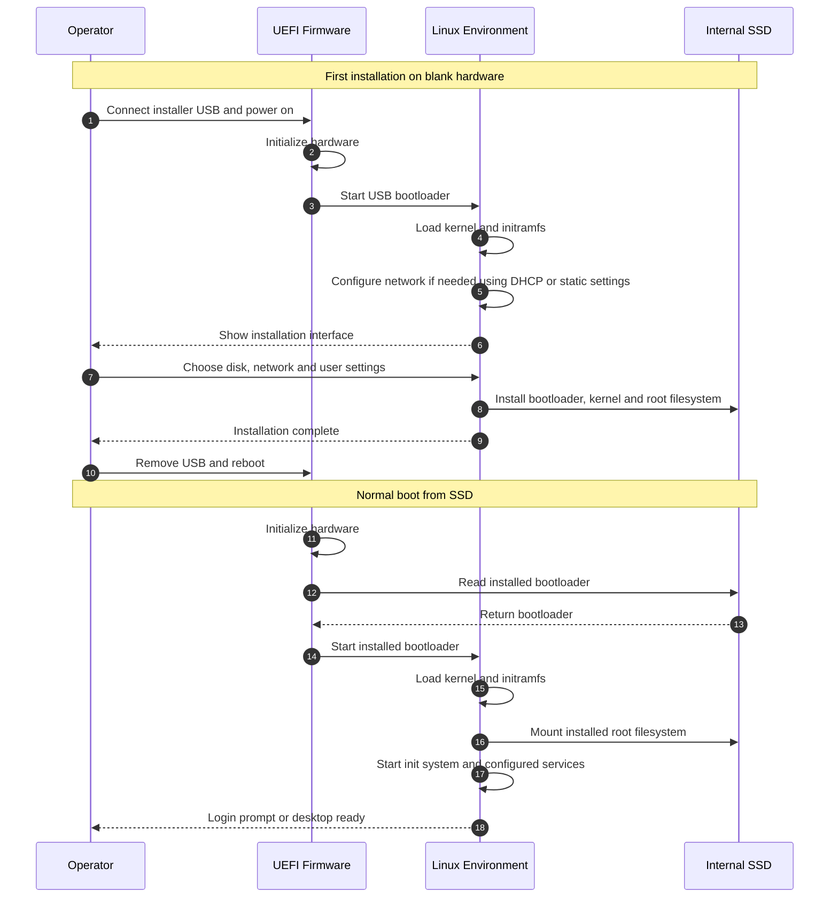
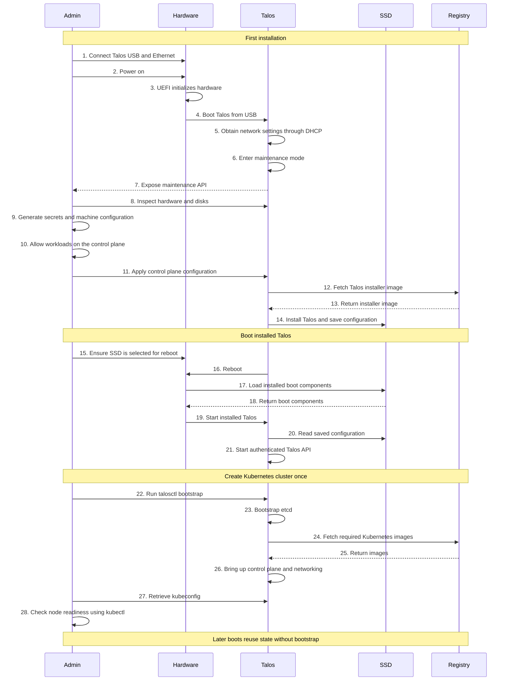
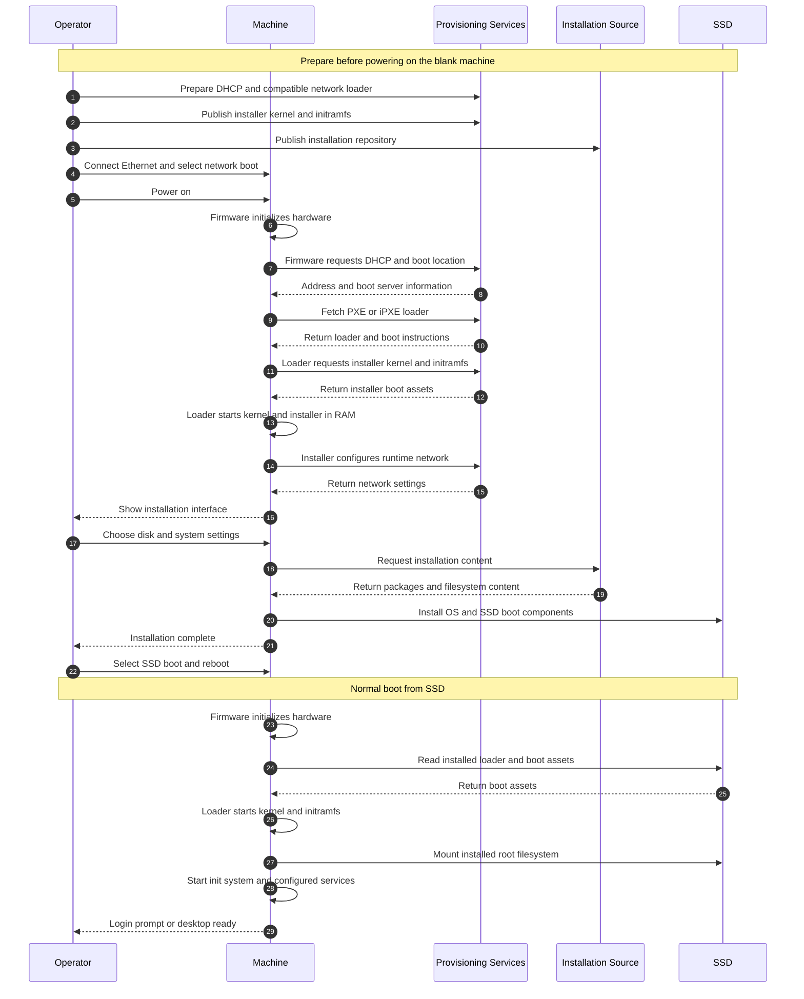
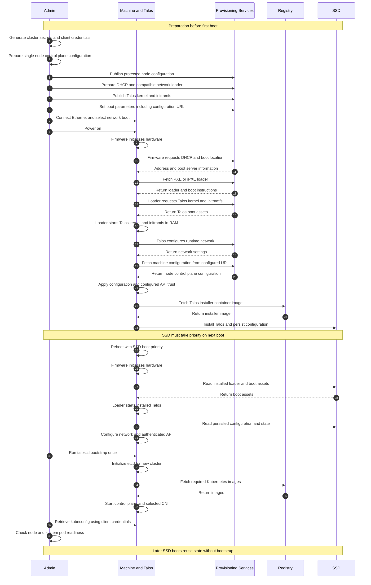

# General Linux and Talos Boot Comparison

Parent: [Detailed notes](README.md).

This topic is organized by the medium used for the first boot. Each scenario compares general Linux and Talos from cold hardware through installation and subsequent SSD boot.

| Scenario | Boot medium | Learning status |
| --- | --- | --- |
| 1.1 | USB | Round 1, current discussion |
| 1.2 | Network | Complete diagram draft for Round 2; learner review pending |

Documents 03 and 04 remain unapproved drafts.

## Scenario 1.1: USB Boot

Scope: a typical Linux distribution installed from USB onto a blank SSD. Automated installers and other operating systems can differ. Firmware starts the loader; the loader starts the kernel. Secure Boot checks apply when enabled and correctly configured.

### General Linux Installation and Boot

The OS becomes usable without Kubernetes. Kubernetes installation is a separate task in this comparison. Login and SSH availability depend on the distribution and selected services.

Networking supplies an IP address and, as configured, a gateway and DNS. A typical installer uses DHCP or accepts static settings. It matters for downloads and remote access; offline installation from complete local media can proceed without it.

### Talos Single-Node Scope

Scope: blank bare-metal disk, USB boot, reachable registry, one control-plane node also running workloads. This is the ordinary configuration-driven installation path, not the EC2 AMI or NEN factory identity workflow.

### Talos Installation and Cluster Bootstrap

### Numbered Step Notes

- **Step 4, common boot chain:** UEFI starts the USB loader, which loads the kernel and initramfs. Talos initially runs in RAM.
- **Step 5, common networking:** DHCP supplies the node address and, when configured, gateway and DNS. General Linux also needs these for downloads and remote access.
- **Steps 6–8, Talos difference:** Without machine configuration, Talos exposes its maintenance API. Use `talosctl` to inspect the node and identify the target SSD. This replaces an interactive installation screen; Talos has no ordinary user login or SSH service.
- **Steps 9–11, Talos difference:** Generate cluster secrets and a control-plane machine configuration. It declares the node role, installation disk and installer image, Kubernetes endpoint, networking and cluster trust material. Applying it tells Talos what to install and which cluster to join; controllers use it to configure services and persist the node configuration. Keep the separate `talosconfig` client credentials on the administrator workstation.
- **Step 10, Talos difference:** Permit workloads on this single control-plane node. For v1.14, configure the control-plane scheduling taint through `KubeNodeConfig`; otherwise ordinary workloads can remain unscheduled.
- **Steps 12–14, Talos difference:** Talos downloads an installer container image, not another ISO. The installer writes boot assets and initializes the selected SSD; the node saves configuration for later boots. A general Linux installer usually installs packages and a conventional root filesystem.
- **Steps 15–20, common SSD transition:** Set the disk boot order and remove or unmount installation media after the USB environment has booted, following the installation guide. Do this before applying configuration triggers installation and its automatic reboot. Step 15 is a boot requirement, not a last-second manual action. On SSD boot, the loader loads the kernel and initramfs, then Talos reads persisted configuration.
- **Step 21, Talos difference:** The configured API uses mutual TLS. The administrator verifies the server using the Talos CA; the node verifies the client's certificate and proof that it holds the matching private key, then checks its roles. Maintenance access did not require this configured client identity. Applying trusted configuration establishes this change; reboot itself does not create authentication. `--insecure` cannot bypass authentication on the configured API.
- **Steps 22–23, Talos difference:** Run `talosctl bootstrap` once to initialize etcd for this new cluster. Ordinary restarts reuse existing cluster state.
- **Steps 24–28, Talos difference:** Talos manages Kubernetes services. Fetch the required images, establish control-plane services and the selected CNI, retrieve `kubeconfig`, then check node and system-pod readiness. A general Linux installation finishes before any separate Kubernetes setup.

The numbered arrows show dependencies, not exact timing. Image downloads and service startup can overlap. Kubernetes readiness requires working container networking; one node provides no node-level availability redundancy.

Sources: [Talos getting started](https://docs.siderolabs.com/talos/v1.14/getting-started/getting-started), [workloads on control planes](https://docs.siderolabs.com/talos/v1.14/deploy-and-manage-workloads/workloads-on-controlplane).

## Scenario 1.2: Network Boot

Scope: a blank SSD, a PXE-capable machine and a provisioning LAN. DHCP supplies boot information; a boot service supplies a compatible loader and OS boot assets. This example uses PXE/iPXE, not booting across a customer NAT.

The provisioning participant below groups DHCP, boot-asset and configuration services for readability. These are separate responsibilities and can run on different servers. Matchbox and Squid are not prerequisites for understanding this sequence.

### General Linux Network Installation and SSD Boot

This is a typical distribution installer flow. Automated installation can replace the operator's selections.

### Talos Network Installation and Single-Node Kubernetes

This example selects automatic machine-configuration retrieval with the `talos.config` kernel parameter. Before boot, prepare a node-specific control-plane configuration and protect its delivery. Without that parameter or another configuration source, Talos enters maintenance mode and the administrator can apply configuration through the API as in scenario 1.1.

### Numbered Step Notes and Differences

- **Steps 1–6, preparation:** Unlike the interactive Linux example, Talos configuration and cluster trust are prepared before this automatic installation. Include the correct installation disk and single-node scheduling configuration. Publish matching architecture/version boot assets and installer image. Generic metal PXE also requires the documented kernel parameters, including `talos.platform=metal`, `slab_nomerge` and `pti=on`.
- **Steps 7–18, common boot:** Firmware gets network boot information before an OS exists. The loader downloads kernel and initramfs. Once started, the OS configures its own network; the firmware's DHCP exchange is not the running OS network configuration. USB supplies those initial boot assets locally instead.
- **Steps 19–21, Talos difference:** Talos retrieves and applies machine configuration rather than asking for installer-screen selections. The configuration supplies installation instructions, node role and cluster trust. No maintenance API exchange is needed in this selected automatic path. Configuration retrieval failure must be diagnosed; do not assume installation succeeded.
- **Steps 22–24, Talos difference:** Installation uses a Talos installer container image from the registry and saves configuration to SSD. PXE kernel and initramfs only start the RAM environment; downloading them does not install the SSD.
- **Steps 25–31, SSD boot:** Arrange disk-first boot before the automatic reboot. Firmware loads SSD boot assets; Talos restores persisted configuration and its authenticated API. Both operating systems can boot locally after installation without repeating PXE installation.
- **Steps 32–38, Talos difference:** Authenticate with workstation client credentials, bootstrap the new cluster once, start Kubernetes and its CNI, retrieve Kubernetes credentials, and verify readiness. General Linux does not implicitly create a Kubernetes cluster.

### Security and Failure Boundaries

- DHCP and a MAC-based configuration lookup do not authenticate the machine. Restrict provisioning access and protect configuration containing secrets. HTTPS requires a certificate chain the booted environment actually trusts.
- These diagrams assume compatible boot assets and working network, storage and registry access. Secure Boot requires a separately prepared trusted boot chain; PXE alone does not establish it.
- Missing DHCP or boot assets prevents the initial network boot. Missing runtime networking prevents configuration or image retrieval. A wrong install disk can overwrite data.
- An authenticated Talos API requires valid trusted client credentials and roles. Losing the administrator's private key cannot be fixed with maintenance-mode flags; recovery depends on separately retained credentials or secrets.
- Detailed security and recovery explanations in documents 03 and 04 remain unapproved drafts. DHCP, Matchbox, Squid and remote NAT remain later discussion topics.

Sources: [Talos PXE](https://docs.siderolabs.com/talos/v1.14/platform-specific-installations/bare-metal-platforms/pxe), [Talos getting started](https://docs.siderolabs.com/talos/v1.14/getting-started/getting-started), [Talos workloads on control planes](https://docs.siderolabs.com/talos/v1.14/deploy-and-manage-workloads/workloads-on-controlplane), [general Linux example: RHEL network installation](https://docs.redhat.com/en/documentation/red_hat_enterprise_linux/10/html/interactively_installing_rhel_over_the_network/preparing-a-pxe-installation-source).
