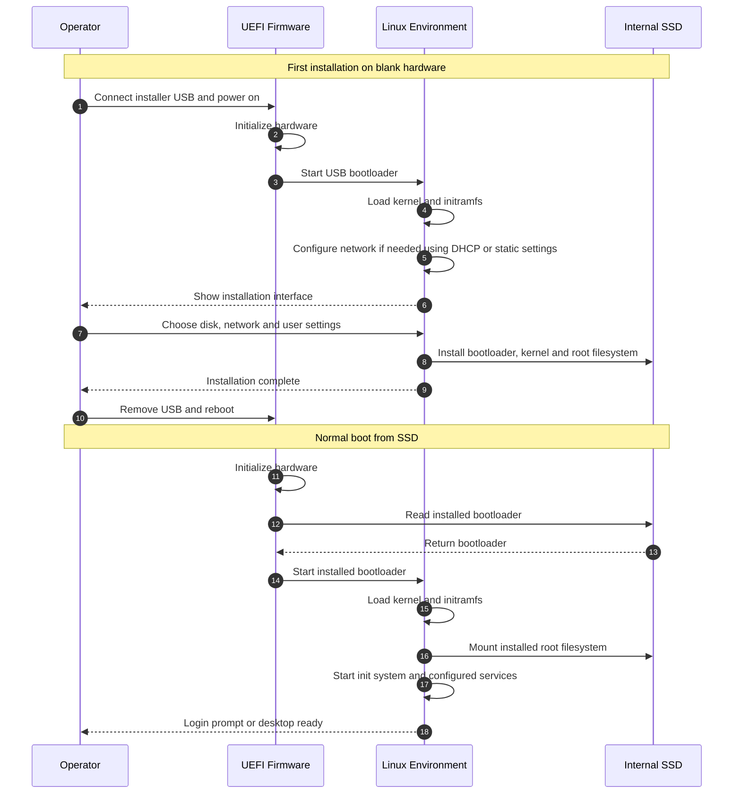
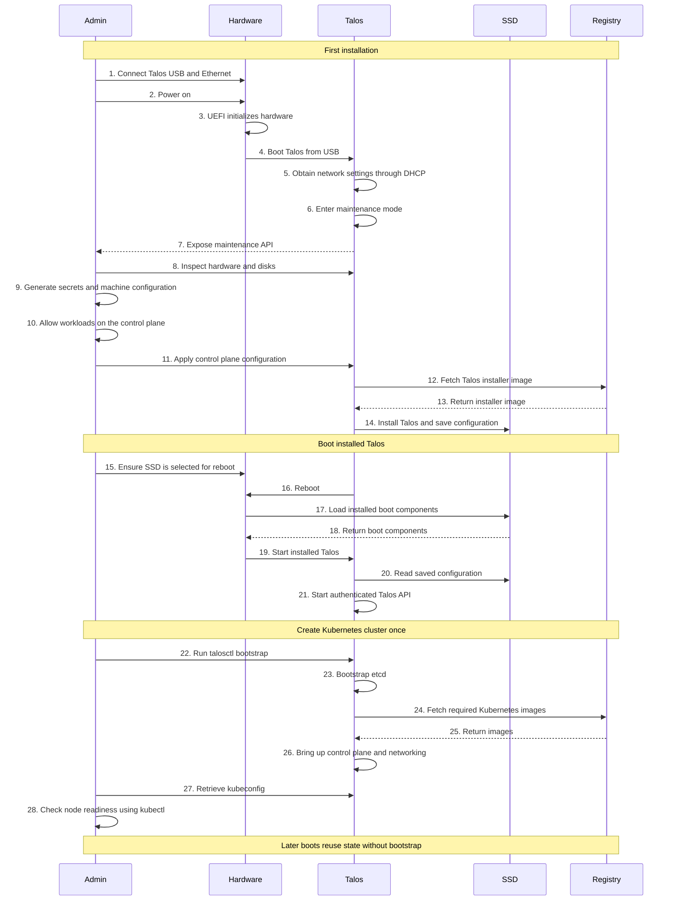
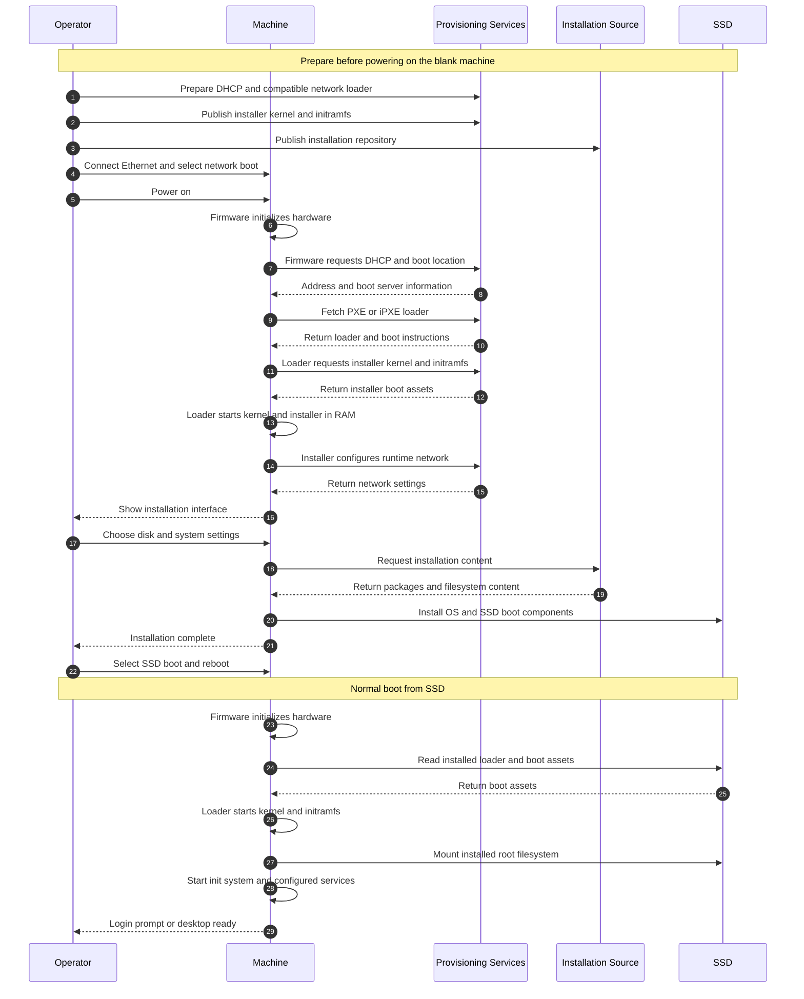
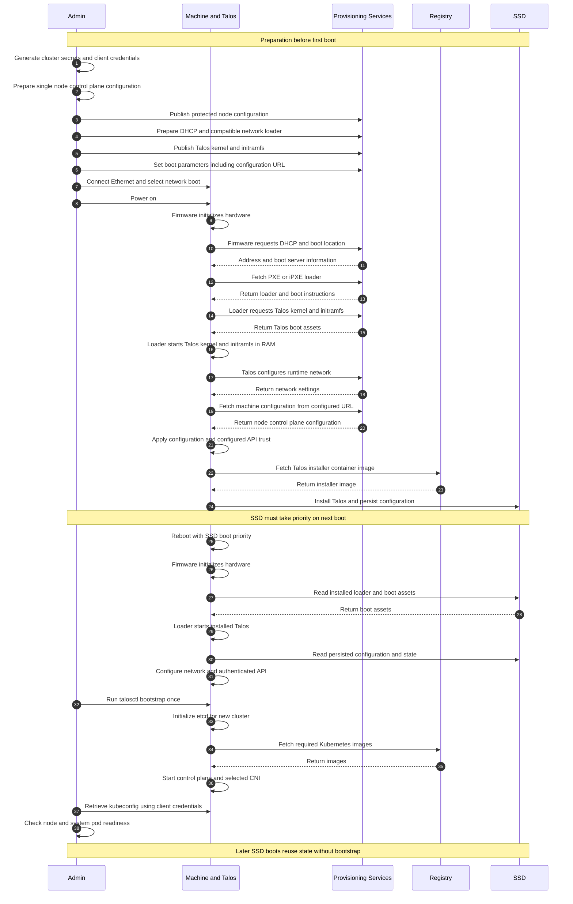

# General Linux and Talos Boot Comparison

[Detailed notes](README.md)

A reference for how firmware starts an operating system, how USB and network installation work, and how Talos brings up Kubernetes.

| Section | Topic |
| --- | --- |
| 1.1 | USB installation and SSD boot |
| 1.2 | Network installation and SSD boot |
| 1.3 | Network services and remote boot |
| 1.4 | USB versus network boot in Talos |

### Notes

**Bootloader**

A bootloader starts the operating system. After BIOS or UEFI initializes the hardware and selects a boot entry, the bootloader loads the Linux kernel into RAM and hands control to it. The boot files can come from USB, SSD or the network.

Its main jobs are:

- **Load the kernel:** Find the selected kernel and start it.
- **Offer a boot menu:** Let you choose an operating system or kernel version, when a menu is configured.
- **Pass kernel parameters:** Supply startup settings, such as the root filesystem location or recovery options supported by the OS.
- **Load initramfs:** Make the early userspace environment available to the kernel. It contains tools and drivers needed during startup, often including those required to find and mount the root filesystem.

Common Linux bootloaders include:

| Bootloader | Description |
| --- | --- |
| **GRUB 2** | Widely used by Linux distributions. Supports boot menus, multiple kernels and starting other operating systems. |
| **systemd-boot** | A small UEFI boot manager. It selects and starts EFI boot entries, including Unified Kernel Images (UKIs). |
| **Syslinux** | A family of bootloaders, including variants for removable media, optical media and PXE network boot. |
| **LILO** | An older Linux bootloader, mainly relevant to legacy systems. |

The usual sequence is:

1. **Power on:** BIOS or UEFI initializes hardware.
2. **Select a boot entry:** Firmware starts a loader from the chosen device or network service.
3. **Choose what to boot:** The loader reads its settings and may show a menu.
4. **Start the kernel:** The loader provides the kernel, initramfs and startup parameters, then hands over control.
5. **Continue startup:** The kernel initializes hardware and starts early userspace, which continues into the operating system.

For a new **Talos v1.14** installation, UEFI systems use **systemd-boot**, while legacy x86_64 BIOS systems use **GRUB**. An upgraded installation can retain its older bootloader.

On the UEFI path, Talos uses a **UKI**, which packages the kernel, initramfs and kernel command line in one EFI executable. A UKI can also be started directly by compatible firmware. The diagrams use “load boot components” as a short description of this process.

Sources: [GNU GRUB](https://www.gnu.org/software/grub/), [GRUB manual](https://www.gnu.org/software/grub/manual/grub/grub.html), [Talos boot loader](https://docs.siderolabs.com/talos/v1.14/platform-specific-installations/bare-metal-platforms/bootloader).

## Scenario 1.1: USB Boot

This example installs a typical Linux distribution from USB onto a blank SSD. Automated installers and other operating systems can differ. Firmware starts the loader; the loader starts the kernel. Secure Boot checks apply when enabled and correctly configured.

### General Linux Installation and Boot

The OS becomes usable without Kubernetes. Kubernetes installation is a separate task in this comparison. Login and SSH availability depend on the distribution and selected services.

Networking supplies an IP address and, as configured, a gateway and DNS. A typical installer uses DHCP or accepts static settings. It matters for downloads and remote access; offline installation from complete local media can proceed without it.

### Talos Installation and Cluster Bootstrap

### Notes

- **Steps 4–5:** The loader starts the kernel and initramfs. Talos runs in RAM and obtains networking, as a Linux installer does.
- **Steps 6–8:** Without configuration, Talos exposes its maintenance API. Inspect hardware using `talosctl`; there is no ordinary login or SSH service.
- **Steps 9–11:** Machine configuration supplies the role, disk, installer image, networking, Kubernetes endpoint and trust material. Talos uses it to install and configure services. Keep administrator credentials in the separate `talosconfig` file.
- **Step 10:** A single control-plane node needs permission to schedule workloads. Talos v1.14 expresses the scheduling taint through `KubeNodeConfig`.
- **Steps 12–14:** The installer is a container image, not another ISO. It writes Talos to SSD and the node saves configuration.
- **Steps 15–20:** Prepare SSD boot priority and remove or unmount installation media before applying configuration triggers automatic installation and reboot. The installed loader starts Talos, which reads saved configuration.
- **Step 21:** The configured API uses mutual TLS: the client verifies the server, and the server verifies the client certificate, private-key possession and roles. Configuration establishes trust; reboot does not create it. `--insecure` does not bypass this authentication.
- **Steps 22–23:** Bootstrap etcd once for a new cluster. Do not repeat bootstrap on ordinary restarts.
- **Steps 24–28:** Talos starts Kubernetes. Container networking must work before the node and workloads are ready. General Linux does not create Kubernetes as part of ordinary OS installation.

Downloads and service startup can overlap. A single node has no node-level availability redundancy.

Sources: [Talos getting started](https://docs.siderolabs.com/talos/v1.14/getting-started/getting-started), [workloads on control planes](https://docs.siderolabs.com/talos/v1.14/deploy-and-manage-workloads/workloads-on-controlplane).

## Scenario 1.2: Network Boot

For this example, the machine has a blank SSD, supports PXE and connects to the provisioning LAN. DHCP supplies boot information; a boot service supplies a compatible loader and OS boot assets. This example uses PXE/iPXE on a LAN.

“Provisioning Services” includes DHCP, boot files and machine configuration. These services can run on different servers. We will discuss Matchbox and Squid separately.

### General Linux Network Installation and SSD Boot

This is a typical distribution installer flow. Automated installation can replace the operator's selections.

### Talos Network Installation and Single-Node Kubernetes

In this example, `talos.config` tells Talos where to download its machine configuration. Before boot, prepare a node-specific control-plane configuration and protect its delivery. Without that parameter or another configuration source, Talos enters maintenance mode and the administrator can apply configuration through the API as in scenario 1.1.

### Notes

- **Steps 1–6:** Unlike the interactive Linux example, Talos configuration and cluster trust are prepared before this automatic installation. Include the correct installation disk and single-node scheduling configuration. Publish matching architecture/version boot assets and installer image. Generic metal PXE also requires the documented kernel parameters, including `talos.platform=metal`, `slab_nomerge` and `pti=on`.
- **Steps 7–18:** Firmware gets network boot information before an OS exists. The loader downloads kernel and initramfs. Once started, the OS configures its own network; the firmware's DHCP exchange is not the running OS network configuration. USB supplies those initial boot assets locally instead.
- **Steps 19–21:** Talos retrieves and applies machine configuration rather than asking for installer-screen selections. The configuration supplies installation instructions, node role and cluster trust. No maintenance API exchange is needed in this selected automatic path. Configuration retrieval failure must be diagnosed; do not assume installation succeeded.
- **Steps 22–24:** Installation uses a Talos installer container image from the registry and saves configuration to SSD. PXE kernel and initramfs only start the RAM environment; downloading them does not install the SSD.
- **Steps 25–31:** Arrange disk-first boot before the automatic reboot. Firmware loads SSD boot assets; Talos restores persisted configuration and its authenticated API. Both operating systems can boot locally after installation without repeating PXE installation.
- **Steps 32–38:** Authenticate with workstation client credentials, bootstrap the new cluster once, start Kubernetes and its CNI, retrieve Kubernetes credentials, and verify readiness. General Linux does not implicitly create a Kubernetes cluster.

A working network, correct installation disk and compatible boot assets are essential. PXE alone does not establish Secure Boot or protect machine configuration.

Sources: [Talos PXE](https://docs.siderolabs.com/talos/v1.14/platform-specific-installations/bare-metal-platforms/pxe), [RHEL network installation](https://docs.redhat.com/en/documentation/red_hat_enterprise_linux/10/html/interactively_installing_rhel_over_the_network/preparing-a-pxe-installation-source).

## Section 1.3: Network Services and Remote Boot

Network boot has two stages: discover how to boot, then download the boot files. The files may be on the same LAN or on a distant server.

1. Firmware obtains networking and boot information, usually through DHCP.
2. It starts a compatible network loader.
3. The loader fetches the kernel and initramfs, or a supported EFI boot image.
4. The kernel starts; the OS configures its own networking.
5. Talos receives machine configuration and installs to SSD, as shown in section 1.2.

### Notes

| Component | What it does |
| --- | --- |
| **DHCP** | Supplies an IP address and network settings; a PXE setup also provides boot information |
| **DHCP relay** | Forwards requests to a DHCP server on another routed network |
| **TFTP** | Often serves the first PXE loader |
| **iPXE** | Downloads and runs boot instructions, with support for fetching assets over HTTP |
| **HTTP/HTTPS server** | Serves boot scripts and OS files |
| **Matchbox** | Selects boot profiles using machine labels such as MAC or UUID; optional |
| **Squid** | Proxies web requests and can cache eligible content; optional |
| **Configuration service** | Delivers the Talos machine configuration for automatic setup |
| **Registry** | Supplies installer and Kubernetes container images |

- DHCP discovery stays on the local subnet unless a relay is configured. It does not broadcast across the Internet.
- A distant boot server needs working routing, DNS and firewall permissions. Outbound downloads can pass through NAT.
- An OS-level VPN is unavailable before that OS starts. A pre-existing router VPN is a different option.
- HTTPS requires loader support and trusted certificates. Secure Boot separately checks executable trust.
- Matchbox does not replace DHCP. Hardware labels select profiles but do not authenticate machines.
- Squid does not install the OS. Ordinary HTTPS tunnels do not expose their contents for caching.

Read: [PXE, iPXE, TFTP and HTTP](../../learning-foundations/pxe-ipxe-tftp-http.md) for the two-stage delivery process and its exceptions.

Watch: [DHCP video](https://youtu.be/IUOVSIKj6GU).

Sources: [DHCP: RFC 2131](https://www.rfc-editor.org/rfc/rfc2131), [iPXE](https://ipxe.org/howto/chainloading), [Matchbox](https://matchbox.psdn.io/), [Squid HTTPS](https://wiki.squid-cache.org/Features/HTTPS).

## Section 1.4: USB Boot and Network Boot in Talos

Both methods start Talos. The main difference is where the first boot files come from and what must work before the kernel starts.

| What changes? | USB boot | Network boot |
| --- | --- | --- |
| First boot files | Talos ISO written to USB | Boot files downloaded from a boot service |
| Firmware starts | Loader on USB | Network loader discovered through the configured boot path |
| Networking before Talos | Not needed to read USB boot files | Needed to discover and download boot files |
| Preparation | Create USB media and select USB boot | Prepare boot services, compatible assets and boot instructions |
| First failures to check | USB image, device and boot selection | DHCP, loader location, routing and asset delivery |
| Updating initial boot files | Rewrite or replace the USB image | Update the boot service and its instructions |
| Hands-on work | Usually insert media per machine, unless virtual media is available | Can boot many machines without inserting USB media |
| WAN dependency | Initial boot files are local | Initial boot depends on WAN when files are hosted remotely |

### Notes

- **Configuration is a separate choice:** Either method can enter maintenance mode when no machine configuration is available. Network boot does not automatically mean zero-touch installation, and USB boot does not always mean manual configuration.
- **Our examples use different delivery methods:** Section 1.1 applies configuration through the maintenance API. Section 1.2 fetches it through a configured URL. That is a setup choice, not an inherent difference in Talos.
- **USB is not an offline installation by itself:** It supplies initial boot files. The ordinary installation still needs configuration and access to installer and Kubernetes images. A disconnected setup must provide those separately.
- **Booting is not installing:** On blank hardware, both illustrated paths start Talos in RAM. Applying installation configuration causes installation to the selected SSD.
- **The installed OS can be the same:** With matching assets and configuration, both methods install the same Talos version, node role and cluster trust.
- **Later boots use SSD:** Once installed, select SSD boot. Neither the USB nor the network boot service is needed for the ordinary local boot path.
- **Kubernetes setup is unchanged:** Configure the node, bootstrap the new cluster once, then check readiness.
- **Security depends on the full boot chain:** The medium alone does not establish Secure Boot or trusted configuration delivery.

USB needs less boot-service setup. Network boot centralizes the initial files, while adding network dependencies.

Sources: [Talos getting started](https://docs.siderolabs.com/talos/v1.14/getting-started/getting-started), [Talos PXE](https://docs.siderolabs.com/talos/v1.14/platform-specific-installations/bare-metal-platforms/pxe).

### Upgrading Talos

After installation to SSD, the upgrade process is the same in both cases.

| Originally installed using | How you upgrade |
| --- | --- |
| **USB** | Send an authenticated upgrade request to the running node. It downloads the target installer image and updates its installed OS. No replacement USB is needed for a normal upgrade. |
| **Network boot** | Use the same API upgrade process. Changing the PXE server's files does not upgrade an already installed node. Those files affect future network boots. |

1. Check the supported upgrade path and choose the correct image, including required customizations.
2. Request the upgrade through the Talos API, usually with `talosctl upgrade`.
3. The node downloads the image, updates its boot assets and reboots.
4. Check the Talos version and cluster health.

Talos retains the previous OS image for rollback. Upgrade Kubernetes separately, and do not repeat cluster bootstrap. Expect downtime on our single-node setup.

Source: [Talos upgrade guide](https://docs.siderolabs.com/talos/v1.14/configure-your-talos-cluster/lifecycle-management/upgrading-talos).

### The Modern Boot Stack

| Layer | Purpose |
| --- | --- |
| **UEFI and optional Secure Boot** | Initialize hardware, select a boot entry and check trusted signatures when enabled |
| **Boot manager or loader** | Start the selected OS; Talos uses systemd-boot on new UEFI installations |
| **Kernel and initramfs, optionally packaged as a UKI** | Initialize hardware and provide the early startup environment |
| **OS services** | Configure networking, storage and APIs; Talos manages these declaratively |
| **Container runtime and Kubernetes** | Run and coordinate container workloads after the OS is running |

An ISO is a boot-media image. A UKI packages early boot components. An installer image writes or upgrades Talos on disk. These serve different purposes.

### Next

Next, follow one machine's DHCP exchange: how it gets an address, discovers the boot service and starts iPXE.
