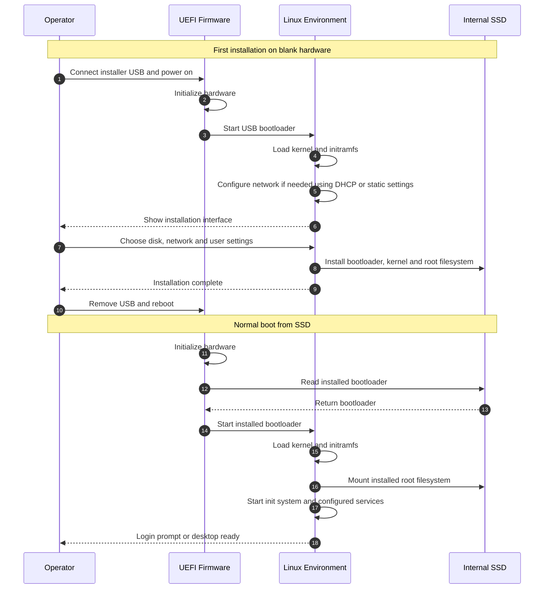

# General Linux Boot Sequence

Parent: [Detailed notes](README.md). Compare: [Talos sequence](02-talos-single-node-boot.md).

Scope: a typical Linux distribution installed from USB onto a blank SSD. Automated installers and other operating systems can differ. Firmware starts the loader; the loader starts the kernel. Secure Boot checks apply when enabled and correctly configured.

## General Linux Installation and Boot

The OS becomes usable without Kubernetes. Kubernetes installation is a separate task in this comparison. Login and SSH availability depend on the distribution and selected services.

Networking supplies an IP address and, as configured, a gateway and DNS. A typical installer uses DHCP or accepts static settings. It matters for downloads and remote access; offline installation from complete local media can proceed without it.
