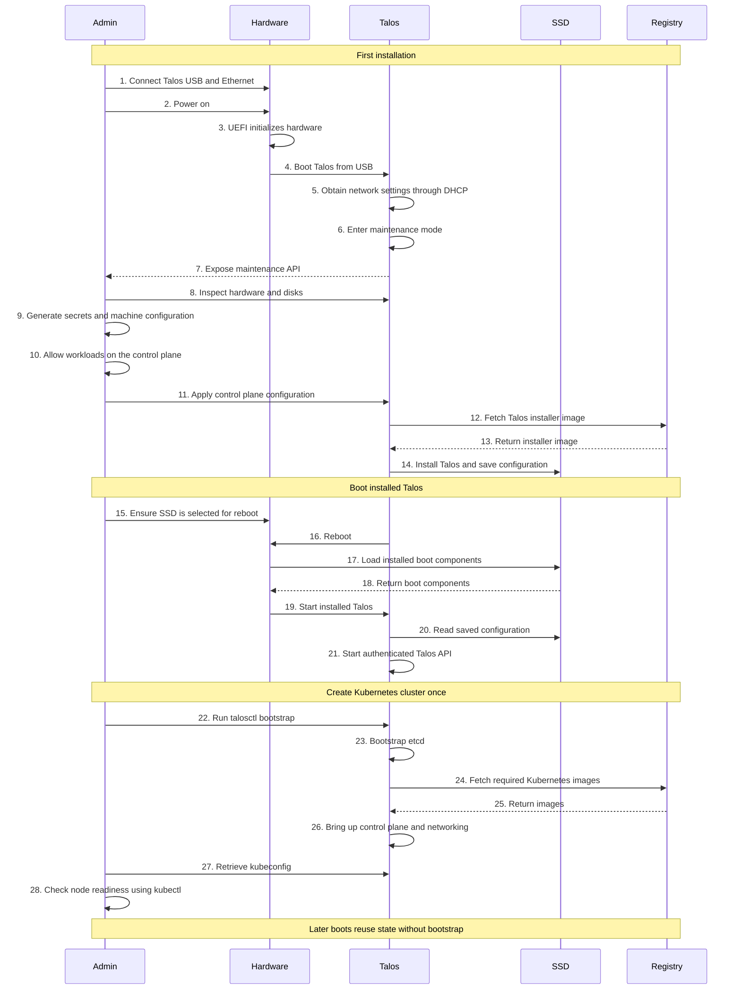

# Talos Single-Node Boot Sequence

Parent: [Detailed notes](README.md). Previous: [General Linux](01-general-linux-boot.md). Next: [Configuration and authentication](03-configuration-and-api-authentication.md).

Scope: blank bare-metal disk, USB boot, reachable registry, one control-plane node also running workloads. This is the ordinary configuration-driven installation path, not the EC2 AMI or NEN factory identity workflow.

## Talos Installation and Cluster Bootstrap

Step numbers preserve our discussion. This is a dependency overview, not an exact service trace: image downloads and service startup can overlap or happen earlier. The loader starts the kernel; the Hardware-to-Talos arrows abbreviate that chain. API authentication follows configured trust, not a security property created by the reboot itself.

The USB environment initially runs in RAM. Remove/unmount installation media after it has booted, following the installation guide, and identify the SSD before configuration triggers installation. Step 15 expresses the boot-device requirement, not a prompt to race the automatic reboot.

Step 22 is a one-time cluster initialization. Do not run bootstrap on ordinary restarts. Step 26 requires functioning container networking. A single node has no node-level availability redundancy.

Sources: [Talos getting started](https://docs.siderolabs.com/talos/v1.14/getting-started/getting-started), [workloads on control planes](https://docs.siderolabs.com/talos/v1.14/deploy-and-manage-workloads/workloads-on-controlplane).
