# Track 2 Deep Dive --- Secure Zero-Touch Talos Edge

## Goal

Understand how 100--1,000 customer-premise Talos edge nodes can be
prepared centrally, shipped cold, powered on by a customer, establish
trust across the Internet, and then be managed securely without SSH.

This README focuses on the trust chain:

**Factory → Boot Artifact → Secure Boot → TPM → Customer → Internet →
Enrollment → Attestation → Machine Identity → Day-2 Operations**

------------------------------------------------------------------------

## 1. The Track-2 Mental Model

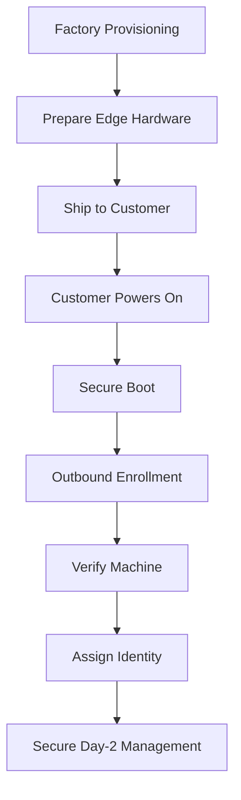

The important architectural property is that the customer edge can sit
behind NAT/firewalls and initiate outbound management connectivity. The
central platform should not depend on exposing SSH on the edge.

------------------------------------------------------------------------

## 2. What Is a UKI?

**UKI = Unified Kernel Image.**

A UKI packages important early-boot components into a single EFI
executable. Conceptually this can include the Linux kernel, initramfs,
kernel command line and OS metadata.

### UKI Boot Model

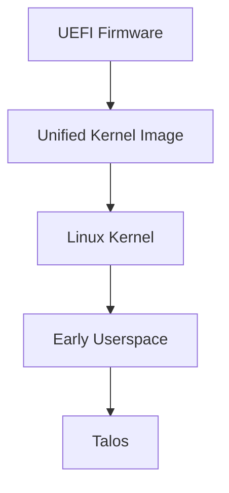

UKI and Secure Boot solve different problems:

-   **UKI:** packages the boot components.
-   **Secure Boot:** determines whether an EFI executable is trusted to
    execute.

------------------------------------------------------------------------

## 3. Secure Boot Infrastructure

The private signing key belongs in controlled signing infrastructure,
not on every edge machine.

### Secure Boot Chain

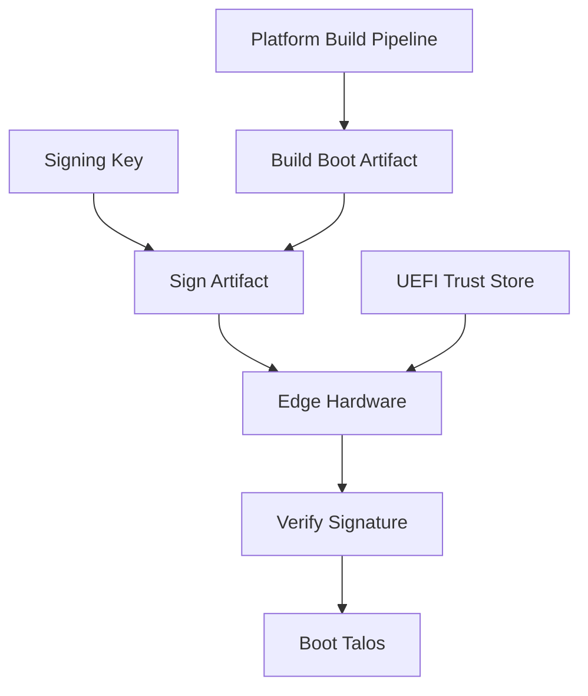

Conceptually:

``` text
Secure Build Environment
        |
        | private signing key
        v
   Sign boot artifact
        |
        v
   Edge hardware
        |
        | verifies against trusted key
        v
      Boot
```

The edge contains the **trust information needed to verify signatures**,
not the central private signing key.

Secure Boot answers:

> **"Is this software allowed to execute?"**

It does not by itself prove the running state to the remote data center.

------------------------------------------------------------------------

## 4. Secure Boot vs Measured Boot

These are related but different controls.

``` text
Secure Boot
    ↓
May this software execute?

Measured Boot
    ↓
What participated in the boot process?

Remote Attestation
    ↓
Can the machine prove that state remotely?
```

This distinction leads to the TPM.

------------------------------------------------------------------------

## 5. TPM Fundamentals

A **TPM --- Trusted Platform Module** provides hardware-backed
cryptographic capabilities.

For this architecture, think about three uses:

1.  Protect cryptographic keys.
2.  Record boot measurements in PCRs.
3.  Produce evidence that can be verified remotely.

A TPM should not be thought of simply as a tiny USB drive containing
certificates.

------------------------------------------------------------------------

## 6. PCR Measurements

**PCR = Platform Configuration Register.**

PCRs hold cryptographic state derived from measurements taken during
boot.

They do not contain copies of the firmware, kernel or UKI.

### Measured Boot

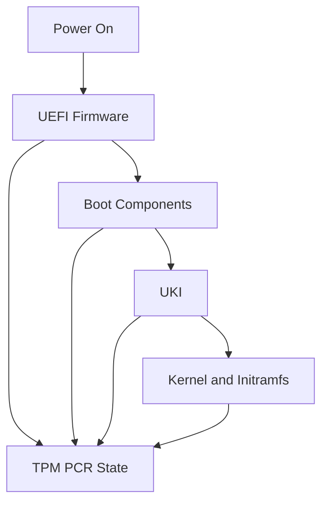

Conceptually, measurements are extended:

``` text
New PCR =
HASH(
    Previous PCR
    +
    New Measurement
)
```

Therefore a changed measured boot chain can produce a different final
PCR state.

------------------------------------------------------------------------

## 7. Remote Attestation

Secure Boot happens locally. Attestation allows a remote system to
evaluate evidence about the machine.

### TPM Remote Attestation

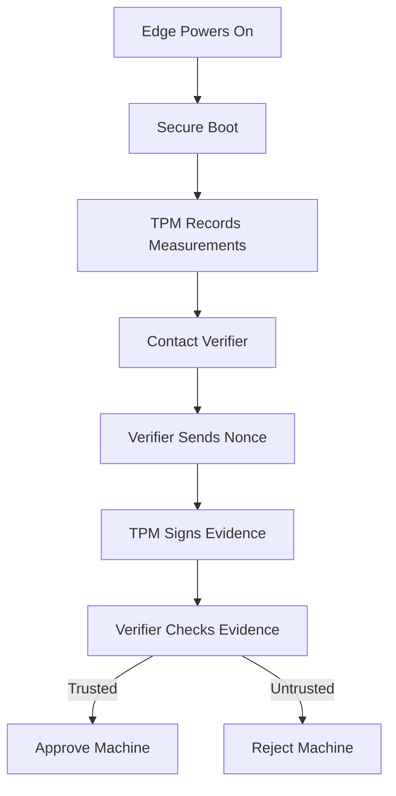

Typical infrastructure:

  -----------------------------------------------------------------------
  Component               Location                Purpose
  ----------------------- ----------------------- -----------------------
  TPM 2.0                 Edge hardware           Hardware-backed keys
                                                  and PCR state

  PCRs                    TPM                     Boot measurements

  Attestation key         TPM-backed              Signs attestation
                                                  evidence

  Attestation agent       Edge                    Exchanges evidence with
                                                  verifier

  Verifier                Data center/cloud       Evaluates evidence

  Attestation policy      Data center/cloud       Defines acceptable
                                                  states

  Identity/CA service     Data center/cloud       Grants operational
                                                  identity after approval

  Inventory               Data center/cloud       Maps hardware to
                                                  customer/site/role
  -----------------------------------------------------------------------

------------------------------------------------------------------------

## 8. Why the Nonce Matters

The verifier can send a fresh random challenge.

``` text
EDGE                              VERIFIER

Enrollment request  ------------>

                    <------------ Fresh nonce

TPM signs:
nonce + evidence

Signed evidence     ------------>

                         Verify signature
                         Verify freshness
                         Evaluate policy
```

The nonce helps prevent an attacker from replaying previously captured
valid evidence.

------------------------------------------------------------------------

## 9. Attestation During Upgrades

A legitimate Talos/boot artifact upgrade changes the measured software
and therefore may change expected measurements.

The verifier must understand which states are currently approved.

### Controlled Upgrade Trust

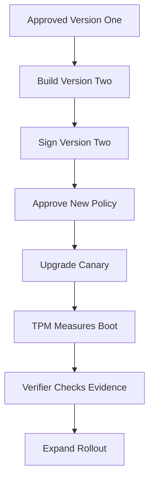

During rollout:

``` text
Version 1  → Approved
Version 2  → Approved
Unknown    → Reject
```

After migration, old states can be removed according to rollback and
lifecycle policy.

The key lesson is that **image rollout and attestation policy rollout
must be coordinated**.

------------------------------------------------------------------------

## 10. TPM-Bound Identity and Anti-Cloning

The desired security property is:

> **EDGE-347's identity belongs to the intended hardware, not merely to
> a copyable SSD.**

### Hardware-Bound Identity

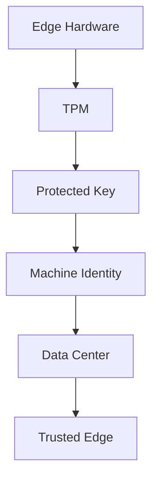

A cloned disk placed into different hardware should not automatically
reproduce a hardware-bound private identity.

Conceptually:

``` text
Original device
TPM-A + SSD
    ↓
Expected hardware identity

Cloned SSD
    ↓
Different TPM-B
    ↓
Cannot simply reproduce TPM-A proof
    ↓
Verification should fail
```

Where strong anti-cloning is required, avoid relying solely on
exportable device private keys stored on disk.

------------------------------------------------------------------------

## 11. TPM and Disk Encryption

TPM-backed protection can also be used as part of disk encryption
policy.

Conceptually:

``` text
Secure Boot
     ↓
Expected platform state
     ↓
TPM-backed key release
     ↓
Encrypted storage available
     ↓
Talos starts
```

Disk encryption and remote attestation solve different problems:

-   **Disk encryption:** protects data at rest.
-   **Attestation:** provides evidence about platform state to another
    system.

------------------------------------------------------------------------

## 12. EK, AK, PCR and Machine Certificate

These concepts should remain separate.

  -----------------------------------------------------------------------
  Item                    Mental model            Purpose
  ----------------------- ----------------------- -----------------------
  EK                      TPM foundational        Establish TPM
                          identity                provenance/identity

  AK                      Attestation signing     Sign attestation
                          identity                evidence

  PCR                     Boot-state measurements Represent measured
                                                  platform state

  Machine certificate     Operational identity    Authenticate EDGE-347
                                                  during normal operation
  -----------------------------------------------------------------------

### Identity Chain

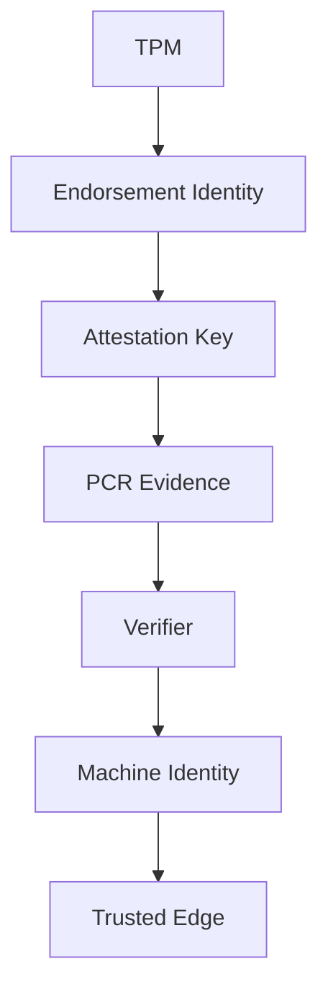

The operational machine certificate does not need to be the same thing
as the TPM's endorsement or attestation identity.

------------------------------------------------------------------------

## 13. Factory Trust

For zero-touch deployment, the data center needs a reason to associate a
newly arriving machine with the device that was prepared and shipped.

Factory inventory can provide that binding.

Example:

``` text
Asset       EDGE-347
Customer    Customer-ABC
Hardware    Edge-Type-A
TPM         Expected TPM identity
Image       Approved Talos profile
Status      Ready to ship
```

### Factory Trust Chain

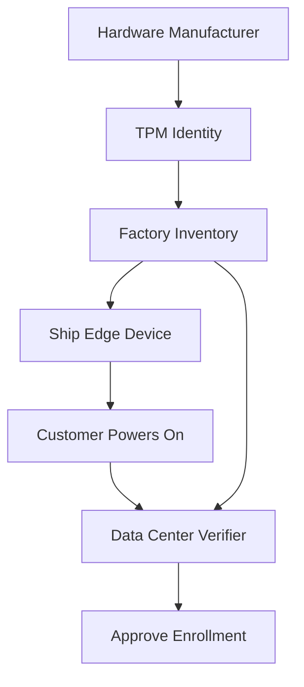

At enrollment, two forms of information meet:

``` text
Factory knowledge
       +
Runtime cryptographic proof
       ↓
Central verification
       ↓
Operational identity
```

------------------------------------------------------------------------

## 14. Who Provides What?

Talos, Omni, TPM hardware and your own platform have different
responsibilities.

  ---------------------------------------------------------------------
  Layer                              Responsibility
  ---------------------------------- ----------------------------------
  Talos                              Immutable/API-managed OS, Talos
                                     PKI, Secure Boot-related
                                     capabilities, TPM-backed storage
                                     capabilities

  Omni                               Fleet enrollment/connectivity and
                                     centralized Talos/Kubernetes
                                     lifecycle

  TPM/UEFI                           Hardware root-of-trust primitives,
                                     protected keys, Secure Boot
                                     support and measurements

  Your platform                      Inventory, customer mapping,
                                     policy, approvals, rollout
                                     governance

  Attestation system                 Evaluates TPM/platform evidence
                                     against an approved policy
  ---------------------------------------------------------------------

Do not assume:

``` text
Talos + Omni = complete TPM remote-attestation platform
```

Remote hardware attestation is a separate architectural requirement that
may require additional infrastructure and integration.

------------------------------------------------------------------------

## 15. Three Security Levels

Not every edge deployment needs the maximum design immediately.

### Edge Trust Levels

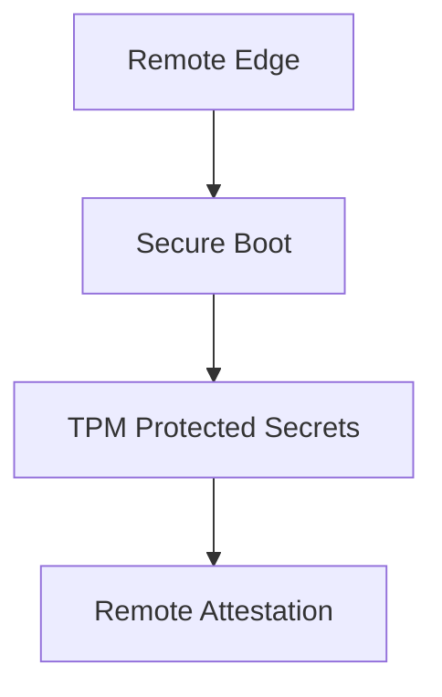

### Level 1 --- Secure Boot

Goal:

> Prevent unauthorized boot software from being accepted by the
> configured Secure Boot trust chain.

Good baseline for controlled edge appliances.

### Level 2 --- TPM-Backed Protection

Goal:

> Make sensitive local material harder to extract or clone from stolen
> storage/hardware.

Useful when devices live at customer premises.

### Level 3 --- Remote Attestation

Goal:

> Require the remote device to prove an acceptable hardware/software
> state before receiving sensitive production access.

Useful when:

-   Physical environment is not trusted.
-   Strong anti-cloning is required.
-   Secrets must be withheld from modified devices.
-   Compliance requires measured-boot evidence.
-   Central systems need evidence of device state before authorization.

------------------------------------------------------------------------

## 16. Practical Track-2 Architecture

For many edge deployments, start by designing Levels 1 and 2 well.

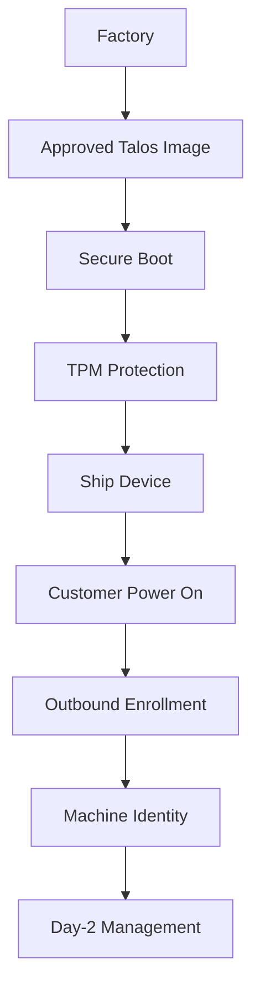

Then introduce remote attestation only when the threat model or
compliance requirement justifies the additional infrastructure.

------------------------------------------------------------------------

## 17. Day-2 Operations

After enrollment, the model changes from bootstrap trust to operational
identity.

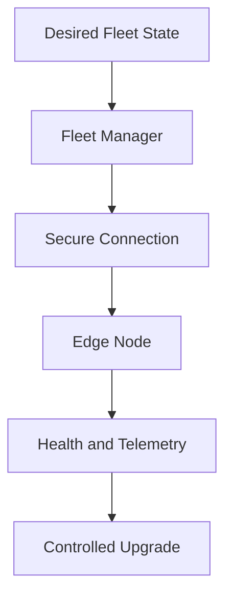

Day-2 principles:

-   No SSH dependency.
-   Use machine/operator cryptographic identity.
-   Maintain desired configuration centrally.
-   Upgrade using tested images.
-   Roll out through lab and canary rings.
-   Monitor health before expanding rollout.
-   Rotate credentials according to policy.
-   Replace/reimage failed nodes rather than manually repairing OS
    drift.
-   Keep application persistence independent of disposable OS state.

------------------------------------------------------------------------

## 18. Complete Trust Story

The full high-assurance model can now be read as:

``` text
Factory inventory
       ↓
Approved boot artifact
       ↓
Signed boot chain
       ↓
Secure Boot
       ↓
TPM measurements
       ↓
Customer network
       ↓
Outbound enrollment
       ↓
Remote attestation
       ↓
Verify device + state
       ↓
Issue operational identity
       ↓
Talos / Omni management
       ↓
Controlled Day-2 lifecycle
```

------------------------------------------------------------------------

## 19. Questions Still to Design

Before calling Track 2 production-ready, decide:

1.  What exactly is provisioned at the factory?
2.  What secrets, if any, may exist before shipment?
3.  How does the edge discover the central endpoint?
4.  Is Omni enrollment sufficient for the threat model?
5.  Is Secure Boot required?
6.  Is TPM-backed disk protection required?
7.  Is hardware remote attestation actually required?
8.  How is factory inventory bound to a customer?
9.  What happens when a device is stolen?
10. What happens when a motherboard/TPM is replaced?
11. How are enrollment credentials rotated?
12. How are old boot measurements retired during upgrades?
13. How does a device recover when it cannot contact management?
14. What is the break-glass procedure?
15. How is a decommissioned device cryptographically revoked?

------------------------------------------------------------------------

## 20. Decision: Build a Real Track-2 PoC

We will now turn the architecture discussion into a working lab.

The PoC deliberately avoids Omni and any paid fleet-management
dependency.

### PoC Goal

Start with:

-   One clean AWS EC2 instance with only SSH/admin access.
-   One local Oracle VirtualBox VM representing a customer EDGE
    appliance.
-   The EDGE and EC2 are on completely separate networks.
-   The EDGE should initiate connectivity toward the public control
    plane.
-   Build the required control-plane services ourselves.
-   Learn the trust, bootstrap, PKI, Talos API, image, networking,
    Secure Boot and TPM concepts incrementally.

The final learning path is:

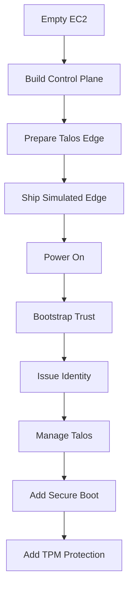

------------------------------------------------------------------------

## 21. PoC Topology

### Two Independent Networks

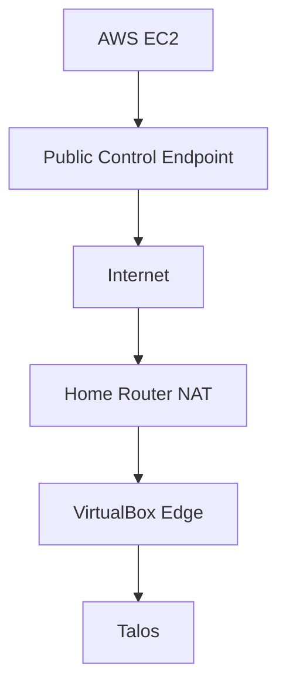

This intentionally resembles a real customer deployment:

-   EC2 represents the central data center/control plane.
-   VirtualBox represents a remote appliance.
-   The edge receives a private address locally.
-   The customer/home router performs NAT.
-   No inbound connection from AWS to the customer's LAN is assumed.
-   Bootstrap traffic is initiated by the edge.

------------------------------------------------------------------------

## 22. EC2 Control-Plane Specification

### Initial Lab Size

  Item                                   PoC Specification
  -------------------------------------- ------------------------------------------------------
  OS                                     Ubuntu LTS
  Architecture                           x86_64
  Instance                               2 vCPU / 4 GiB RAM minimum
  Preferred if building images locally   4 vCPU / 8 GiB RAM
  Root disk                              40--60 GiB gp3
  Public endpoint                        Elastic IP or stable DNS name
  Container runtime                      Docker initially
  Source control                         Git
  TLS                                    Public/server certificate for exposed HTTPS services
  Persistence                            Docker volumes initially
  Backup                                 Git for configuration + backup of CA/service state

The first PoC can use one EC2 host. Production would separate
trust-sensitive services and remove unnecessary public exposure.

### EC2 Security Group

Start with the minimum required exposure:

  -----------------------------------------------------------------------
  Port                    Source                  Purpose
  ----------------------- ----------------------- -----------------------
  TCP 22                  Administrator IP only   Initial EC2
                                                  administration

  TCP 443                 Edge networks /         Bootstrap/enrollment
                          Internet for PoC        HTTPS

  Other ports             Closed initially        Open only when a
                                                  demonstrated component
                                                  requires them
  -----------------------------------------------------------------------

Do **not** expose Docker, databases, CA administration interfaces,
registries, or Talos administrative APIs publicly just because they run
on EC2.

------------------------------------------------------------------------

## 23. What We Build on EC2

The control plane will evolve in phases rather than installing
everything immediately.

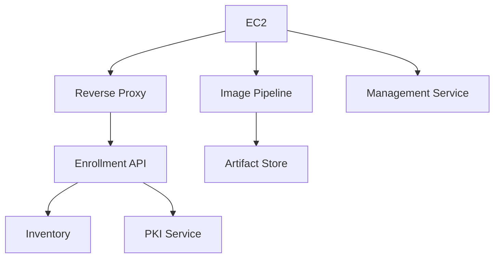

### Components

  -------------------------------------------------------------------------
  Component               Purpose                   First PoC
                                                    Implementation
  ----------------------- ------------------------- -----------------------
  Reverse proxy           Public HTTPS entry point  Container

  Enrollment API          Bootstrap edge devices    Small custom service

  Inventory               EDGE-ID/customer/device   File/SQLite initially
                          state                     

  PKI/CA                  Issue operational machine Self-managed CA
                          identity                  

  Image pipeline          Produce controlled Talos  Talos imager/Image
                          artifacts                 Factory workflow

  Artifact store          Serve approved            Local storage/object
                          artifacts/config          storage later

  Management tooling      Talos API operations      `talosctl` + automation

  Audit logs              Record enrollment/admin   Local structured logs
                          actions                   initially
  -------------------------------------------------------------------------

The purpose is to understand each responsibility before replacing simple
PoC components with production-grade services.

------------------------------------------------------------------------

## 24. Container Strategy

For the PoC, application/control-plane services can run as Docker
containers.

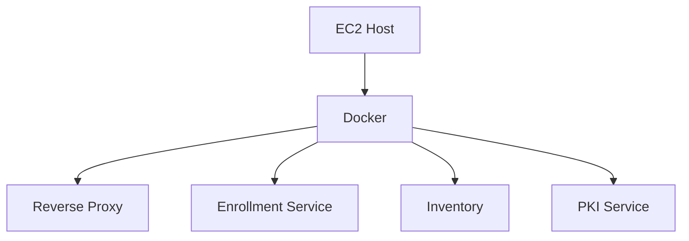

Important distinction:

**Docker is only the runtime for our control-plane services.**

It is not the security boundary for the entire architecture.

In a production design:

-   CA private keys may need stronger isolation.
-   Signing keys should not live casually inside ordinary application
    containers.
-   Public services and trust services should be separated.
-   Persistent state must be backed up.
-   Secrets need dedicated protection.

------------------------------------------------------------------------

## 25. Image Pipeline

Talos boot assets can be generated with the Talos image tooling. The PoC
should first use a normal Talos ISO and later move to controlled/custom
and Secure Boot artifacts.

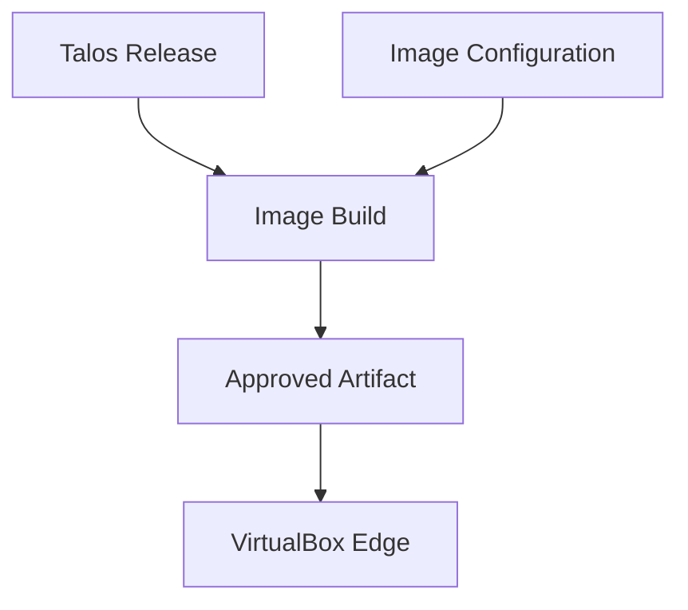

Learning progression:

1.  Boot an official Talos ISO.
2.  Understand maintenance mode.
3.  Apply a machine configuration.
4.  Install Talos to the virtual disk.
5.  Reproduce the image/configuration process.
6.  Generate controlled boot artifacts.
7.  Introduce Secure Boot artifacts.
8.  Introduce signing-key governance.

Talos supports custom boot assets through its image tooling, including
ISO, disk and Secure Boot variants. For the PoC, do not build an entire
custom Image Factory service on day one; first understand the underlying
artifact flow.

------------------------------------------------------------------------

## 26. VirtualBox EDGE Specification

Create one VM that behaves as closely as practical to a remote
appliance.

  -----------------------------------------------------------------------
  Item                                Suggested PoC Value
  ----------------------------------- -----------------------------------
  VM name                             `EDGE-001`

  Guest type                          Other Linux 64-bit

  CPU                                 2 vCPU

  RAM                                 2 GiB

  Disk                                32 GiB dynamically allocated

  Firmware                            UEFI where supported

  NIC                                 NAT initially

  Installation media                  Talos ISO

  SSH                                 None

  Management                          Talos API

  Kubernetes role                     Start with
                                      single-node/control-plane lab if
                                      Kubernetes is required
  -----------------------------------------------------------------------

The VirtualBox NAT network is useful because the EDGE can initiate
Internet traffic while EC2 cannot directly initiate connections to the
VM.

That reproduces an important customer-edge constraint.

------------------------------------------------------------------------

## 27. What Goes on EDGE-001 Initially

For the first learning phase:

``` text
EDGE-001
├── Talos boot artifact
├── virtual disk
├── network via DHCP/NAT
├── bootstrap control-plane URL
└── minimal bootstrap information
```

Later phases add:

``` text
EDGE-001
├── signed Talos boot artifact
├── Secure Boot trust
├── TPM-backed protection
├── unique EDGE identity
└── controlled enrollment state
```

------------------------------------------------------------------------

## 28. What Must NOT Be Preloaded

The factory/VM image must not become a copy of the control plane.

Do not embed:

-   Cluster CA private keys.
-   Platform root CA private key.
-   Image-signing private key.
-   Administrator `talosconfig`.
-   Administrator Kubernetes kubeconfig.
-   AWS IAM access keys.
-   Database administrative credentials.
-   Production application secrets.
-   Fleet-wide administrative private keys.
-   Long-lived shared root credentials.

The rule remains:

> Give the edge enough information to find and bootstrap with the
> platform, but not enough privilege to administer the platform.

------------------------------------------------------------------------

## 29. PoC Phases

### Phase 0 --- Foundation

Goal: prove EC2 and EDGE are truly separate systems.

**Status:** IN PROGRESS

**Execution rule:** Complete and verify one step before starting the
next. Record commands, evidence and decisions without storing secrets,
private keys, public IP addresses or administrator credentials in Git.

Build:

-   EC2.
-   Elastic IP/DNS.
-   Docker.
-   Git working directory.
-   HTTPS endpoint.
-   VirtualBox EDGE VM.
-   NAT networking.

Validate:

``` text
EDGE-001
   |
   | outbound HTTPS
   v
EC2 endpoint
```

Do not configure Talos trust yet.

#### Phase 0 Practical Runbook

Working files prepared for this phase:

- `PHASE-0-SETUP.md` --- EC2, administrator-workstation and EDGE-001
  specifications, required binaries and validation commands.
- `phase0-aws.tf` --- self-contained AWS configuration using profile
  `personal` in region `ap-south-1`.
- `terraform.tfvars.example` --- safe input template; copy it to the
  Git-ignored `terraform.tfvars` before planning.
- `setup-wsl.sh` --- installs Terraform, AWS CLI v2, Git, OpenSSH and
  `talosctl` inside Ubuntu WSL.
- `.gitignore` --- excludes Terraform state/plans, credentials and
  generated administrative configurations.

- [x] **0.1 --- Inventory and prerequisites:** Confirm the administrator
  workstation, AWS access, EC2 target region, public DNS choice,
  VirtualBox version and available CPU/RAM/disk.
- [x] **0.2 --- Create EC2:** Launch a clean Ubuntu LTS instance with a
  stable public endpoint and an administrator-only SSH path.
- [x] **0.3 --- Restrict ingress:** Permit TCP 22 only from the
  administrator public IP and TCP 443 for the PoC; keep all other
  inbound ports closed.
- [x] **0.4 --- Prepare EC2:** Patch the host, install Docker and Git,
  create the PoC working directory and confirm Docker operation.
- [x] **0.5 --- Publish HTTPS endpoint:** Run a minimal containerized
  endpoint behind TLS and verify its certificate and response.
- [x] **0.6 --- Create EDGE-001:** Create the VirtualBox VM with UEFI,
  one NAT NIC and a blank virtual disk. Do not add bridged or
  host-forwarded management access.
- [ ] **0.7 --- Prove network separation:** Record the EC2 network and
  EDGE private/NAT network, confirming that EC2 has no route to the
  EDGE private address.
- [ ] **0.8 --- Prove outbound HTTPS:** From the EDGE-side network,
  connect to the public HTTPS endpoint and capture the corresponding
  server access log.
- [ ] **0.9 --- Phase review:** Validate all Phase 0 acceptance criteria
  and answer the five architecture learning questions in Section 34.

#### Phase 0 Evidence Log

| Step | Status | Evidence / Decision |
| --- | --- | --- |
| 0.1 | Complete | Ubuntu WSL 2 verified with Terraform 1.16.3, AWS CLI 2.36.49, Git 2.43.0, OpenSSH 9.6p1 and `talosctl` 1.13.4. AWS profile `personal` is authorized; target region is `ap-south-1`. |
| 0.2 | Complete | Ubuntu 24.04 LTS EC2 created with encrypted 60 GiB gp3 root disk, Elastic IP and SSM status `Online`. |
| 0.3 | Complete | Inbound rules verified: TCP 22 restricted to the administrator `/32`; TCP 443 open for the Phase 0 edge test; no additional inbound rules. |
| 0.4 | Complete | Cloud-init completed without fatal errors. Docker service is active, the `ubuntu` user has Docker-group access, `hello-world` ran successfully and Git is installed. Recoverable IPv6 IMDS probe warnings were accepted for the IPv4-only PoC VPC. |
| 0.5 | Complete | Caddy HTTPS endpoint verified at edge-poc.npanda.online; Docker and Caddy are active on the control host. |
| 0.6 | Complete | EDGE-001 created in VirtualBox 7.2.18 with 2 vCPU, 2 GiB RAM, 32 GiB dynamic VDI, EFI firmware and one NAT NIC. Talos v1.13.4 ISO checksum verified before use. |
| 0.7 | Pending | |
| 0.8 | Pending | |
| 0.9 | Pending | |

------------------------------------------------------------------------

### Phase 1 --- Talos Fundamentals

Goal: understand Talos before automating it.

Learn:

-   ISO boot.
-   Maintenance mode.
-   Talos API.
-   `talosctl`.
-   Machine configuration.
-   Installation to disk.
-   Talos PKI.
-   `talosconfig`.

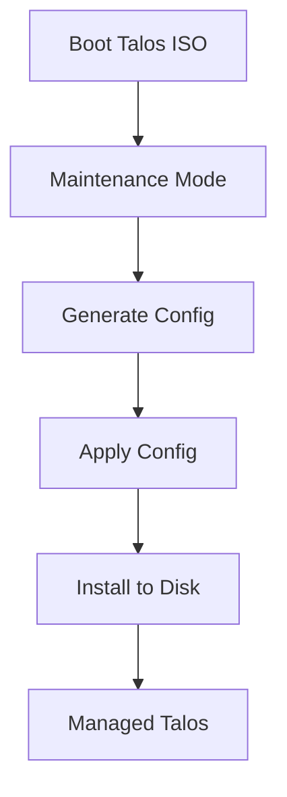

At this phase manual operations are intentional. We need to understand
the primitive before automating it.

------------------------------------------------------------------------

### Phase 2 --- Build Enrollment Service

Goal: replace manual discovery with a central bootstrap workflow.

The edge should be able to tell the platform:

``` text
I have booted.
I am requesting enrollment.
Here is my bootstrap identity.
```

The service maintains states such as:

``` text
NEW
  ↓
ENROLLING
  ↓
APPROVED
  ↓
CONFIGURED
  ↓
ACTIVE
```

The first implementation can use a simple API and SQLite. The objective
is understanding the protocol and trust boundaries, not building a large
enterprise application.

------------------------------------------------------------------------

### Phase 3 --- Per-Device Identity

Goal: remove dependence on a fleet-wide bootstrap secret.

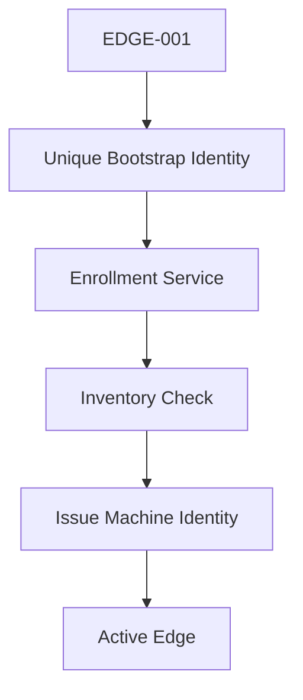

Learn:

-   Device identity.
-   Public/private keys.
-   CSR.
-   CA.
-   Certificate issuance.
-   Rotation.
-   Revocation.
-   Bootstrap identity versus operational identity.

------------------------------------------------------------------------

### Phase 4 --- Outbound Management Channel

Goal: manage a node that remains behind customer NAT.

Do not solve this by exposing the VirtualBox VM directly to the
Internet.

Study and implement an outbound secure channel such as WireGuard or
another mutually authenticated tunnel architecture.

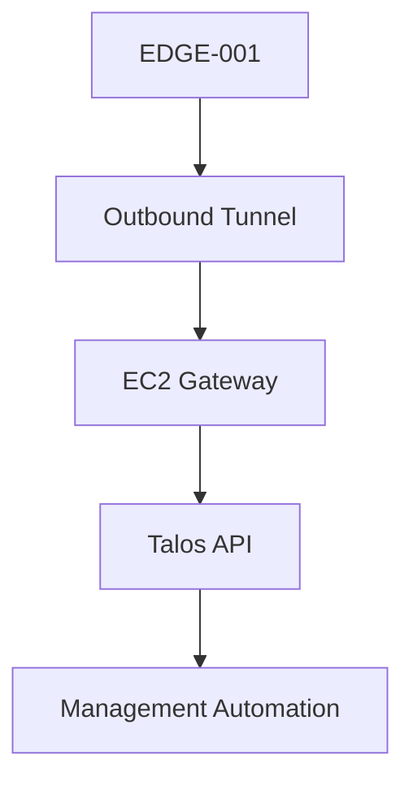

This phase converts the lab from a local Talos exercise into a realistic
remote-edge architecture.

------------------------------------------------------------------------

### Phase 5 --- Secure Boot

Goal: make the boot chain controlled.

Learn:

-   UEFI.
-   UKI.
-   Signing key.
-   Verification certificate/public trust.
-   Signed Talos artifact.
-   Secure Boot state.
-   Upgrade signing.

``` mermaid
flowchart TD
    A[Build Artifact]
    B[Sign Artifact]
    C[EDGE UEFI]
    D[Verify Signature]
    E[Boot Talos]

    A --> B
    B --> C
    C --> D
    D --> E
```

VirtualBox is useful for the broader Talos lab, but Secure Boot behavior
must be validated against the capabilities of the installed VirtualBox
version. If the virtualization platform prevents a faithful experiment,
keep the same control-plane PoC and move only this phase to a VM
platform or physical device with suitable UEFI Secure Boot support.

------------------------------------------------------------------------

### Phase 6 --- TPM Protection

Goal: understand hardware-bound local protection.

Learn:

-   TPM 2.0.
-   PCRs.
-   LUKS2.
-   TPM-bound disk keys.
-   Secure Boot/PCR relationship.
-   What happens when boot state changes.

Talos supports TPM-based disk encryption and can bind LUKS2 key material
to PCR policy.

``` mermaid
flowchart TD
    A[Secure Boot State]
    B[TPM PCR]
    C[Protected Disk Key]
    D[Unlock STATE]
    E[Start Talos]

    A --> B
    B --> C
    C --> D
    D --> E
```

As with Secure Boot, if VirtualBox cannot provide the required TPM
behavior accurately, move this phase to a suitable TPM-capable
virtualization environment or physical edge hardware.

------------------------------------------------------------------------

### Phase 7 --- Image and Upgrade Pipeline

Goal: treat the appliance as replaceable/versioned infrastructure.

``` mermaid
flowchart TD
    A[Git Change]
    B[Build Image]
    C[Sign]
    D[Test]
    E[EDGE Canary]
    F[Health Check]
    G[Promote]

    A --> B
    B --> C
    C --> D
    D --> E
    E --> F
    F --> G
```

Learn:

-   Reproducible artifacts.
-   Version pinning.
-   Signing.
-   Canary rollout.
-   Rollback.
-   Upgrade policy.
-   Auditability.

------------------------------------------------------------------------

## 30. What This PoC Will Teach

This two-machine lab covers most of the architectural concepts we have
discussed:

  Concept                                                Covered?
  --------------------------- -----------------------------------
  Talos boot/install                                          Yes
  Maintenance mode                                            Yes
  Talos API                                                   Yes
  Talos PKI                                                   Yes
  No-SSH operations                                           Yes
  Customer NAT boundary                                       Yes
  Outbound bootstrap                                          Yes
  Enrollment workflow                                         Yes
  Device inventory                                            Yes
  Per-device identity                                         Yes
  Certificate lifecycle                                       Yes
  Secure management tunnel                                    Yes
  Image pipeline                                              Yes
  Upgrade lifecycle                                           Yes
  Secure Boot concepts                                        Yes
  TPM concepts                                                Yes
  TPM remote attestation                                  Not yet
  1,000-node scale behavior                       Simulated later
  Real hardware TPM quirks      Requires real hardware eventually

This is therefore a strong learning PoC for Track 2.

------------------------------------------------------------------------

## 31. Deliberately Out of Scope Initially

Do not add these until the basic trust chain works:

-   Omni.
-   Paid fleet managers.
-   Remote TPM attestation.
-   Multi-region HA.
-   Kubernetes-based control plane.
-   Complex microservices.
-   Large external databases.
-   Kafka.
-   Service mesh.
-   Full observability stack.
-   1,000 VMs.
-   Production HSM integration.

First prove one EDGE securely.

Then automate ten.

Then reason about one thousand.

------------------------------------------------------------------------

## 32. First Milestone

The first concrete milestone is intentionally small:

``` mermaid
flowchart TD
    A[Create EC2]
    B[Install Docker]
    C[Expose HTTPS]
    D[Create EDGE-001]
    E[Boot Talos ISO]
    F[EDGE Calls EC2]
    G[Observe Request]

    A --> B
    B --> C
    C --> D
    D --> E
    E --> F
    F --> G
```

### Success Criteria

Milestone 1 is complete when:

1.  EC2 was created from scratch.
2.  Only required Security Group ports are open.
3.  A containerized HTTPS bootstrap endpoint is running.
4.  `EDGE-001` boots Talos in VirtualBox.
5.  EDGE networking works through NAT.
6.  The EDGE can initiate a request to the EC2 endpoint.
7.  EC2 does not require inbound connectivity to the customer's private
    EDGE address.
8.  We can explain every component involved.

After this milestone, we move to **bootstrap identity and enrollment**.

------------------------------------------------------------------------

## 33. Repository Structure

Use a simple repository so every learning step becomes reproducible.

``` text
track-2-poc/
├── README.md
├── docs/
│   ├── architecture.md
│   ├── trust-model.md
│   └── threat-model.md
├── ec2/
│   ├── setup/
│   ├── docker/
│   └── security/
├── enrollment/
│   ├── api/
│   ├── inventory/
│   └── pki/
├── images/
│   ├── talos/
│   └── secureboot/
├── edge/
│   ├── EDGE-001/
│   └── configs/
├── scripts/
├── tests/
└── audit/
```

Keep secrets, private keys, generated `talosconfig`, kubeconfig and
credentials outside Git.

------------------------------------------------------------------------

## 34. Learning Rule

For every PoC phase, answer five questions before moving on:

``` text
1. What problem are we solving?
2. What component solves it?
3. What trust does that component require?
4. What happens if it is compromised?
5. How will this work for 1,000 edges?
```

This keeps the PoC focused on architecture rather than merely getting
commands to work.

------------------------------------------------------------------------

## 35. Immediate Next Step

Start with **Phase 0 + Phase 1** only.

Do not build the enrollment service yet.

First establish:

**EC2 endpoint + VirtualBox networking + Talos maintenance mode + Talos
API fundamentals.**

Once those are understood, the enrollment service will have a clear
purpose instead of becoming an unexplained custom component.


### Practical PoC Checkpoint — Control Host Recovery

- Control host: `track-2-poc-control`
- EC2: `i-046a5eabd05b9b01e`
- Region: `ap-south-1`
- Administration verified through AWS Systems Manager Session Manager.
- Docker verified active.
- Caddy verified active.
- `edge-poc.npanda.online` resolves to the control-host Elastic IP.
- HTTPS bootstrap endpoint verified.
- Terraform state recovered from the original workstation and transferred securely to the personal workstation.
- Terraform state remains local and is excluded from Git.
- EC2 public-IP association drift is ignored to prevent unintended replacement.
- Existing EC2 key-pair public-key drift is ignored; SSM is the preferred administration path.
- Port 80 is represented in Terraform for Caddy ACME/HTTPS redirect.
- Final Terraform plan: **No changes**.
- No infrastructure replacement or destructive Terraform operation was performed.


### Practical PoC Checkpoint — EDGE-001 Talos Bootstrap

**Status: COMPLETE**

EDGE-001 has progressed from a blank VirtualBox VM to a healthy single-node Talos Kubernetes control plane.

#### Verified build

- VirtualBox: 7.2.18.
- VM: EDGE-001.
- CPU: 2 vCPU.
- RAM: 2 GiB.
- Disk: 32 GiB dynamically allocated VDI.
- Firmware: EFI.
- Network: VirtualBox NAT.
- Talos: v1.13.4.
- Kubernetes: v1.36.1.
- Talos installation disk: /dev/sda.
- Talos node address inside VirtualBox NAT: 10.0.2.15.
- Node role: controlplane.
- Cluster: track-2-poc.
- Final Talos state: **Running / Ready**.
- Kubernetes node: **Ready**.
- etcd, kube-apiserver, kube-controller-manager, kube-scheduler and kubelet verified healthy.
- CoreDNS, Flannel and kube-proxy verified Running.

#### Lab access path

WSL uses local socat listeners for 10.0.2.15 and forwards traffic through the Windows/WSL gateway to VirtualBox NAT. VirtualBox forwards TCP 50000 for the Talos API and TCP 6443 for the Kubernetes API.

This preserves 10.0.2.15 as the client destination so Talos certificate SAN validation succeeds. Connecting directly through the changing WSL/Windows gateway address caused certificate validation failures.

This is a **lab-access workaround**, not the intended production remote-edge management architecture. A later phase will establish an outbound, mutually authenticated management path suitable for customer NAT boundaries.

#### Talos bootstrap sequence learned

Official Talos ISO -> Maintenance Mode -> Talos API -> Generate machine configuration -> Apply control-plane configuration -> Install to /dev/sda -> Detach ISO -> Boot from disk -> Authenticated Talos API -> Bootstrap etcd once -> Kubernetes control plane -> Node Ready.

#### Critical troubleshooting lesson — installation media

The main failure was not PKI or Kubernetes. Talos had successfully installed to /dev/sda, but VirtualBox continued booting from the ISO. Talos reported that it was already installed to disk but had booted from another media and requested a reboot from disk.

Because the node was still running from installation media, it remained in Booting and produced misleading API/TLS symptoms.

Resolution:

1. Power off EDGE-001.
2. Detach the Talos ISO.
3. Change the first boot device to the virtual hard disk.
4. Boot the VM again.
5. Verify the node identifies itself as controlplane.
6. Verify authenticated Talos API access.
7. Bootstrap etcd exactly once.

**Architecture lesson:** when a Talos node has been installed but does not progress normally, verify the boot source before debugging higher layers such as PKI, etcd or Kubernetes.

#### PKI lesson

- controlplane.yaml and talosconfig belong to the same generated trust set.
- Regenerating only the administrative client configuration can create a CA/client identity that does not match the machine configuration already applied to the node.
- Generated talosconfig, kubeconfig and machine secrets remain outside Git.

#### Final validation

- Authenticated Talos API returned client and server v1.13.4 with RBAC enabled.
- Kubernetes node talos-jk6-ckg is Ready with role control-plane, Kubernetes v1.36.1 and internal IP 10.0.2.15.
- kube-system control-plane pods, CoreDNS, Flannel and kube-proxy were Running.

#### Current learning checkpoint

We have now proven Talos ISO boot and maintenance mode, disk discovery, machine configuration, installation to disk, Talos PKI/authenticated API access, no-SSH administration, single-node etcd bootstrap, Kubernetes control-plane startup, and VirtualBox NAT behavior.

Next: complete the remaining Phase 0 network-separation/outbound-HTTPS evidence, then move from local NAT forwarding to the Track-2 secure EDGE-to-control-plane connectivity/enrollment design.

#### Errors Encountered and Troubleshooting Runbook

| Symptom / Error | Root cause | Fix | Lesson |
| --- | --- | --- | --- |
| Talos stayed in `Booting`; node type/cluster initially appeared incomplete | Talos was already installed to the VDI, but VirtualBox kept booting from the installation ISO. Talos intentionally halted normal installed-node startup. | Power off the VM, detach the ISO, set the VDI as the first boot device, then boot again. | Verify the actual boot source before debugging PKI, etcd or Kubernetes. |
| Talos log reported that Talos was already installed but booted from another media | Same installation-media problem above; `talos.halt_if_installed` protected the installed system. | Detach installation media and boot from disk. | Treat console/log evidence as the source of truth instead of assuming a TLS or configuration problem. |
| Direct WSL connection to Talos address `10.0.2.15:50000` timed out | `10.0.2.15` belongs to the VirtualBox NAT network and is not directly routed from WSL. | Add VirtualBox NAT forwarding for TCP 50000 and forward a local WSL listener through the Windows/WSL gateway using `socat`. | VirtualBox NAT provides outbound connectivity but does not make the guest address directly reachable from WSL. |
| Talos TLS validation failed when connecting through the Windows/WSL gateway address | The gateway address was not a SAN in the Talos server certificate, and the WSL gateway can change after restart. | Keep `10.0.2.15` as the Talos client destination and use a local loopback alias plus `socat` to carry the connection through the gateway. | Do not add an unstable workstation/NAT address to long-lived node identity merely to work around lab routing. |
| Fresh `talosconfig` could not authenticate to a machine configured with an earlier generated configuration | Talos machine configuration and administrative client configuration were generated from different PKI sets. | Regenerate a consistent configuration set and apply the matching control-plane configuration while still in the appropriate maintenance/bootstrap state. | Treat generated Talos machine configs and `talosconfig` as one trust set. |
| `kubectl` returned `dial tcp 10.0.2.15:6443: connect: connection refused` even though the Talos console showed the API server healthy | The WSL `socat` listener for Kubernetes TCP 6443 was no longer running. Only the Talos API listener on 50000 remained active. | Recreate the 6443 `socat` listener and verify it with `nc -vz 10.0.2.15 6443` before retrying `kubectl`. | Separate application health from access-path health. A healthy Kubernetes API can still be unreachable when a local lab proxy has stopped. |
| Talos health reached Kubernetes checks but could not initially reach `10.0.2.15:6443` | Talos API forwarding existed for 50000, but the Kubernetes API needed its own 6443 forwarding path. | Configure VirtualBox NAT forwarding and the WSL `socat` listener for 6443 as well. | Talos API and Kubernetes API are separate endpoints and both require connectivity. |

#### Lab Connectivity Troubleshooting Flow

```mermaid
---
title: EDGE Lab Access Path
---
flowchart LR
    A[WSL Tools] -->|10.0.2.15:50000 or 6443| B[socat]
    B -->|Windows gateway| C[VirtualBox NAT]
    C -->|Port forward| D[EDGE-001]
    D --> E[Talos API :50000]
    D --> F[Kubernetes API :6443]
```

When access fails, troubleshoot from left to right:

1. Verify EDGE-001 is **Running / Ready** from the Talos console.
2. Verify VirtualBox NAT forwarding still contains TCP 50000 and 6443.
3. Verify WSL listeners with `ss -lntp | grep -E ':50000|:6443'`.
4. Verify TCP access with `nc -vz 10.0.2.15 50000` and `nc -vz 10.0.2.15 6443`.
5. Only after the network path is healthy, investigate Talos authentication or Kubernetes.

#### Important: socat Is Ephemeral

The WSL loopback alias and `socat` processes are **lab runtime state**. They do not survive all WSL restarts.

After restarting WSL, recreate the local access path when required:

```bash
WIN_IP=$(ip route | awk '/default/ {print $3}')

ip addr show dev lo | grep -q '10.0.2.15/32' || \
  sudo ip addr add 10.0.2.15/32 dev lo

socat TCP-LISTEN:50000,bind=10.0.2.15,reuseaddr,fork \
  TCP:${WIN_IP}:50000 >/tmp/talos-50000.log 2>&1 &

socat TCP-LISTEN:6443,bind=10.0.2.15,reuseaddr,fork \
  TCP:${WIN_IP}:6443 >/tmp/talos-6443.log 2>&1 &
```

Verify before using `talosctl` or `kubectl`:

```bash
ss -lntp | grep -E ':50000|:6443'
nc -vz 10.0.2.15 50000
nc -vz 10.0.2.15 6443
```

These proxies are intentionally a **local PoC workaround**. They must not become the production design for EDGE-to-AWS management connectivity.

#### Screenshot / Visual Evidence

The interactive troubleshooting session used Talos console screenshots to confirm the transition from the failed boot state to the healthy state. Those chat screenshots are not stored as repository assets, so the repository does not currently embed them. The Mermaid access-path diagram above is the durable, source-controlled visual representation.

If screenshots are added later, store only sanitized images under a documentation assets directory and ensure they contain no credentials, private keys, tokens or sensitive infrastructure data.
