# Track 2 Deep Dive --- Secure Zero-Touch Talos Edge

## Goal

Understand how 100--1,000 customer-premise Talos edge nodes can be
prepared centrally, shipped cold, powered on by a customer, establish
trust across the Internet, and then be managed securely without SSH.

This README focuses on the trust chain:

**Factory → Boot Artifact → Secure Boot → TPM → Customer → Internet →
Enrollment → Attestation → Machine Identity → Day-2 Operations**

------------------------------------------------------------------------

## 1. The Track-2 Mental Model

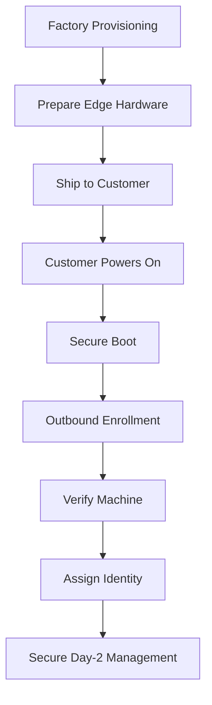

The important architectural property is that the customer edge can sit
behind NAT/firewalls and initiate outbound management connectivity. The
central platform should not depend on exposing SSH on the edge.

------------------------------------------------------------------------

## 2. What Is a UKI?

**UKI = Unified Kernel Image.**

A UKI packages important early-boot components into a single EFI
executable. Conceptually this can include the Linux kernel, initramfs,
kernel command line and OS metadata.

### UKI Boot Model

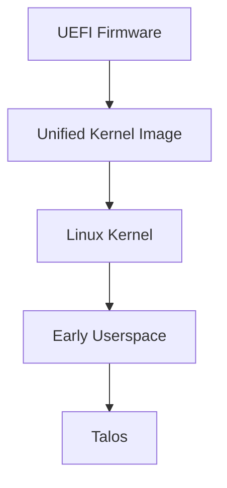

UKI and Secure Boot solve different problems:

-   **UKI:** packages the boot components.
-   **Secure Boot:** determines whether an EFI executable is trusted to
    execute.

------------------------------------------------------------------------

## 3. Secure Boot Infrastructure

The private signing key belongs in controlled signing infrastructure,
not on every edge machine.

### Secure Boot Chain

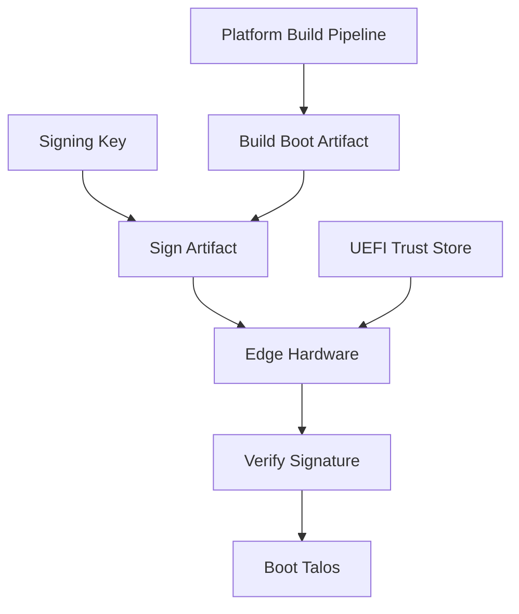

Conceptually:

``` text
Secure Build Environment
        |
        | private signing key
        v
   Sign boot artifact
        |
        v
   Edge hardware
        |
        | verifies against trusted key
        v
      Boot
```

The edge contains the **trust information needed to verify signatures**,
not the central private signing key.

Secure Boot answers:

> **"Is this software allowed to execute?"**

It does not by itself prove the running state to the remote data center.

------------------------------------------------------------------------

## 4. Secure Boot vs Measured Boot

These are related but different controls.

``` text
Secure Boot
    ↓
May this software execute?

Measured Boot
    ↓
What participated in the boot process?

Remote Attestation
    ↓
Can the machine prove that state remotely?
```

This distinction leads to the TPM.

------------------------------------------------------------------------

## 5. TPM Fundamentals

A **TPM --- Trusted Platform Module** provides hardware-backed
cryptographic capabilities.

For this architecture, think about three uses:

1.  Protect cryptographic keys.
2.  Record boot measurements in PCRs.
3.  Produce evidence that can be verified remotely.

A TPM should not be thought of simply as a tiny USB drive containing
certificates.

------------------------------------------------------------------------

## 6. PCR Measurements

**PCR = Platform Configuration Register.**

PCRs hold cryptographic state derived from measurements taken during
boot.

They do not contain copies of the firmware, kernel or UKI.

### Measured Boot

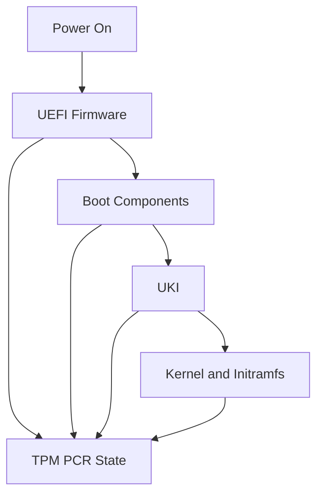

Conceptually, measurements are extended:

``` text
New PCR =
HASH(
    Previous PCR
    +
    New Measurement
)
```

Therefore a changed measured boot chain can produce a different final
PCR state.

------------------------------------------------------------------------

## 7. Remote Attestation

Secure Boot happens locally. Attestation allows a remote system to
evaluate evidence about the machine.

### TPM Remote Attestation

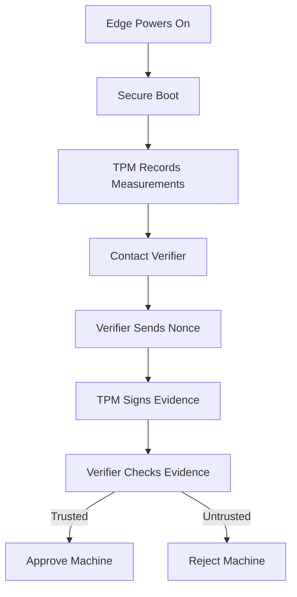

Typical infrastructure:

  -----------------------------------------------------------------------
  Component               Location                Purpose
  ----------------------- ----------------------- -----------------------
  TPM 2.0                 Edge hardware           Hardware-backed keys
                                                  and PCR state

  PCRs                    TPM                     Boot measurements

  Attestation key         TPM-backed              Signs attestation
                                                  evidence

  Attestation agent       Edge                    Exchanges evidence with
                                                  verifier

  Verifier                Data center/cloud       Evaluates evidence

  Attestation policy      Data center/cloud       Defines acceptable
                                                  states

  Identity/CA service     Data center/cloud       Grants operational
                                                  identity after approval

  Inventory               Data center/cloud       Maps hardware to
                                                  customer/site/role
  -----------------------------------------------------------------------

------------------------------------------------------------------------

## 8. Why the Nonce Matters

The verifier can send a fresh random challenge.

``` text
EDGE                              VERIFIER

Enrollment request  ------------>

                    <------------ Fresh nonce

TPM signs:
nonce + evidence

Signed evidence     ------------>

                         Verify signature
                         Verify freshness
                         Evaluate policy
```

The nonce helps prevent an attacker from replaying previously captured
valid evidence.

------------------------------------------------------------------------

## 9. Attestation During Upgrades

A legitimate Talos/boot artifact upgrade changes the measured software
and therefore may change expected measurements.

The verifier must understand which states are currently approved.

### Controlled Upgrade Trust

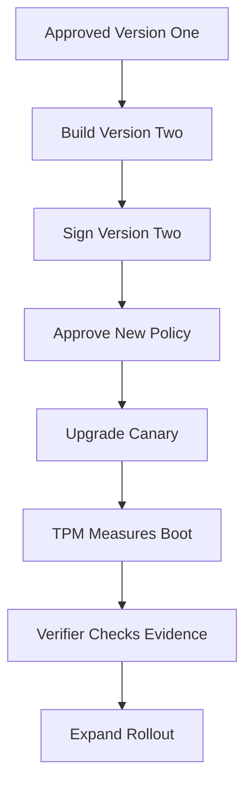

During rollout:

``` text
Version 1  → Approved
Version 2  → Approved
Unknown    → Reject
```

After migration, old states can be removed according to rollback and
lifecycle policy.

The key lesson is that **image rollout and attestation policy rollout
must be coordinated**.

------------------------------------------------------------------------

## 10. TPM-Bound Identity and Anti-Cloning

The desired security property is:

> **EDGE-347's identity belongs to the intended hardware, not merely to
> a copyable SSD.**

### Hardware-Bound Identity

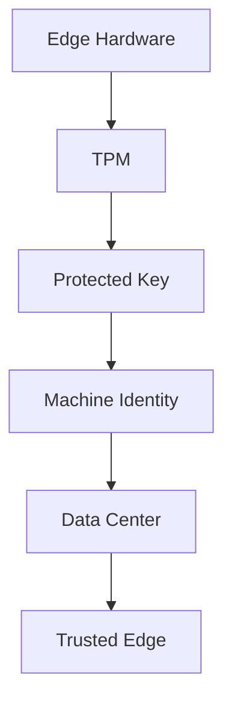

A cloned disk placed into different hardware should not automatically
reproduce a hardware-bound private identity.

Conceptually:

``` text
Original device
TPM-A + SSD
    ↓
Expected hardware identity

Cloned SSD
    ↓
Different TPM-B
    ↓
Cannot simply reproduce TPM-A proof
    ↓
Verification should fail
```

Where strong anti-cloning is required, avoid relying solely on
exportable device private keys stored on disk.

------------------------------------------------------------------------

## 11. TPM and Disk Encryption

TPM-backed protection can also be used as part of disk encryption
policy.

Conceptually:

``` text
Secure Boot
     ↓
Expected platform state
     ↓
TPM-backed key release
     ↓
Encrypted storage available
     ↓
Talos starts
```

Disk encryption and remote attestation solve different problems:

-   **Disk encryption:** protects data at rest.
-   **Attestation:** provides evidence about platform state to another
    system.

------------------------------------------------------------------------

## 12. EK, AK, PCR and Machine Certificate

These concepts should remain separate.

  -----------------------------------------------------------------------
  Item                    Mental model            Purpose
  ----------------------- ----------------------- -----------------------
  EK                      TPM foundational        Establish TPM
                          identity                provenance/identity

  AK                      Attestation signing     Sign attestation
                          identity                evidence

  PCR                     Boot-state measurements Represent measured
                                                  platform state

  Machine certificate     Operational identity    Authenticate EDGE-347
                                                  during normal operation
  -----------------------------------------------------------------------

### Identity Chain

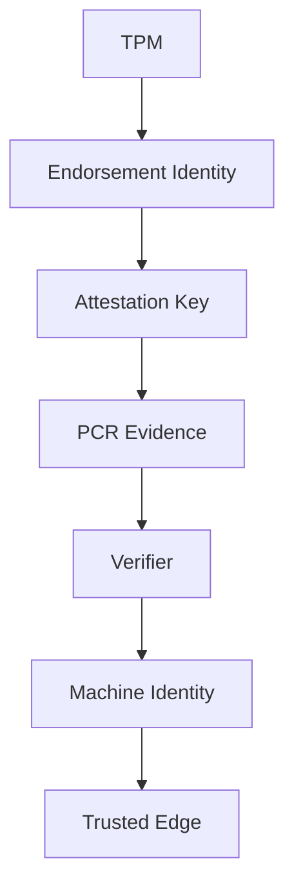

The operational machine certificate does not need to be the same thing
as the TPM's endorsement or attestation identity.

------------------------------------------------------------------------

## 13. Factory Trust

For zero-touch deployment, the data center needs a reason to associate a
newly arriving machine with the device that was prepared and shipped.

Factory inventory can provide that binding.

Example:

``` text
Asset       EDGE-347
Customer    Customer-ABC
Hardware    Edge-Type-A
TPM         Expected TPM identity
Image       Approved Talos profile
Status      Ready to ship
```

### Factory Trust Chain

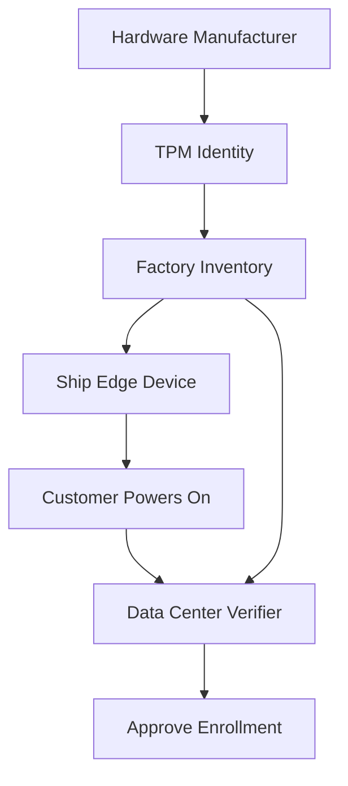

At enrollment, two forms of information meet:

``` text
Factory knowledge
       +
Runtime cryptographic proof
       ↓
Central verification
       ↓
Operational identity
```

------------------------------------------------------------------------

## 14. Who Provides What?

Talos, Omni, TPM hardware and your own platform have different
responsibilities.

  ---------------------------------------------------------------------
  Layer                              Responsibility
  ---------------------------------- ----------------------------------
  Talos                              Immutable/API-managed OS, Talos
                                     PKI, Secure Boot-related
                                     capabilities, TPM-backed storage
                                     capabilities

  Omni                               Fleet enrollment/connectivity and
                                     centralized Talos/Kubernetes
                                     lifecycle

  TPM/UEFI                           Hardware root-of-trust primitives,
                                     protected keys, Secure Boot
                                     support and measurements

  Your platform                      Inventory, customer mapping,
                                     policy, approvals, rollout
                                     governance

  Attestation system                 Evaluates TPM/platform evidence
                                     against an approved policy
  ---------------------------------------------------------------------

Do not assume:

``` text
Talos + Omni = complete TPM remote-attestation platform
```

Remote hardware attestation is a separate architectural requirement that
may require additional infrastructure and integration.

------------------------------------------------------------------------

## 15. Three Security Levels

Not every edge deployment needs the maximum design immediately.

### Edge Trust Levels

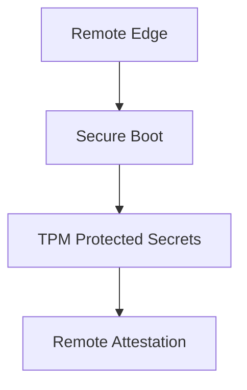

### Level 1 --- Secure Boot

Goal:

> Prevent unauthorized boot software from being accepted by the
> configured Secure Boot trust chain.

Good baseline for controlled edge appliances.

### Level 2 --- TPM-Backed Protection

Goal:

> Make sensitive local material harder to extract or clone from stolen
> storage/hardware.

Useful when devices live at customer premises.

### Level 3 --- Remote Attestation

Goal:

> Require the remote device to prove an acceptable hardware/software
> state before receiving sensitive production access.

Useful when:

-   Physical environment is not trusted.
-   Strong anti-cloning is required.
-   Secrets must be withheld from modified devices.
-   Compliance requires measured-boot evidence.
-   Central systems need evidence of device state before authorization.

------------------------------------------------------------------------

## 16. Practical Track-2 Architecture

For many edge deployments, start by designing Levels 1 and 2 well.

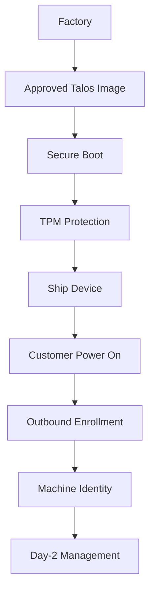

Then introduce remote attestation only when the threat model or
compliance requirement justifies the additional infrastructure.

------------------------------------------------------------------------

## 17. Day-2 Operations

After enrollment, the model changes from bootstrap trust to operational
identity.

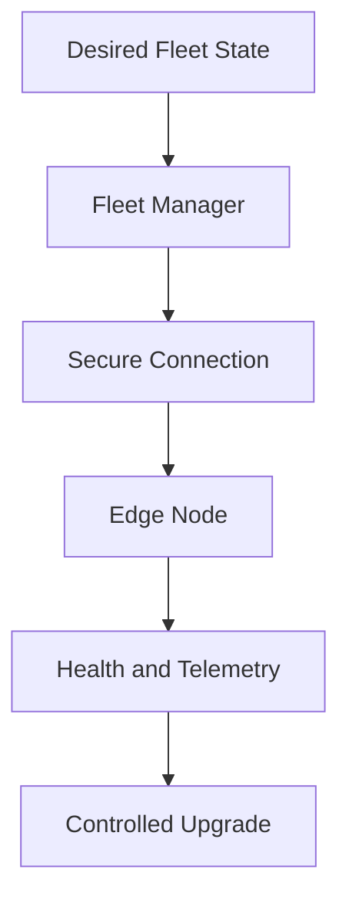

Day-2 principles:

-   No SSH dependency.
-   Use machine/operator cryptographic identity.
-   Maintain desired configuration centrally.
-   Upgrade using tested images.
-   Roll out through lab and canary rings.
-   Monitor health before expanding rollout.
-   Rotate credentials according to policy.
-   Replace/reimage failed nodes rather than manually repairing OS
    drift.
-   Keep application persistence independent of disposable OS state.

------------------------------------------------------------------------

## 18. Complete Trust Story

The full high-assurance model can now be read as:

``` text
Factory inventory
       ↓
Approved boot artifact
       ↓
Signed boot chain
       ↓
Secure Boot
       ↓
TPM measurements
       ↓
Customer network
       ↓
Outbound enrollment
       ↓
Remote attestation
       ↓
Verify device + state
       ↓
Issue operational identity
       ↓
Talos / Omni management
       ↓
Controlled Day-2 lifecycle
```

------------------------------------------------------------------------

## 19. Questions Still to Design

Before calling Track 2 production-ready, decide:

1.  What exactly is provisioned at the factory?
2.  What secrets, if any, may exist before shipment?
3.  How does the edge discover the central endpoint?
4.  Is Omni enrollment sufficient for the threat model?
5.  Is Secure Boot required?
6.  Is TPM-backed disk protection required?
7.  Is hardware remote attestation actually required?
8.  How is factory inventory bound to a customer?
9.  What happens when a device is stolen?
10. What happens when a motherboard/TPM is replaced?
11. How are enrollment credentials rotated?
12. How are old boot measurements retired during upgrades?
13. How does a device recover when it cannot contact management?
14. What is the break-glass procedure?
15. How is a decommissioned device cryptographically revoked?

------------------------------------------------------------------------

## 20. Decision: Build a Real Track-2 PoC

We will now turn the architecture discussion into a working lab.

The PoC deliberately avoids Omni and any paid fleet-management
dependency.

### PoC Goal

Start with:

-   One clean AWS EC2 instance with only SSH/admin access.
-   One local Oracle VirtualBox VM representing a customer EDGE
    appliance.
-   The EDGE and EC2 are on completely separate networks.
-   The EDGE should initiate connectivity toward the public control
    plane.
-   Build the required control-plane services ourselves.
-   Learn the trust, bootstrap, PKI, Talos API, image, networking,
    Secure Boot and TPM concepts incrementally.

The final learning path is:

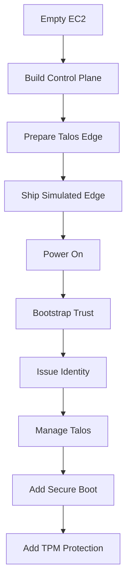

------------------------------------------------------------------------

## 21. PoC Topology

### Two Independent Networks

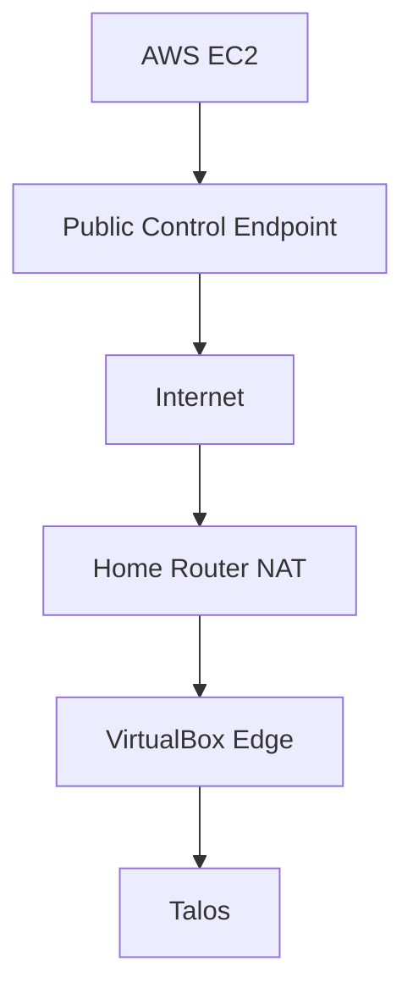

This intentionally resembles a real customer deployment:

-   EC2 represents the central data center/control plane.
-   VirtualBox represents a remote appliance.
-   The edge receives a private address locally.
-   The customer/home router performs NAT.
-   No inbound connection from AWS to the customer's LAN is assumed.
-   Bootstrap traffic is initiated by the edge.

------------------------------------------------------------------------

## 22. EC2 Control-Plane Specification

### Initial Lab Size

  Item                                   PoC Specification
  -------------------------------------- ------------------------------------------------------
  OS                                     Ubuntu LTS
  Architecture                           x86_64
  Instance                               2 vCPU / 4 GiB RAM minimum
  Preferred if building images locally   4 vCPU / 8 GiB RAM
  Root disk                              40--60 GiB gp3
  Public endpoint                        Elastic IP or stable DNS name
  Container runtime                      Docker initially
  Source control                         Git
  TLS                                    Public/server certificate for exposed HTTPS services
  Persistence                            Docker volumes initially
  Backup                                 Git for configuration + backup of CA/service state

The first PoC can use one EC2 host. Production would separate
trust-sensitive services and remove unnecessary public exposure.

### EC2 Security Group

Start with the minimum required exposure:

  -----------------------------------------------------------------------
  Port                    Source                  Purpose
  ----------------------- ----------------------- -----------------------
  TCP 22                  Administrator IP only   Initial EC2
                                                  administration

  TCP 443                 Edge networks /         Bootstrap/enrollment
                          Internet for PoC        HTTPS

  Other ports             Closed initially        Open only when a
                                                  demonstrated component
                                                  requires them
  -----------------------------------------------------------------------

Do **not** expose Docker, databases, CA administration interfaces,
registries, or Talos administrative APIs publicly just because they run
on EC2.

------------------------------------------------------------------------

## 23. What We Build on EC2

The control plane will evolve in phases rather than installing
everything immediately.

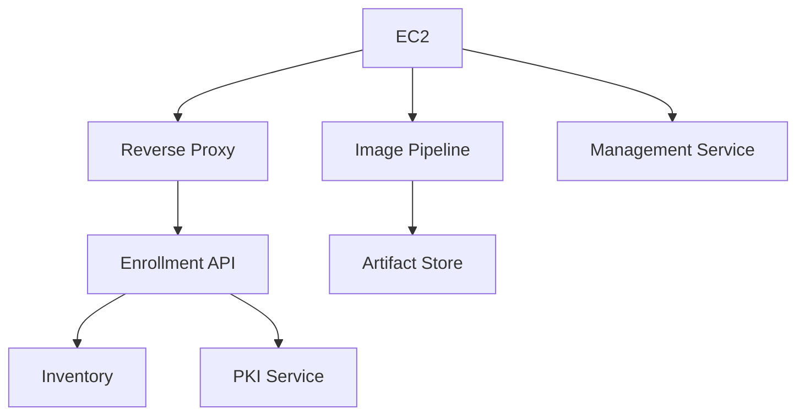

### Components

  -------------------------------------------------------------------------
  Component               Purpose                   First PoC
                                                    Implementation
  ----------------------- ------------------------- -----------------------
  Reverse proxy           Public HTTPS entry point  Container

  Enrollment API          Bootstrap edge devices    Small custom service

  Inventory               EDGE-ID/customer/device   File/SQLite initially
                          state                     

  PKI/CA                  Issue operational machine Self-managed CA
                          identity                  

  Image pipeline          Produce controlled Talos  Talos imager/Image
                          artifacts                 Factory workflow

  Artifact store          Serve approved            Local storage/object
                          artifacts/config          storage later

  Management tooling      Talos API operations      `talosctl` + automation

  Audit logs              Record enrollment/admin   Local structured logs
                          actions                   initially
  -------------------------------------------------------------------------

The purpose is to understand each responsibility before replacing simple
PoC components with production-grade services.

------------------------------------------------------------------------

## 24. Container Strategy

For the PoC, application/control-plane services can run as Docker
containers.

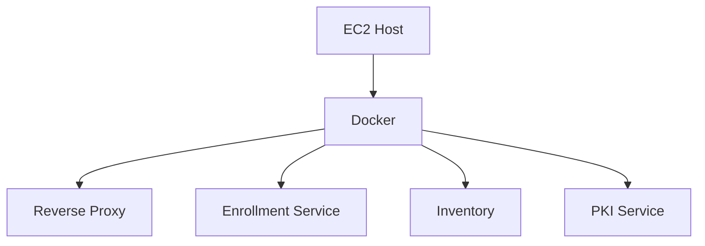

Important distinction:

**Docker is only the runtime for our control-plane services.**

It is not the security boundary for the entire architecture.

In a production design:

-   CA private keys may need stronger isolation.
-   Signing keys should not live casually inside ordinary application
    containers.
-   Public services and trust services should be separated.
-   Persistent state must be backed up.
-   Secrets need dedicated protection.

------------------------------------------------------------------------

## 25. Image Pipeline

Talos boot assets can be generated with the Talos image tooling. The PoC
should first use a normal Talos ISO and later move to controlled/custom
and Secure Boot artifacts.

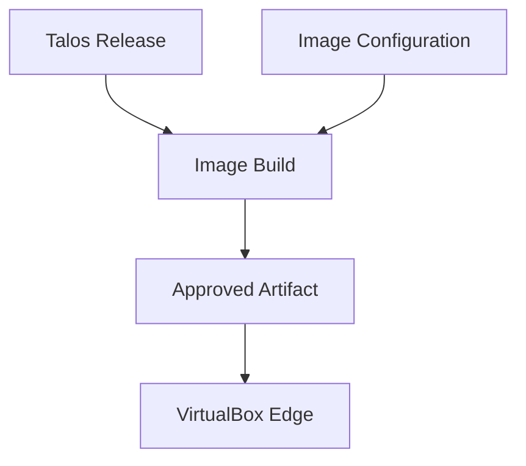

Learning progression:

1.  Boot an official Talos ISO.
2.  Understand maintenance mode.
3.  Apply a machine configuration.
4.  Install Talos to the virtual disk.
5.  Reproduce the image/configuration process.
6.  Generate controlled boot artifacts.
7.  Introduce Secure Boot artifacts.
8.  Introduce signing-key governance.

Talos supports custom boot assets through its image tooling, including
ISO, disk and Secure Boot variants. For the PoC, do not build an entire
custom Image Factory service on day one; first understand the underlying
artifact flow.

------------------------------------------------------------------------

## 26. VirtualBox EDGE Specification

Create one VM that behaves as closely as practical to a remote
appliance.

  -----------------------------------------------------------------------
  Item                                Suggested PoC Value
  ----------------------------------- -----------------------------------
  VM name                             `EDGE-001`

  Guest type                          Other Linux 64-bit

  CPU                                 2 vCPU

  RAM                                 2 GiB

  Disk                                32 GiB dynamically allocated

  Firmware                            UEFI where supported

  NIC                                 NAT initially

  Installation media                  Talos ISO

  SSH                                 None

  Management                          Talos API

  Kubernetes role                     Start with
                                      single-node/control-plane lab if
                                      Kubernetes is required
  -----------------------------------------------------------------------

The VirtualBox NAT network is useful because the EDGE can initiate
Internet traffic while EC2 cannot directly initiate connections to the
VM.

That reproduces an important customer-edge constraint.

------------------------------------------------------------------------

## 27. What Goes on EDGE-001 Initially

For the first learning phase:

``` text
EDGE-001
├── Talos boot artifact
├── virtual disk
├── network via DHCP/NAT
├── bootstrap control-plane URL
└── minimal bootstrap information
```

Later phases add:

``` text
EDGE-001
├── signed Talos boot artifact
├── Secure Boot trust
├── TPM-backed protection
├── unique EDGE identity
└── controlled enrollment state
```

------------------------------------------------------------------------

## 28. What Must NOT Be Preloaded

The factory/VM image must not become a copy of the control plane.

Do not embed:

-   Cluster CA private keys.
-   Platform root CA private key.
-   Image-signing private key.
-   Administrator `talosconfig`.
-   Administrator Kubernetes kubeconfig.
-   AWS IAM access keys.
-   Database administrative credentials.
-   Production application secrets.
-   Fleet-wide administrative private keys.
-   Long-lived shared root credentials.

The rule remains:

> Give the edge enough information to find and bootstrap with the
> platform, but not enough privilege to administer the platform.

------------------------------------------------------------------------

## 29. PoC Phases

### Phase 0 --- Foundation

Goal: prove EC2 and EDGE are truly separate systems.

**Status:** IN PROGRESS

**Execution rule:** Complete and verify one step before starting the
next. Record commands, evidence and decisions without storing secrets,
private keys, public IP addresses or administrator credentials in Git.

Build:

-   EC2.
-   Elastic IP/DNS.
-   Docker.
-   Git working directory.
-   HTTPS endpoint.
-   VirtualBox EDGE VM.
-   NAT networking.

Validate:

``` text
EDGE-001
   |
   | outbound HTTPS
   v
EC2 endpoint
```

Do not configure Talos trust yet.

#### Phase 0 Practical Runbook

Working files prepared for this phase:

- `PHASE-0-SETUP.md` --- EC2, administrator-workstation and EDGE-001
  specifications, required binaries and validation commands.
- `phase0-aws.tf` --- self-contained AWS configuration using profile
  `personal` in region `ap-south-1`.
- `terraform.tfvars.example` --- safe input template; copy it to the
  Git-ignored `terraform.tfvars` before planning.
- `setup-wsl.sh` --- installs Terraform, AWS CLI v2, Git, OpenSSH and
  `talosctl` inside Ubuntu WSL.
- `.gitignore` --- excludes Terraform state/plans, credentials and
  generated administrative configurations.

- [x] **0.1 --- Inventory and prerequisites:** Confirm the administrator
  workstation, AWS access, EC2 target region, public DNS choice,
  VirtualBox version and available CPU/RAM/disk.
- [x] **0.2 --- Create EC2:** Launch a clean Ubuntu LTS instance with a
  stable public endpoint and an administrator-only SSH path.
- [x] **0.3 --- Restrict ingress:** Permit TCP 22 only from the
  administrator public IP and TCP 443 for the PoC; keep all other
  inbound ports closed.
- [x] **0.4 --- Prepare EC2:** Patch the host, install Docker and Git,
  create the PoC working directory and confirm Docker operation.
- [x] **0.5 --- Publish HTTPS endpoint:** Run a minimal containerized
  endpoint behind TLS and verify its certificate and response.
- [x] **0.6 --- Create EDGE-001:** Create the VirtualBox VM with UEFI,
  one NAT NIC and a blank virtual disk. Do not add bridged or
  host-forwarded management access.
- [x] **0.7 --- Prove network separation:** Record the EC2 network and
  EDGE private/NAT network, confirming that EC2 has no route to the
  EDGE private address.
- [x] **0.8 --- Prove outbound HTTPS:** From the EDGE-side network,
  connect to the public HTTPS endpoint and capture the corresponding
  server access log.
- [x] **0.9 --- Phase review:** Validate all Phase 0 acceptance criteria
  and answer the five architecture learning questions in Section 34.

#### Phase 0 Evidence Log

| Step | Status | Evidence / Decision |
| --- | --- | --- |
| 0.1 | Complete | Ubuntu WSL 2 verified with Terraform 1.16.3, AWS CLI 2.36.49, Git 2.43.0, OpenSSH 9.6p1 and `talosctl` 1.13.4. AWS profile `personal` is authorized; target region is `ap-south-1`. |
| 0.2 | Complete | Ubuntu 24.04 LTS EC2 created with encrypted 60 GiB gp3 root disk, Elastic IP and SSM status `Online`. |
| 0.3 | Complete | Inbound rules verified: TCP 22 restricted to the administrator `/32`; TCP 443 open for the Phase 0 edge test; no additional inbound rules. |
| 0.4 | Complete | Cloud-init completed without fatal errors. Docker service is active, the `ubuntu` user has Docker-group access, `hello-world` ran successfully and Git is installed. Recoverable IPv6 IMDS probe warnings were accepted for the IPv4-only PoC VPC. |
| 0.5 | Complete | Caddy HTTPS endpoint verified at edge-poc.npanda.online; Docker and Caddy are active on the control host. |
| 0.6 | Complete | EDGE-001 created in VirtualBox 7.2.18 with 2 vCPU, 2 GiB RAM, 32 GiB dynamic VDI, EFI firmware and one NAT NIC. Talos v1.13.4 ISO checksum verified before use. |
| 0.7 | Complete | AWS control host uses VPC `10.20.0.0/16` with EC2 private IP `10.20.10.27`; EDGE-001 uses VirtualBox NAT address `10.0.2.15`. AWS route tables contain only the local `10.20.0.0/16` route plus the Internet default route and no route to EDGE `10.0.2.0/24`, proving the control plane cannot directly route to the edge private address. |
| 0.8 | Complete | A temporary `curlimages/curl:8.16.0` diagnostic pod on EDGE-001 connected outbound from pod IP `10.244.0.4` to `https://edge-poc.npanda.online` (`13.203.8.51:443`). TLS 1.3 and the Let's Encrypt certificate validated successfully and Caddy returned HTTP/2 `200`. The single-node control-plane taint required an explicit toleration for the diagnostic pod. |
| 0.9 | Complete | Phase review completed. (1) Customer EDGE is behind corporate firewall/NAT, so AWS cannot initiate direct management connectivity. (2) The exact outbound connector/tunnel technology is intentionally not selected yet and will be evaluated in the secure-connectivity phase. (3) AWS must authenticate each EDGE identity, e.g. by validating an EDGE client certificate against a trusted signing CA. (4) Theft of an EDGE private key/certificate could allow an attacker to impersonate that EDGE. (5) Each EDGE must have a unique private key and certificate so compromise of one identity does not compromise the entire fleet. |

------------------------------------------------------------------------

### Phase 1 --- Talos Fundamentals

Goal: understand Talos before automating it.

Learn:

-   ISO boot.
-   Maintenance mode.
-   Talos API.
-   `talosctl`.
-   Machine configuration.
-   Installation to disk.
-   Talos PKI.
-   `talosconfig`.

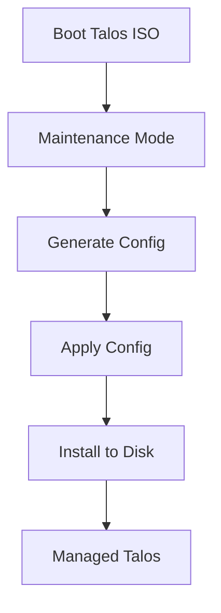

At this phase manual operations are intentional. We need to understand
the primitive before automating it.

------------------------------------------------------------------------

### Phase 2 --- Build Enrollment Service

Goal: replace manual discovery with a central bootstrap workflow.

The edge should be able to tell the platform:

``` text
I have booted.
I am requesting enrollment.
Here is my bootstrap identity.
```

The service maintains states such as:

``` text
NEW
  ↓
ENROLLING
  ↓
APPROVED
  ↓
CONFIGURED
  ↓
ACTIVE
```

The first implementation can use a simple API and SQLite. The objective
is understanding the protocol and trust boundaries, not building a large
enterprise application.

------------------------------------------------------------------------

### Phase 3 --- Per-Device Identity

Goal: remove dependence on a fleet-wide bootstrap secret.

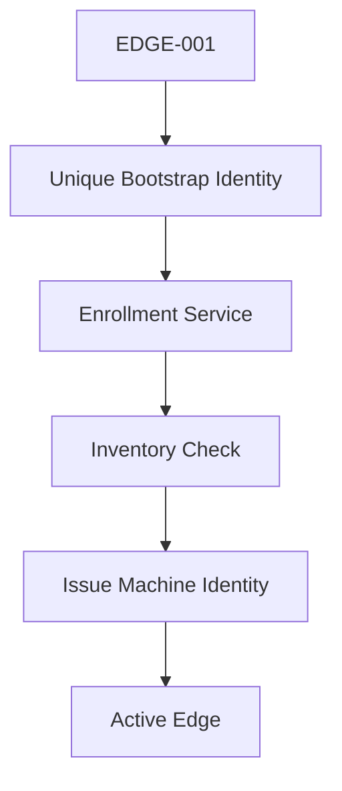

Learn:

-   Device identity.
-   Public/private keys.
-   CSR.
-   CA.
-   Certificate issuance.
-   Rotation.
-   Revocation.
-   Bootstrap identity versus operational identity.

------------------------------------------------------------------------

### Phase 4 --- Outbound Management Channel

Goal: manage a node that remains behind customer NAT.

Do not solve this by exposing the VirtualBox VM directly to the
Internet.

Study and implement an outbound secure channel such as WireGuard or
another mutually authenticated tunnel architecture.

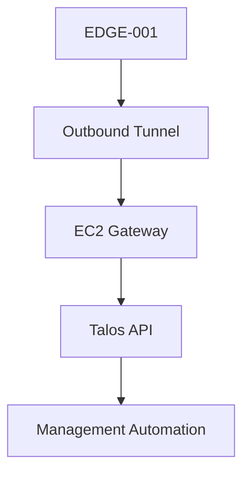

This phase converts the lab from a local Talos exercise into a realistic
remote-edge architecture.

------------------------------------------------------------------------

### Phase 5 --- Secure Boot

Goal: make the boot chain controlled.

Learn:

-   UEFI.
-   UKI.
-   Signing key.
-   Verification certificate/public trust.
-   Signed Talos artifact.
-   Secure Boot state.
-   Upgrade signing.

``` mermaid
flowchart TD
    A[Build Artifact]
    B[Sign Artifact]
    C[EDGE UEFI]
    D[Verify Signature]
    E[Boot Talos]

    A --> B
    B --> C
    C --> D
    D --> E
```

VirtualBox is useful for the broader Talos lab, but Secure Boot behavior
must be validated against the capabilities of the installed VirtualBox
version. If the virtualization platform prevents a faithful experiment,
keep the same control-plane PoC and move only this phase to a VM
platform or physical device with suitable UEFI Secure Boot support.

------------------------------------------------------------------------

### Phase 6 --- TPM Protection

Goal: understand hardware-bound local protection.

Learn:

-   TPM 2.0.
-   PCRs.
-   LUKS2.
-   TPM-bound disk keys.
-   Secure Boot/PCR relationship.
-   What happens when boot state changes.

Talos supports TPM-based disk encryption and can bind LUKS2 key material
to PCR policy.

``` mermaid
flowchart TD
    A[Secure Boot State]
    B[TPM PCR]
    C[Protected Disk Key]
    D[Unlock STATE]
    E[Start Talos]

    A --> B
    B --> C
    C --> D
    D --> E
```

As with Secure Boot, if VirtualBox cannot provide the required TPM
behavior accurately, move this phase to a suitable TPM-capable
virtualization environment or physical edge hardware.

------------------------------------------------------------------------

### Phase 7 --- Image and Upgrade Pipeline

Goal: treat the appliance as replaceable/versioned infrastructure.

``` mermaid
flowchart TD
    A[Git Change]
    B[Build Image]
    C[Sign]
    D[Test]
    E[EDGE Canary]
    F[Health Check]
    G[Promote]

    A --> B
    B --> C
    C --> D
    D --> E
    E --> F
    F --> G
```

Learn:

-   Reproducible artifacts.
-   Version pinning.
-   Signing.
-   Canary rollout.
-   Rollback.
-   Upgrade policy.
-   Auditability.

------------------------------------------------------------------------

## 30. What This PoC Will Teach

This two-machine lab covers most of the architectural concepts we have
discussed:

  Concept                                                Covered?
  --------------------------- -----------------------------------
  Talos boot/install                                          Yes
  Maintenance mode                                            Yes
  Talos API                                                   Yes
  Talos PKI                                                   Yes
  No-SSH operations                                           Yes
  Customer NAT boundary                                       Yes
  Outbound bootstrap                                          Yes
  Enrollment workflow                                         Yes
  Device inventory                                            Yes
  Per-device identity                                         Yes
  Certificate lifecycle                                       Yes
  Secure management tunnel                                    Yes
  Image pipeline                                              Yes
  Upgrade lifecycle                                           Yes
  Secure Boot concepts                                        Yes
  TPM concepts                                                Yes
  TPM remote attestation                                  Not yet
  1,000-node scale behavior                       Simulated later
  Real hardware TPM quirks      Requires real hardware eventually

This is therefore a strong learning PoC for Track 2.

------------------------------------------------------------------------

## 31. Deliberately Out of Scope Initially

Do not add these until the basic trust chain works:

-   Omni.
-   Paid fleet managers.
-   Remote TPM attestation.
-   Multi-region HA.
-   Kubernetes-based control plane.
-   Complex microservices.
-   Large external databases.
-   Kafka.
-   Service mesh.
-   Full observability stack.
-   1,000 VMs.
-   Production HSM integration.

First prove one EDGE securely.

Then automate ten.

Then reason about one thousand.

------------------------------------------------------------------------

## 32. First Milestone

The first concrete milestone is intentionally small:

``` mermaid
flowchart TD
    A[Create EC2]
    B[Install Docker]
    C[Expose HTTPS]
    D[Create EDGE-001]
    E[Boot Talos ISO]
    F[EDGE Calls EC2]
    G[Observe Request]

    A --> B
    B --> C
    C --> D
    D --> E
    E --> F
    F --> G
```

### Success Criteria

Milestone 1 is complete when:

1.  EC2 was created from scratch.
2.  Only required Security Group ports are open.
3.  A containerized HTTPS bootstrap endpoint is running.
4.  `EDGE-001` boots Talos in VirtualBox.
5.  EDGE networking works through NAT.
6.  The EDGE can initiate a request to the EC2 endpoint.
7.  EC2 does not require inbound connectivity to the customer's private
    EDGE address.
8.  We can explain every component involved.

After this milestone, we move to **bootstrap identity and enrollment**.

------------------------------------------------------------------------

## 33. Repository Structure

Use a simple repository so every learning step becomes reproducible.

``` text
track-2-poc/
├── README.md
├── docs/
│   ├── architecture.md
│   ├── trust-model.md
│   └── threat-model.md
├── ec2/
│   ├── setup/
│   ├── docker/
│   └── security/
├── enrollment/
│   ├── api/
│   ├── inventory/
│   └── pki/
├── images/
│   ├── talos/
│   └── secureboot/
├── edge/
│   ├── EDGE-001/
│   └── configs/
├── scripts/
├── tests/
└── audit/
```

Keep secrets, private keys, generated `talosconfig`, kubeconfig and
credentials outside Git.

------------------------------------------------------------------------

## 34. Learning Rule

For every PoC phase, answer five questions before moving on:

``` text
1. What problem are we solving?
2. What component solves it?
3. What trust does that component require?
4. What happens if it is compromised?
5. How will this work for 1,000 edges?
```

This keeps the PoC focused on architecture rather than merely getting
commands to work.

------------------------------------------------------------------------

## 35. Immediate Next Step

Start with **Phase 0 + Phase 1** only.

Do not build the enrollment service yet.

First establish:

**EC2 endpoint + VirtualBox networking + Talos maintenance mode + Talos
API fundamentals.**

Once those are understood, the enrollment service will have a clear
purpose instead of becoming an unexplained custom component.


### Practical PoC Checkpoint — Control Host Recovery

- Control host: `track-2-poc-control`
- EC2: `i-046a5eabd05b9b01e`
- Region: `ap-south-1`
- Administration verified through AWS Systems Manager Session Manager.
- Docker verified active.
- Caddy verified active.
- `edge-poc.npanda.online` resolves to the control-host Elastic IP.
- HTTPS bootstrap endpoint verified.
- Terraform state recovered from the original workstation and transferred securely to the personal workstation.
- Terraform state remains local and is excluded from Git.
- EC2 public-IP association drift is ignored to prevent unintended replacement.
- Existing EC2 key-pair public-key drift is ignored; SSM is the preferred administration path.
- Port 80 is represented in Terraform for Caddy ACME/HTTPS redirect.
- Final Terraform plan: **No changes**.
- No infrastructure replacement or destructive Terraform operation was performed.


### Practical PoC Checkpoint — EDGE-001 Talos Bootstrap

**Status: COMPLETE**

EDGE-001 has progressed from a blank VirtualBox VM to a healthy single-node Talos Kubernetes control plane.

#### Verified build

- VirtualBox: 7.2.18.
- VM: EDGE-001.
- CPU: 2 vCPU.
- RAM: 2 GiB.
- Disk: 32 GiB dynamically allocated VDI.
- Firmware: EFI.
- Network: VirtualBox NAT.
- Talos: v1.13.4.
- Kubernetes: v1.36.1.
- Talos installation disk: /dev/sda.
- Talos node address inside VirtualBox NAT: 10.0.2.15.
- Node role: controlplane.
- Cluster: track-2-poc.
- Final Talos state: **Running / Ready**.
- Kubernetes node: **Ready**.
- etcd, kube-apiserver, kube-controller-manager, kube-scheduler and kubelet verified healthy.
- CoreDNS, Flannel and kube-proxy verified Running.

#### Lab access path

WSL uses local socat listeners for 10.0.2.15 and forwards traffic through the Windows/WSL gateway to VirtualBox NAT. VirtualBox forwards TCP 50000 for the Talos API and TCP 6443 for the Kubernetes API.

This preserves 10.0.2.15 as the client destination so Talos certificate SAN validation succeeds. Connecting directly through the changing WSL/Windows gateway address caused certificate validation failures.

This is a **lab-access workaround**, not the intended production remote-edge management architecture. A later phase will establish an outbound, mutually authenticated management path suitable for customer NAT boundaries.

#### Talos bootstrap sequence learned

Official Talos ISO -> Maintenance Mode -> Talos API -> Generate machine configuration -> Apply control-plane configuration -> Install to /dev/sda -> Detach ISO -> Boot from disk -> Authenticated Talos API -> Bootstrap etcd once -> Kubernetes control plane -> Node Ready.

#### Critical troubleshooting lesson — installation media

The main failure was not PKI or Kubernetes. Talos had successfully installed to /dev/sda, but VirtualBox continued booting from the ISO. Talos reported that it was already installed to disk but had booted from another media and requested a reboot from disk.

Because the node was still running from installation media, it remained in Booting and produced misleading API/TLS symptoms.

Resolution:

1. Power off EDGE-001.
2. Detach the Talos ISO.
3. Change the first boot device to the virtual hard disk.
4. Boot the VM again.
5. Verify the node identifies itself as controlplane.
6. Verify authenticated Talos API access.
7. Bootstrap etcd exactly once.

**Architecture lesson:** when a Talos node has been installed but does not progress normally, verify the boot source before debugging higher layers such as PKI, etcd or Kubernetes.

#### PKI lesson

- controlplane.yaml and talosconfig belong to the same generated trust set.
- Regenerating only the administrative client configuration can create a CA/client identity that does not match the machine configuration already applied to the node.
- Generated talosconfig, kubeconfig and machine secrets remain outside Git.

#### Final validation

- Authenticated Talos API returned client and server v1.13.4 with RBAC enabled.
- Kubernetes node talos-jk6-ckg is Ready with role control-plane, Kubernetes v1.36.1 and internal IP 10.0.2.15.
- kube-system control-plane pods, CoreDNS, Flannel and kube-proxy were Running.

#### Current learning checkpoint

We have now proven Talos ISO boot and maintenance mode, disk discovery, machine configuration, installation to disk, Talos PKI/authenticated API access, no-SSH administration, single-node etcd bootstrap, Kubernetes control-plane startup, and VirtualBox NAT behavior.

Next: complete the remaining Phase 0 network-separation/outbound-HTTPS evidence, then move from local NAT forwarding to the Track-2 secure EDGE-to-control-plane connectivity/enrollment design.

#### Errors Encountered and Troubleshooting Runbook

| Symptom / Error | Root cause | Fix | Lesson |
| --- | --- | --- | --- |
| Talos stayed in `Booting`; node type/cluster initially appeared incomplete | Talos was already installed to the VDI, but VirtualBox kept booting from the installation ISO. Talos intentionally halted normal installed-node startup. | Power off the VM, detach the ISO, set the VDI as the first boot device, then boot again. | Verify the actual boot source before debugging PKI, etcd or Kubernetes. |
| Talos log reported that Talos was already installed but booted from another media | Same installation-media problem above; `talos.halt_if_installed` protected the installed system. | Detach installation media and boot from disk. | Treat console/log evidence as the source of truth instead of assuming a TLS or configuration problem. |
| Direct WSL connection to Talos address `10.0.2.15:50000` timed out | `10.0.2.15` belongs to the VirtualBox NAT network and is not directly routed from WSL. | Add VirtualBox NAT forwarding for TCP 50000 and forward a local WSL listener through the Windows/WSL gateway using `socat`. | VirtualBox NAT provides outbound connectivity but does not make the guest address directly reachable from WSL. |
| Talos TLS validation failed when connecting through the Windows/WSL gateway address | The gateway address was not a SAN in the Talos server certificate, and the WSL gateway can change after restart. | Keep `10.0.2.15` as the Talos client destination and use a local loopback alias plus `socat` to carry the connection through the gateway. | Do not add an unstable workstation/NAT address to long-lived node identity merely to work around lab routing. |
| Fresh `talosconfig` could not authenticate to a machine configured with an earlier generated configuration | Talos machine configuration and administrative client configuration were generated from different PKI sets. | Regenerate a consistent configuration set and apply the matching control-plane configuration while still in the appropriate maintenance/bootstrap state. | Treat generated Talos machine configs and `talosconfig` as one trust set. |
| `kubectl` returned `dial tcp 10.0.2.15:6443: connect: connection refused` even though the Talos console showed the API server healthy | The WSL `socat` listener for Kubernetes TCP 6443 was no longer running. Only the Talos API listener on 50000 remained active. | Recreate the 6443 `socat` listener and verify it with `nc -vz 10.0.2.15 6443` before retrying `kubectl`. | Separate application health from access-path health. A healthy Kubernetes API can still be unreachable when a local lab proxy has stopped. |
| Talos health reached Kubernetes checks but could not initially reach `10.0.2.15:6443` | Talos API forwarding existed for 50000, but the Kubernetes API needed its own 6443 forwarding path. | Configure VirtualBox NAT forwarding and the WSL `socat` listener for 6443 as well. | Talos API and Kubernetes API are separate endpoints and both require connectivity. |

#### Lab Connectivity Troubleshooting Flow

**EDGE Lab Access Path**

```mermaid
flowchart LR
    A[WSL Tools] -->|10.0.2.15:50000 or 6443| B[socat]
    B -->|Windows gateway| C[VirtualBox NAT]
    C -->|Port forward| D[EDGE-001]
    D --> E[Talos API :50000]
    D --> F[Kubernetes API :6443]
```

When access fails, troubleshoot from left to right:

1. Verify EDGE-001 is **Running / Ready** from the Talos console.
2. Verify VirtualBox NAT forwarding still contains TCP 50000 and 6443.
3. Verify WSL listeners with `ss -lntp | grep -E ':50000|:6443'`.
4. Verify TCP access with `nc -vz 10.0.2.15 50000` and `nc -vz 10.0.2.15 6443`.
5. Only after the network path is healthy, investigate Talos authentication or Kubernetes.

#### Important: socat Is Ephemeral

The WSL loopback alias and `socat` processes are **lab runtime state**. They do not survive all WSL restarts.

After restarting WSL, recreate the local access path when required:

```bash
WIN_IP=$(ip route | awk '/default/ {print $3}')

ip addr show dev lo | grep -q '10.0.2.15/32' || \
  sudo ip addr add 10.0.2.15/32 dev lo

socat TCP-LISTEN:50000,bind=10.0.2.15,reuseaddr,fork \
  TCP:${WIN_IP}:50000 >/tmp/talos-50000.log 2>&1 &

socat TCP-LISTEN:6443,bind=10.0.2.15,reuseaddr,fork \
  TCP:${WIN_IP}:6443 >/tmp/talos-6443.log 2>&1 &
```

Verify before using `talosctl` or `kubectl`:

```bash
ss -lntp | grep -E ':50000|:6443'
nc -vz 10.0.2.15 50000
nc -vz 10.0.2.15 6443
```

These proxies are intentionally a **local PoC workaround**. They must not become the production design for EDGE-to-AWS management connectivity.

#### Screenshot / Visual Evidence

The interactive troubleshooting session used Talos console screenshots to confirm the transition from the failed boot state to the healthy state. Those chat screenshots are not stored as repository assets, so the repository does not currently embed them. The Mermaid access-path diagram above is the durable, source-controlled visual representation.

If screenshots are added later, store only sanitized images under a documentation assets directory and ensure they contain no credentials, private keys, tokens or sensitive infrastructure data.


### Learning Checkpoint — Talos-Native WireGuard Design

Before implementation, the secure management design was reviewed using architecture questions.

#### Q1. Where should WireGuard run if Kubernetes may be broken?

**Answer:** At the Talos host/network layer, not as a Kubernetes workload.

The recovery path must not depend on the component being recovered.

**Recovery Path Independence**

```mermaid
flowchart TD
    A[EDGE Boots] --> B[Talos Networking]
    B --> C[WireGuard Tunnel]
    C --> D[Talos API :50000]
    B --> E[Kubernetes]
    E -->|May fail| F[Workloads]
```

#### Q2. Should 1,000 EDGE nodes share one WireGuard key?

**Answer:** No. Each EDGE requires a unique WireGuard key pair. Compromise of one EDGE should allow that peer to be removed without rotating the other 999 identities.

WireGuard key pairs are separate from the certificate/private-key identity used for enrollment or mTLS.

#### Q3. Which side requires a publicly reachable WireGuard endpoint?

**Answer:** The AWS WireGuard gateway. EDGE is behind customer firewall/NAT and initiates outbound UDP to AWS. EDGE does not require an inbound Internet endpoint.

**EDGE Initiates Tunnel**

```mermaid
flowchart LR
    A[EDGE-001 Behind NAT] -->|Outbound UDP| B[Internet]
    B --> C[AWS WireGuard Endpoint]
    C <-->|Encrypted Tunnel| A
```

#### Q4. What is `10.100.0.2`?

**Answer:** It is an additional fixed management/overlay IP assigned to EDGE-001's WireGuard interface, not a replacement for its LAN/NAT IP `10.0.2.15`.

Example PoC addressing:

- AWS WireGuard: `10.100.0.1`
- EDGE-001 WireGuard: `10.100.0.2`
- EDGE-001 LAN/NAT: `10.0.2.15`

WireGuard supplies the IP path; it is not an application proxy forwarding `10.100.0.2:50000` to `10.0.2.15:50000`.

#### Q5. What about Talos API TLS SAN validation?

If AWS manages Talos using `10.100.0.2:50000`, the Talos API certificate must be valid for the stable WireGuard management address. Otherwise network connectivity can succeed while TLS identity verification fails.

**Principle:** network reachability does not equal trusted application connectivity. Do not solve SAN mismatch by disabling TLS verification.

#### Q6. Who starts WireGuard after an EDGE reboot?

Talos host networking does. The desired dependency chain is:

**EDGE Boot Recovery Path**

```mermaid
flowchart TD
    A[EDGE Power On] --> B[Talos Boots]
    B --> C[Host Network]
    C --> D[WireGuard Starts]
    D --> E[Outbound Tunnel to AWS]
    E --> F[Remote Talos API]
    B --> G[Kubernetes]
    G -->|Healthy or Failed| H[Cluster State]
```

This keeps the management/recovery channel independent of Kubernetes health.

#### Q7. Where is the AWS WireGuard endpoint configured?

In the Talos machine configuration for the WireGuard peer. Conceptually, EDGE-001 is configured with the AWS WireGuard public key and endpoint `13.203.8.51:51820`, plus an appropriate persistent keepalive for the NAT path. AWS holds the corresponding EDGE-001 public key and overlay address assignment.

#### Q8. Is `10.100.0.2` fixed?

For this design, yes: it is a stable address allocated specifically to EDGE-001. It is not a special WireGuard-defined address. At fleet scale, management IPs should be allocated centrally and mapped to EDGE identity and WireGuard public key.

#### Q9. How far can overlay addressing scale?

The capacity is determined by the chosen overlay CIDR. A `/24` is suitable only for a small PoC; a larger range such as a carefully selected `/16` provides much more address space for a 1,000-node fleet.

Address count alone is not the architecture's scaling limit. Gateway throughput, peer count, availability, routing, operational management, failure domains and overlap with customer/AWS networks must also be designed. At larger scale, use gateway pools/sharding rather than treating one EC2 WireGuard gateway as an unlimited fleet endpoint.

#### Implementation Checkpoint

The next practical sequence is:

1. Start the AWS control host while EDGE-001 remains powered off.
2. Configure and validate the AWS WireGuard endpoint first.
3. Generate unique WireGuard identity for EDGE-001.
4. Configure Talos-native WireGuard and the stable management address.
5. Ensure Talos API TLS identity is valid for the management path.
6. Boot EDGE-001 and verify EDGE-initiated tunnel establishment.
7. Verify Talos API management through the tunnel independently of Kubernetes.


------------------------------------------------------------------------

## 36. Secure Connectivity Checkpoint — WireGuard Attempt 1

**Status: PAUSED SAFELY — baseline recovered**

This checkpoint records the first practical attempt to add a Talos-native
WireGuard management path between EDGE-001 and the AWS control host. The
attempt was intentionally stopped after a recoverable network failure so
the behavior can be understood before another configuration change.

### Baseline Before the Change

The healthy EDGE-001 baseline was re-verified before the experiment:

- Talos client/server: v1.13.4.
- Talos API: authenticated and RBAC enabled.
- Existing management/lab address: `10.0.2.15/24` on `enp0s3`.
- VirtualBox NIC: NAT, cable connected.
- VirtualBox forwards TCP 50000 for Talos API and TCP 6443 for Kubernetes API.
- Kubernetes remained a healthy single-node control plane.
- The current Talos configuration was exported locally for inspection and
  recovery reference. It contains secrets and must never be committed.
- EDGE-001 WireGuard private key is stored only in a protected local
  temporary file with mode `600`; it must never be printed or committed.

### AWS WireGuard Preparation

The AWS control host was prepared first:

- WireGuard host address: `10.100.0.1/24`.
- UDP 51820 is the PoC WireGuard listener.
- EDGE-001 was registered as a peer with overlay address
  `10.100.0.2/32`.
- EDGE-001 has a unique WireGuard key pair.
- AWS stores only the EDGE public key for peer authentication.
- The EDGE private key remains local to the EDGE preparation environment.
- TCP 50000 is **not** exposed publicly.

The PoC intentionally permits UDP 51820 from arbitrary Internet source
addresses because a customer EDGE can appear behind an unknown NAT
address. Peer authentication is performed by WireGuard keys. Production
gateway policy, rate controls and failure-domain design remain future
work.

### Target Connectivity

**Secure EDGE Management Path**

```mermaid
flowchart LR
    A[EDGE-001] -->|Outbound UDP 51820| B[Customer NAT]
    B --> C[Internet]
    C --> D[AWS WireGuard Gateway]
    A --- E[wg0 10.100.0.2]
    D --- F[wg0 10.100.0.1]
    F -->|Talos API over tunnel| E
```

The key architectural requirement remains: AWS does not initiate a
connection to the EDGE private LAN address. EDGE establishes the secure
outbound tunnel first.

### Q&A Captured During the Design

#### Q10. Is the current Kubernetes cluster the final zero-touch EDGE state?

**Answer:** No. The current cluster is a baseline learning and validation
environment. The target flow is that a newly booted EDGE establishes
bootstrap trust/connectivity with the AWS control plane, is identified and
authorized, receives its intended Talos configuration, and then converges
to the desired Kubernetes state.

#### Q11. Is EDGE-001 currently in Talos Maintenance Mode?

**Answer:** No. Maintenance Mode was a temporary bootstrap/unconfigured
state. EDGE-001 is now a configured Talos node running a Kubernetes
control plane.

#### Q12. Should every gateway use the entire fleet WireGuard CIDR?

**Answer:** No. Reserve a sufficiently large fleet address space, then
divide it into gateway pools/subnets or failure domains. Sharding can
follow geography, tenant, capacity, availability zone or another
operational boundary.

**WireGuard Fleet Sharding**

```mermaid
flowchart TD
    A[Fleet Overlay Address Space]
    A --> B[Gateway Group A]
    A --> C[Gateway Group B]
    A --> D[Gateway Group C]
    B --> E[EDGE Pool]
    C --> F[EDGE Pool]
    D --> G[EDGE Pool]
```

#### Q13. Does WireGuard replace Talos PKI?

**Answer:** No. WireGuard provides an authenticated encrypted network
tunnel using WireGuard key pairs. Talos still uses its own PKI and API
identity. Production bootstrap identity, device enrollment and private PKI
remain separate design concerns.

#### Q14. Can the management CIDR change later?

**Answer:** Yes, but expansion that preserves existing addresses is easier
than renumbering. Renumbering can affect WireGuard addresses and
AllowedIPs, Talos certificate SANs, inventory/IPAM, routes, firewall
policy and monitoring. A production migration should prefer an explicit
transition such as temporary dual addressing where supported.

#### Q15. Can an EDGE move between WireGuard gateway groups?

**Answer:** Yes. Gateway assignment should not become the permanent EDGE
identity. Preserve device identity and, where practical, its stable
management address while changing gateway ownership/routing. Prefer a
stable gateway service/DNS endpoint over embedding an EC2 instance IP in
long-lived fleet configuration.

#### Q16. Why add `10.100.0.2` to the Talos API SANs?

**Answer:** A working WireGuard route is not enough. If `talosctl`
connects to `10.100.0.2:50000`, the Talos API certificate must be valid
for that management identity. The correct solution is valid identity/SAN
configuration, not disabling TLS verification.

### Configuration Preparation

The running machine configuration was inspected without exposing its
private PKI material. It showed:

- `machine.certSANs: []` before the experiment.
- No legacy `machine.network` block in the extracted primary
  MachineConfig.
- A separate existing `HostnameConfig` document.
- No `wg0` link before the experiment.

A candidate configuration was prepared locally with:

- existing MachineConfig;
- `10.100.0.2` added to `machine.certSANs`;
- existing HostnameConfig preserved;
- a separate `WireguardConfig` for `wg0`.

The candidate passed:

```text
talosctl validate --config <candidate> --mode metal
<candidate> is valid for metal mode
```

**Important lesson:** schema validation proves that the configuration is
valid Talos syntax. It does **not** prove that replacing the active
configuration preserves all effective runtime networking.

### Failed Attempt — What Happened

The candidate was applied with Talos `try` mode and a three-minute
rollback timeout.

Immediately after the apply:

- Talos reported that the configuration was applied without reboot.
- The Talos console changed from `10.0.2.15` to **IP: n/a**.
- DNS checks reported `network is unreachable`.
- Remote Talos API access through the existing lab path timed out during
  the TLS/authentication handshake.
- The Kubernetes processes already running locally were not sufficient to
  provide a usable management network.
- The expected automatic rollback did not restore remote connectivity
  while the machine remained running.
- A controlled VM reboot restored the persisted working configuration.
- After reboot, `10.0.2.15` returned and authenticated
  `talosctl version` again reported Talos v1.13.4 with RBAC enabled.

### Failure Visual

**WireGuard Attempt 1 Failure**

```mermaid
flowchart TD
    A[Healthy EDGE 10.0.2.15]
    B[Apply Validated Multi-Document Config]
    C[Effective Base Network Lost]
    D[Console Shows IP n/a]
    E[DNS Network Unreachable]
    F[Talos API Unreachable]
    G[Try Timeout Expires]
    H[Connectivity Still Not Restored]
    I[Controlled VM Reboot]
    J[Persisted Baseline Restored]
    K[10.0.2.15 and Talos API Healthy]

    A --> B --> C
    C --> D
    C --> E
    C --> F
    D --> G
    E --> G
    F --> G
    G --> H --> I --> J --> K
```

### Baseline Routing Evidence After Recovery

After reboot, Talos again reported:

```text
enp0s3    10.0.2.15/24
network   10.0.2.0/24 via enp0s3
default   via 10.0.2.2 on enp0s3
```

This proves the base VirtualBox NAT path was restored. The next attempt
must preserve this path while **adding** WireGuard.

**Required Additive Network Change**

```mermaid
flowchart LR
    A[enp0s3 10.0.2.15] --> B[Default via 10.0.2.2]
    B --> C[VirtualBox NAT]
    D[wg0 10.100.0.2] --> E[AWS wg0 10.100.0.1]
    A -. must remain .-> D
```

### Troubleshooting Additions

| Symptom / Error | Observation / Root Cause | Recovery / Fix | Lesson |
| --- | --- | --- | --- |
| TCP 50000/6443 accepted connections but TLS/application traffic stalled after an EDGE restart | VirtualBox NAT port-forwarding path was present but application bytes were not reaching the guest correctly. Windows localhost tests showed the same behavior, ruling out only WSL/socat as the cause. | Stop/restart EDGE-001 cleanly in VirtualBox GUI mode. After restart, Talos API v1.13.4 became reachable again. | A successful TCP connect does not prove end-to-end application connectivity. Test at TCP, TLS and application layers. |
| `talosctl` timed out during authentication handshake although TCP 50000 was reachable | Same broken forwarding/application path above. | Reboot/restart restored the VirtualBox NAT forwarding behavior. | Separate transport acceptance from successful TLS/mTLS exchange. |
| `yq '.machine.network'` returned `null` | The exported Talos configuration is multi-document and the primary MachineConfig has no legacy `machine.network` section. | Inspect document structure first and use the configuration model appropriate to Talos v1.13. | Do not assume older Talos machine-config structure on a newer release. |
| Candidate configuration passed `talosctl validate` but EDGE lost `enp0s3` address after apply | Structural validity did not guarantee preservation of the effective automatically established base network state. | Allow the experiment to fail safely; reboot restored the persisted baseline. Do not repeat the same replacement-style apply. | Validation is necessary but not sufficient for safe network mutation. Preserve the working underlay explicitly or use a supported additive mechanism. |
| `--mode=try --timeout=3m` did not restore reachable networking within the observed timeout | The trial configuration removed the usable management path; the expected live rollback was not sufficient to recover remote access in this experiment. | Controlled reboot restored the persisted working configuration. | Never treat try mode as the only recovery plan for remote network changes. Maintain console/out-of-band access and a known-good persisted state. |

### Screenshot Evidence and Safety

Two Talos console screenshots from the failed trial showed the diagnostic
state: **IP: n/a** and repeated DNS/network-unreachable errors. They were
used as evidence during troubleshooting. The repository keeps the
sanitized Mermaid reconstructions above as durable visual documentation.

Raw chat screenshots and generated Talos machine configuration are not
committed because screenshots/configuration can unintentionally expose
environment details, tokens, keys or certificates. Any future screenshot
asset should be reviewed and sanitized before being added under a
documentation assets directory.

### Lessons Learned

1. Preserve the underlay before adding an overlay. WireGuard is additive;
   `enp0s3`, DHCP/default routing and the existing recovery path must
   remain functional.
2. Talos configuration documents can be syntactically valid while still
   causing an operational network outage.
3. Do not reconstruct and replace the full running configuration merely
   to add one network feature until the exact Talos v1.13 merge/apply
   semantics are understood.
4. `--mode=try` reduces risk but does not replace console access,
   persisted known-good configuration and a reboot/recovery plan.
5. Never debug only at the TCP layer. Verify TCP → TLS/mTLS → Talos API.
6. Keep WireGuard identity, Talos PKI identity and future enrollment
   identity conceptually separate.
7. Never print, paste or commit EDGE private keys, Talos machine secrets,
   `talosconfig` or kubeconfig.
8. The production goal remains zero-touch: the current manually built
   Kubernetes cluster is only the learning baseline.

### Safe Pause Point

At the end of this session:

- EDGE-001 is healthy again on `10.0.2.15`.
- Talos API authentication works.
- Kubernetes baseline remains intact.
- AWS WireGuard gateway preparation is retained.
- EDGE WireGuard private material remains local and protected.
- WireGuard has **not** been accepted as a persistent EDGE configuration.
- No second WireGuard apply should be attempted until the Talos v1.13
  additive networking/configuration behavior is understood.

### Next Session

Resume from **Talos v1.13 additive network configuration research**.

The next practical change must satisfy all of these conditions before it
is applied:

```text
Keep enp0s3 / 10.0.2.15
Keep default route via 10.0.2.2
Keep console/recovery access
Add wg0 / 10.100.0.2
Establish EDGE -> AWS WireGuard handshake
Validate Talos API TLS identity over 10.100.0.2
Only then make the configuration persistent
```


---

## 37. Architecture Update — Local WireGuard Proof First

The PoC execution plan changed after the first WireGuard experiment.

The AWS Elastic IP is no longer part of the current PoC baseline. Rather
than debug Talos networking and AWS Internet reachability at the same
time, the WireGuard/Talos integration will first be proven locally on the
personal laptop.

### Revised Validation Strategy

The laptop will temporarily simulate the AWS WireGuard gateway using a
Docker-based WireGuard endpoint.

**Local WireGuard Proof**

```mermaid
flowchart LR
    A[EDGE-001<br/>Talos / VirtualBox]
    B[Laptop Network Path]
    C[Docker WireGuard Gateway<br/>10.100.0.1]
    D[wg0<br/>10.100.0.2]

    A -->|Existing underlay| B
    B -->|UDP 51820| C
    A --- D
    D -. WireGuard overlay .-> C
```

This local phase is intended to isolate the Talos configuration problem
from AWS-specific variables. It does not change the production direction:
a customer EDGE must still be able to establish secure outbound
connectivity while behind NAT/firewalls.

### Phase 1 — Local Proof

Before changing Talos, inspect and prove the actual path among
VirtualBox, the laptop/WSL/Docker environment, and the temporary
WireGuard gateway.

The sequence is:

```text
Prove laptop/EDGE network path
        ↓
Start Docker WireGuard gateway
        ↓
Prove EDGE can reach the intended UDP/51820 path
        ↓
Verify Talos v1.13.4 additive network semantics
        ↓
Show sanitized Talos candidate before applying
        ↓
Preserve enp0s3 / 10.0.2.15 / default route
        ↓
Add wg0 / 10.100.0.2
        ↓
Verify WireGuard handshake
        ↓
Verify overlay routing and TCP
        ↓
Handle Talos API SAN/TLS identity separately
        ↓
Verify Talos API over the overlay
```

The Talos API SAN change should not be unnecessarily bundled with the
first network mutation. Separating underlay preservation, WireGuard
transport, and Talos API identity reduces blast radius and makes failures
easier to attribute.

### Phase 2 — Return to AWS

Only after the local method is proven will the same validated pattern be
moved back to an AWS EC2 WireGuard gateway.

The intended long-lived EDGE configuration should use a stable DNS name
for the gateway rather than embedding a changing EC2 public IP:

```text
boot.npanda.online:51820
```

Conceptually:

**Stable WireGuard Endpoint**

```mermaid
flowchart LR
    A[EDGE Fleet]
    B[boot.npanda.online]
    C[Current Public IP]
    D[AWS WireGuard Gateway]

    A -->|WireGuard endpoint| B
    B -->|DNS resolution| C
    C -->|UDP 51820| D
```

DNS provides a stable configuration name while allowing the public
address behind that name to change. Before this is treated as a
production recovery mechanism, the exact WireGuard implementation
behavior for DNS resolution and endpoint re-resolution must be verified.
DNS stability does not by itself guarantee that an already-running peer
will immediately discover a changed address.

### Decisions at This Checkpoint

- The previous AWS Elastic IP is no longer assumed to exist or remain the
  WireGuard endpoint.
- Local Docker validation comes before another AWS attempt.
- Do not involve `boot.npanda.online` in the first local transport test;
  use the directly reachable laptop endpoint so DNS is not another
  variable.
- `boot.npanda.online` is the intended stable endpoint name when the
  gateway returns to AWS.
- The local Docker gateway is a test substitute for the AWS gateway, not
  the final architecture.
- Preserve `enp0s3`, `10.0.2.15`, the default route via
  `10.0.2.2`, and the existing Talos API recovery path throughout the
  experiment.
- Do not repeat the previous multi-document Talos apply unchanged.
- Prove the network path to the local WireGuard gateway before debugging
  Talos WireGuard configuration.

### Updated Safe Restart Point

No implementation action is implied by this architecture update.

Resume with the interactive learning workflow from `AGENTS.md`. The
first practical objective is to inspect the personal-laptop networking
path and determine how EDGE-001 can reach a Docker WireGuard listener on
UDP 51820 without modifying the healthy Talos underlay.


---

## 38. Local Network Map — Underlay, Overlay and WSL Access

Before building the local Docker WireGuard gateway, the lab network paths
were separated explicitly. The similar-looking `10.0.2.x` and
`10.100.0.x` addresses belong to completely different networks.

### IP and Port Map

| Component | IP / Port | Layer | Purpose |
| --- | --- | --- | --- |
| EDGE-001 normal NIC | `10.0.2.15` | VirtualBox underlay | Existing Talos node address |
| VirtualBox NAT gateway / host-access path | `10.0.2.2` | VirtualBox underlay | Address EDGE can use to reach services exposed by the laptop |
| Talos API | `10.0.2.15:50000/TCP` | Current management path | Talos API before WireGuard management is enabled |
| Kubernetes API | `10.0.2.15:6443/TCP` | Current management path | Kubernetes API before WireGuard management is enabled |
| Local WireGuard endpoint | `10.0.2.2:51820/UDP` | WireGuard transport / underlay | Reachable endpoint EDGE uses to establish the tunnel |
| EDGE WireGuard interface | `10.100.0.2` | WireGuard overlay | EDGE management address inside the private tunnel |
| Gateway WireGuard interface | `10.100.0.1` | WireGuard overlay | Docker/AWS gateway address inside the private tunnel |

Memory rule:

```text
10.0.2.x     = OUTSIDE the WireGuard tunnel / VirtualBox underlay
10.100.0.x   = INSIDE the WireGuard tunnel / private overlay
```

The WireGuard peer endpoint and the WireGuard peer overlay address are
different concepts:

```text
10.0.2.2:51820 = Where can EDGE reach the peer to create the tunnel?
Public key      = Which WireGuard peer is EDGE cryptographically talking to?
10.100.0.1      = How does EDGE address that peer after the tunnel exists?
```

### Complete Local Connectivity Model

**Local EDGE Network Paths**

```mermaid
flowchart LR
    W[WSL<br/>talosctl / kubectl]
    S[socat]
    H[Windows / VirtualBox<br/>Port Forwarding]
    E[EDGE-001<br/>enp0s3 10.0.2.15]
    V[VirtualBox NAT Gateway<br/>10.0.2.2]
    D[Docker WireGuard<br/>UDP 51820]
    EW[EDGE wg0<br/>10.100.0.2]
    GW[Gateway wg0<br/>10.100.0.1]

    W -->|TCP 50000 / 6443| S
    S --> H
    H -->|Current API access| E

    E -->|UDP 51820 underlay| V
    V -->|Docker host-port publish| D

    EW <-->|WireGuard overlay| GW
    D --- GW
    E --- EW
```

There are three paths to keep conceptually separate.

**1. Current WSL management path**

```text
WSL
  |
  | talosctl / kubectl
  v
socat
  |
  v
Windows / VirtualBox forwarding
  |
  v
EDGE 10.0.2.15
  |- TCP 50000  Talos API
  '- TCP 6443   Kubernetes API
```

`socat` is a lab access mechanism for WSL-to-VirtualBox communication.
It is not part of WireGuard. It currently lets the management tools in
WSL reach the EDGE APIs while preserving `10.0.2.15` as the destination
identity used by the existing TLS configuration.

**2. WireGuard underlay / bootstrap path**

```text
EDGE 10.0.2.15
      |
      | UDP 51820
      v
10.0.2.2:51820
      |
      | Docker host-port publishing
      v
Docker WireGuard gateway
```

The peer endpoint is therefore `10.0.2.2:51820` for the local PoC.
The overlay address `10.100.0.1` cannot bootstrap the tunnel because it
only becomes reachable after WireGuard is established.

**3. WireGuard overlay path**

```text
EDGE wg0                         Gateway wg0
10.100.0.2  <=================> 10.100.0.1
                 WireGuard
```

The overlay is the intended private management network. After transport,
routing and Talos TLS identity are proven independently, the target is to
manage EDGE through `10.100.0.2` rather than depend on the local
WSL/socat/VirtualBox forwarding workaround.

### Underlay Reachability Proof

Before changing Talos networking, a temporary HTTP listener was started
on the laptop and EDGE connectivity was tested with a Talos debug
container. The connection succeeded:

```text
Trying 10.0.2.2:18080...
Established connection to 10.0.2.2 from 10.0.2.15
HTTP/1.0 200 OK
```

This experimentally proves that EDGE-001 can reach a laptop-hosted
service through `10.0.2.2`. Therefore `10.0.2.2:51820/UDP` is the
correct local endpoint model for the next Docker WireGuard experiment.

The temporary HTTP server exposed a directory containing sensitive Talos
configuration files, so it must be stopped immediately after the
reachability test. Talos machine configuration, `talosconfig`,
`kubeconfig`, private keys and similar credentials must never be served,
printed or committed.

### Local-to-AWS Mapping

The architecture remains the same when the gateway moves back to AWS.
Only the reachable underlay endpoint changes:

```text
Local PoC:
EDGE -> 10.0.2.2:51820 -> Docker WireGuard gateway

AWS:
EDGE -> boot.npanda.online:51820 -> EC2/Docker WireGuard gateway
```

The intended overlay addressing can remain:

```text
Gateway wg0  = 10.100.0.1
EDGE-001 wg0 = 10.100.0.2
```

This separation is fundamental: the **underlay endpoint creates the
tunnel**, while the **overlay addresses carry private management traffic
after the tunnel exists**.

---

## 39. Theory Checkpoint — ZTP, Trust Bootstrap and PKI Lifecycle

The practical WireGuard lab is intentionally paused while the remaining
architecture and interview theory is completed. The current theory goal is
to answer a larger production question:

> How can a new remote edge machine become a trusted, managed Kubernetes
> node without requiring an engineer to configure it manually?

### Zero-Touch Provisioning Goal

For a large edge fleet, the desired customer-site experience is:

```text
Rack -> Cable -> Power On
             |
             v
        Discover bootstrap service
             |
             v
        Establish trust
             |
             v
       Receive identity/config
             |
             v
        Join managed platform
```

The important lesson is that zero-touch provisioning is not simply
automated configuration delivery. Before sensitive configuration or
credentials are issued, the platform needs a trustworthy answer to:

> Who is this machine, and should I trust its current state?

### Inventory Identity vs Cryptographic Identity

Factory inventory may initially associate a device with identifiers such
as its serial number or MAC address:

```text
MAC / Serial
     |
     v
Inventory record
     |
     v
EDGE-001 -> customer / site / expected hardware
```

These identifiers are useful for inventory and correlation, but a MAC
address is not strong proof of identity because it can be observed and
spoofed.

A stronger model gives each device a cryptographic identity, ideally
anchored to hardware.

```text
Inventory identifier
       |
       v
TPM-backed device identity
       |
       v
Device certificate
       |
       v
Factory CA / Sub-CA trust
```

### Device Identity and TPM

A certificate proves possession of a corresponding private key, but a
private key stored as an ordinary exportable file could be copied.

A TPM-backed key improves the desired property:

> The identity should belong to this physical device, not merely to files
> copied from its disk.

The resulting mental model is:

```text
MAC / serial -> Which device claims to be connecting?
Certificate  -> Can it cryptographically prove an identity?
TPM          -> Is that identity anchored to the intended hardware?
```

### Identity Is Not Enough — Verify Boot State

A genuine device could still boot modified or unauthorized software.
Therefore device identity and software/platform trust are separate
questions.

```text
Is this the genuine EDGE-001?
        |
        +-> TPM-backed device identity / certificate

Is EDGE-001 running an approved boot chain?
        |
        +-> Secure Boot + measured boot / attestation
```

Secure Boot controls which appropriately signed boot software is allowed
to execute. Remote attestation provides evidence to a central verifier
about the measured state that actually booted.

This gives the conceptual enrollment chain:

```text
Factory inventory
       |
TPM-backed identity
       |
Signed / approved boot chain
       |
Secure Boot
       |
Measured boot / attestation
       |
Central verifier
       |
Trust established
       |
Issue operational identity
```

### Factory Identity vs Operational Identity

The long-lived factory/device identity should not necessarily be the same
credential used for normal operations.

Two separate questions are being answered:

- **Factory identity:** Who are you initially, and are you an enrolled
  physical device?
- **Operational identity:** Now that you are trusted, what are you allowed
  to do?

After successful verification, each EDGE should receive its own
operational identity rather than sharing fleet-wide credentials.

Example inventory state:

```text
EDGE-001
|- Customer / Site
|- Serial / MAC
|- TPM identity
|- Certificate identity
|- Expected software / boot state
|- WireGuard identity
'- Lifecycle status: Active / Revoked / Retired
```

Per-device identity provides independent authentication, authorization,
rotation and revocation.

### Stolen or Compromised EDGE

If EDGE-001 is stolen, the response should isolate that device without
requiring credential changes on the rest of the fleet.

Conceptually:

```text
EDGE-001 stolen
      |
Inventory -> REVOKED
      |
Reject / revoke EDGE-001 operational identity
      |
Remove its WireGuard peer / key
      |
Remove or disable platform authorization
      |
EDGE-001 can no longer establish normal trusted access
```

MAC filtering can be used as defense-in-depth, but it should not be the
primary security boundary. Likewise, a certificate SAN is an identity
attribute; the security action is to revoke, reject or otherwise disable
the compromised credential/identity rather than treating the SAN itself
as the revocation mechanism.

### Short-Lived Credentials and Renewal

A stolen device may be offline when it is revoked. It can later return
with a locally stored certificate that still looks valid. This motivates
limited credential lifetime plus controlled renewal.

Heartbeat and credential renewal solve different problems:

- **Heartbeat:** Is the EDGE alive/reachable?
- **Credential renewal:** Is the EDGE still trusted and authorized?

A renewal service can evaluate the current inventory state and trust
policy before issuing another certificate.

```text
EDGE requests renewal
        |
        v
Authenticate existing identity
        |
        v
Check inventory / revocation / policy
        |
    +---+---+
    |       |
 Active   Revoked
    |       |
    v       v
 Renew    Reject
```

Certificate lifetime is an architecture trade-off. Very short lifetimes
reduce the useful lifetime of stolen credentials but make continued edge
operation more dependent on the central identity service. Long lifetimes
improve disconnected operation but increase exposure after compromise.

For an edge environment that may lose Internet connectivity for two or
three days, a useful design direction is a certificate valid for several
days, for example seven days, while attempting renewal much earlier. The
exact lifetime is a policy decision based on threat model, outage
tolerance and recovery requirements rather than a universal value.

### CA Hierarchy and Blast-Radius Isolation

Do not use one signing authority indiscriminately for factory identity,
operations and platform administration. Separate trust domains with
subordinate CAs.

```text
                   Offline Root CA
                        |
          +-------------+-------------+
          |             |             |
          v             v             v
     Factory CA    Operations CA   Platform CA
          |             |             |
    Device identity   EDGE certs   Talos / K8s PKI
```

Benefits include:

- smaller compromise blast radius;
- independent certificate policies and lifetimes;
- independent rotation and revocation;
- separation of factory trust from day-to-day operational trust.

The root CA should remain highly protected and preferably offline where
the operational model permits it. Day-to-day issuance belongs to the
appropriate subordinate signing infrastructure.

### Operations Sub-CA Compromise

A compromised Operations Sub-CA is a fleet-level incident because an
attacker may be able to mint apparently valid operational identities.

Recovery should preserve unaffected trust domains:

```text
Offline Root CA
      |
      +-> Factory CA -> TPM/device identity       still trusted
      |
      '-> Operations CA                           compromised
                    |
                    v
              Revoke / distrust
                    |
                    v
              Operations CA v2
                    |
                    v
       Re-authenticate legitimate devices
       using independent factory identity
                    |
                    v
          Issue new operational certs
```

Routine CA rotation is good lifecycle hygiene, but compromise recovery
also requires distrusting the compromised authority, establishing a new
authority, distributing the new trust chain, and re-issuing operational
credentials to legitimate devices.

### Current Trust-Bootstrap Mental Model

The theory now forms one continuous chain:

```text
ZTP
 |
Factory inventory
 |
Device identity
 |
TPM-backed proof
 |
Secure Boot
 |
Measured boot / attestation
 |
Trust decision
 |
Unique operational identity
 |
Short-lived certificate + renewal
 |
Per-device revocation
 |
CA hierarchy / compromise recovery
 |
Day-2 operations
```

### Interview-Level Takeaways

1. MAC addresses and serial numbers are inventory identifiers, not strong
   cryptographic proof.
2. Device certificates provide cryptographic identity; TPM-backed keys
   strengthen hardware binding and anti-cloning.
3. A genuine machine identity does not prove that trusted software
   booted. Secure Boot and attestation address a different part of the
   trust problem.
4. Factory identity and operational identity should be separated.
5. Every EDGE should have a unique operational identity so one compromised
   device can be revoked without rotating the entire fleet.
6. Credential expiry and renewal reduce the useful lifetime of stolen
   credentials, but lifetime must account for disconnected edge operation.
7. Heartbeat and certificate renewal are separate lifecycle functions.
8. Separate subordinate CAs reduce blast radius and allow independent
   lifecycle policies.
9. A compromised operational Sub-CA requires a new trust path and
   re-issuance, ideally using an unaffected factory/hardware identity to
   re-establish trust.
10. Zero-touch provisioning is fundamentally a trust-bootstrap problem,
    not merely an automation problem.

### Theory Status

Completed in this checkpoint:

- Zero-Touch Provisioning mental model.
- Inventory identity vs cryptographic identity.
- TPM-backed machine identity.
- Secure Boot vs device identity.
- Remote attestation as runtime trust evidence.
- Factory identity vs operational identity.
- Per-device credentials and revocation.
- Short-lived credentials and automatic renewal.
- Offline/disconnected edge lifetime trade-offs.
- Root CA / Sub-CA separation.
- Operations Sub-CA compromise recovery.

Next theory topic:

> **Day-2 Talos operations and fleet rollout:** how to safely upgrade,
> observe, stop, recover and progressively roll out changes across
> hundreds of remote EDGE nodes.

The practical WireGuard lab remains paused until the theory track is
complete.


---

## 40. Day-2 Operations — Fleet Rollout, Recovery and Data Durability

The practical WireGuard lab remains paused while the theory-first interview track continues.

### Upgrade campaigns and maintenance windows

Manage upgrades as lifecycle campaigns rather than forcing every EDGE immediately:

Release approved -> campaign announced -> support/EOL timeline -> customer-approved maintenance window -> EDGE eligible -> progressive rollout -> health validation -> completion/EOL.

Not mandatory immediately does not mean optional forever. Critical security issues may require an expedited policy.

### Progressive rollout and health gates

Even a standardized fleet should not upgrade simultaneously. Use lab/test, small canary, health gates and soak, then progressively larger production batches.

An upgrade is successful only after Talos/API management connectivity, WireGuard where used, etcd on control-plane nodes, kube-apiserver, kubelet, required Kubernetes networking, Node Ready, critical workloads, and customer-facing connectivity are healthy.

If a batch breaches the agreed failure threshold, automatically pause the campaign. Investigate whether failures are site-specific or release-related before resuming.

### Recovery hierarchy and OOB

WireGuard is an alternate secure management path while the OS/network stack is alive; it is not true out-of-band management.

Recovery hierarchy:

Normal management -> WireGuard + Talos API -> automated self-recovery/known-good boot -> OOB/BMC -> customer-assisted recovery -> replace appliance -> field engineer when justified.

OOB means Out-of-Band management. A BMC can provide OS-independent power control, Serial-over-LAN/remote console, boot-device selection and virtual recovery media.

Whether every low-cost EDGE needs sophisticated OOB is a TCO/SLA decision: compare added hardware, operations and security cost with failure probability, downtime, support cost and field-visit cost. Customer-assisted recovery and appliance replacement remain fallback paths.

A/B or known-good boot images are a useful general edge-appliance recovery pattern, but exact Talos rollback behavior must be verified for the applicable Talos release before treating it as a native capability.

### Configuration rollout

Treat Talos configuration changes with the same safety discipline: versioned config -> canary -> management/Kubernetes/workload/customer-connectivity gates -> soak -> progressive batches -> automatic pause on failure.

A configuration can be schema-valid and Kubernetes can be healthy while customer connectivity is broken. Operational safety requires service-level validation.

### SCM, inventory and desired state

Keep versioned configuration artifacts in SCM such as Git. Inventory references versions rather than storing hundreds of manually maintained copies.

Git/SCM answers WHAT the configuration is. Inventory answers WHICH configuration an EDGE should run, together with customer/site, identity, lifecycle and health state. A reconciliation controller compares desired and observed versions.

If desired=v5 and observed=v4, reconcile toward v5 subject to rollout/safety policy. Retries must be bounded. Repeated health-gate failures should stop automatic reconciliation, mark the EDGE degraded and escalate rather than create an endless retry loop.

### Hardware replacement and identity

For replacement: revoke the old device identity; register new hardware/TPM identity; update inventory; issue fresh operational and WireGuard credentials; reconcile the desired Talos/Kubernetes/application state. Never copy the failed device's old private identity to replacement hardware.

### Infrastructure recovery vs data recovery

Desired-state automation can reconstruct Talos, Kubernetes, credentials and applications, but cannot reconstruct business data that existed only on a failed local disk/hostPath PV.

Key principle: infrastructure reconstruction and data recovery are separate problems.

For important local data, use periodic and/or on-demand backup to central storage or an HA location. For sites that must work while disconnected, provide a recoverable local copy outside the failed EDGE box where justified, then synchronize centrally when connectivity returns.

### RPO and RTO

RPO asks how much data loss the business can tolerate. RTO asks how long the service can remain unavailable.

If the last backup is 02:00 and hardware fails at 14:00, the recovery point is 02:00 and up to 12 hours of data may be lost.

RTO includes failure detection, replacement availability, ZTP/enrollment, Talos/Kubernetes/application recovery, data transfer/restore and service validation.

If RPO <= 15 minutes while a site can be disconnected for 2-3 days, central backup alone cannot maintain a 15-minute off-site recovery point during the outage. Local durability can protect against individual EDGE failure, but complete site failure can exceed off-site RPO. This constraint must be explicit.

### Disconnected storage capacity and runway

Design storage around the maximum expected offline period. Use retention policies for bounded metrics/log/search data, capacity alerts, growth-rate monitoring and storage runway.

Example: 30 GB free at 10 GB/day growth gives about 3 days of runway.

Before 100% utilization, progressively shed or backpressure lower-value data. Business-critical customer data must not simply be deleted; define prioritization, reserved capacity, safe write rejection or degraded-service behavior.

### Parked topic — Juniper SRX and customer networking

Cover separately in this series: SRX routing, firewall/NAT policy, segmentation, outbound WireGuard connectivity, and the boundary between customer networking and platform management.

### Current Day-2 mental model

Campaign + maintenance window -> canary/batches -> health gates/soak -> automatic pause -> recovery hierarchy -> versioned config in SCM -> inventory desired/observed state -> bounded reconciliation -> replacement/new identity -> backup/restore -> RPO/RTO -> disconnected storage/runway -> centralized fleet observability.

### Resume point

Next question: With 500 EDGE devices, how should centralized monitoring identify which sites actually require operator attention without producing hundreds of low-value per-device alerts?

### Remaining Day-2 topics

1. Central fleet observability, aggregation, alert routing and noise reduction.
2. Fleet health/SLO views and heartbeat/offline-state handling.
3. Backup restore testing and recovery validation.
4. etcd/control-plane backup and recovery where applicable.
5. Kubernetes/Talos version compatibility and lifecycle sequencing.
6. Routine certificate/key rotation.
7. EDGE decommissioning, secure wipe and retirement.
8. Fleet failure domains, concurrency limits and regional/customer segmentation.
9. Break-glass and disaster-recovery procedures.
10. Final production architecture and interview-level summary for 100-1,000+ EDGE nodes without Omni.

After theory is complete, return to the paused WireGuard/Talos lab with a safer deterministic management-underlay design.


---

## 41. EDGE Platform Recipe Inventory

This section turns the architecture into an inventory of concrete ingredients. Each ingredient should answer:

**What is it? -> Where does it live? -> For whom? -> Why is it needed? -> What architectural problem does it solve? -> How significant is it? -> What is its lifecycle?**

### Inventory categories

1. Network and IP
2. Identity and certificates
3. Software
4. Automation and scripts
5. Architectural patterns
6. Inventory and data
7. Observability
8. Policies and lifecycle

| Category | Item | Where | For whom | Why | Architectural problem solved | Significance | Lifecycle |
| --- | --- | --- | --- | --- | --- | --- | --- |
| Network | EDGE underlay IP | Customer site | EDGE/Talos | Normal site connectivity | Underlay networking | Critical | Assigned/discovered -> monitored -> released on retirement |
| Network | WireGuard overlay IP | EDGE + gateway | Operations | Private management address | Secure remote management | Critical | Allocate per EDGE -> track in inventory -> revoke/reuse by policy |
| Network | WireGuard public endpoint | Central/DC | EDGE fleet | Allow outbound tunnel establishment through NAT/firewall | Remote connectivity | Critical | Publish -> monitor -> rotate/migrate endpoint safely |
| Network | DNS/NTP | Customer/central | Talos/Kubernetes | Name resolution and trusted time | Platform operation and PKI | Critical | Configure -> monitor -> change through controlled rollout |
| Identity/Certificate | Factory/device identity | TPM/EDGE | Enrollment service | Prove initial machine identity | Trust bootstrap | Critical | Provision -> attest/use for enrollment -> revoke/retire |
| Identity/Certificate | Operational EDGE certificate | EDGE | Control platform | Authenticate trusted EDGE | Day-2 identity | Critical | Issue -> renew -> rotate -> revoke |
| Identity/Certificate | Talos PKI | EDGE/control plane | talosctl + Talos API | mTLS administration | Secure OS management | Critical | Bootstrap -> rotate -> revoke/rebuild according to Talos lifecycle |
| Identity/Certificate | Kubernetes PKI | EDGE cluster | Kubernetes components/admins | Secure Kubernetes control plane | Cluster security | Critical | Bootstrap -> monitor expiry -> rotate/renew |
| Identity/Certificate | WireGuard key pair | EDGE + gateway | WireGuard peers | Authenticate tunnel peers | Secure overlay | Critical | Generate uniquely -> distribute public key -> rotate/revoke |
| Identity/Certificate | Factory Sub-CA | Protected central PKI | Factory/device identity | Establish factory trust domain | Trust-domain separation | Critical | Create under Root CA -> controlled issuance -> rotate/distrust |
| Identity/Certificate | Operations Sub-CA | Central PKI | EDGE fleet | Issue operational identities | Credential lifecycle | Critical | Create -> issue/renew -> rotate -> revoke/distrust on compromise |
| Software | Talos | EDGE | Kubernetes platform | Immutable API-managed host OS | Secure host lifecycle | Critical | Approved version -> campaign -> upgrade -> EOL |
| Software | Kubernetes | EDGE | Applications/platform | Workload orchestration | Application platform | Critical | Version policy -> staged upgrade -> support/EOL |
| Software | WireGuard | EDGE + gateway | Operations | Secure management overlay | NAT-friendly remote management | Critical | Deploy -> monitor -> upgrade -> retire |
| Software | Fleet controller | Central | Operations | Reconcile desired and observed state | Fleet management | Critical | Deploy -> HA/upgrade -> continuously reconcile |
| Software | Inventory service | Central | Platform/Ops | Map device, customer, site, identity and state | Fleet source of assignment | Critical | Create record -> update state -> revoke/retire -> retain audit history |
| SCM | Git | Central | Platform engineering | Version configuration and automation | Desired-state/version control | Critical | Commit/review -> release/tag -> retain known-good history |
| Automation | ZTP/bootstrap workflow | Factory/central | New EDGE | Rack -> cable -> power-on provisioning | Zero-touch provisioning | Critical | Build/test -> execute per device -> version/update |
| Automation | Enrollment workflow | EDGE + central | New EDGE | Establish initial trust and operational identity | Trust bootstrap | Critical | Authenticate -> verify -> issue identity -> audit |
| Automation | Health validation | Central + EDGE | Rollout controller | Determine rollout success | Safe deployment | Critical | Define gates -> evaluate per rollout -> evolve with SLOs |
| Automation | Backup/restore | EDGE + central/HA storage | Stateful workloads | Recover persistent data | DR/data durability | Critical when stateful | Schedule/sync -> verify backup -> restore-test -> expire by policy |
| Pattern | Desired-state reconciliation | Central | Fleet controller | Correct desired vs observed drift | Configuration consistency | Critical | Continuously compare -> bounded reconcile -> escalate failures |
| Pattern | Canary/progressive rollout | Central | Fleet | Limit blast radius | Safe upgrades/config changes | Critical | Canary -> soak -> batches -> complete/pause |
| Pattern | Health gates | EDGE + central | Rollout controller | Validate before promotion | Failure containment | Critical | Evaluate at each stage -> stop on threshold breach |
| Pattern | Maintenance window | Inventory/control plane | Customer/Ops | Control disruptive changes | Operational governance | High | Define -> approve -> execute -> audit |
| Pattern | Bounded retries | Controller | EDGE | Avoid endless failed reconciliation | Failure containment | High | Retry within policy -> stop -> mark degraded -> escalate |
| Pattern | OOB recovery | BMC/customer network | Operations/customer | Recover when OS/network management is unavailable | Break-glass recovery | TCO/SLA dependent | Provision -> secure/monitor -> use during failure -> retire |
| Pattern | Short-lived identity | EDGE/PKI | Fleet | Limit stolen credential lifetime | Credential security | High | Issue -> renew early -> expire/revoke |
| Pattern | Sub-CA separation | Central PKI | Security/platform | Limit CA compromise blast radius | PKI isolation | Critical | Separate trust domains -> rotate independently -> recover independently |
| Data | Fleet inventory | Central | Controller/Ops | Track EDGE/customer/site/desired/observed state | Fleet lifecycle | Critical | Register -> reconcile/update -> revoke/retire -> audit retention |
| Data | Local persistent data | EDGE/site storage | Application | Continue operation while disconnected | Application state | Workload dependent | Write -> protect/replicate -> retain -> restore/delete by policy |
| Data | Central backup | DC/cloud | DR | Restore failed/replaced EDGE | Data recovery | Critical when stateful | Ingest -> verify -> retain -> restore-test -> expire |
| Observability | Heartbeat | EDGE -> central | Operations | Determine availability/reachability | Fleet health | Critical | Emit -> aggregate -> detect missing heartbeat -> alert/state transition |
| Observability | Metrics/logs | EDGE -> central | SRE/Ops | Diagnose health and failures | Day-2 operations | Critical | Collect -> buffer -> transmit -> retain/rotate |
| Policy | Retention/runway | EDGE | Platform | Survive WAN outage without filling storage | Storage protection | Critical | Set thresholds -> monitor growth/runway -> shed/backpressure by priority |
| Policy | Upgrade campaign/EOL | Central | Customer/Ops | Govern software lifecycle | Fleet lifecycle | High | Available -> recommended -> maintenance -> deadline/EOL -> unsupported |
| Policy | Revocation | Inventory/PKI/WireGuard | Security/Ops | Disable stolen/compromised/retired EDGE | Compromise containment | Critical | Mark revoked -> reject identity -> remove peer/access -> preserve audit trail |

### Lifecycle lens

The lifecycle column is deliberately included because possessing an ingredient is not enough for a production platform. The architecture must define who creates it, how it changes, how it is rotated or renewed, and how it is safely destroyed or revoked.

This is particularly important for certificates, WireGuard keys, configuration versions, device identities, software releases and backups.

### Interview mental model

When asked how the EDGE platform is actually built, move through:

Network/IP -> Identity/Certificates -> Software -> Automation -> Patterns -> Inventory/Data -> Observability -> Policies/Lifecycle.

This bridges high-level architecture and implementation without prematurely dropping into low-level commands.


---

## 42. Mental Model — Remember the EDGE Story

The detailed recipe inventory is useful as a reference, but it is too large to memorize. Use this short story instead:

**Box -> Trust -> Build -> Operate -> Protect -> Recover -> Fleet**

### Sketch 1 — A box arrives

```text
[ Factory ] ----ship----> [ Customer Site ]

                         +-----------+
Rack -> Cable -> Power ->|   EDGE    |
                         +-----------+
```

The goal is that the customer does not manually build the platform.

### Sketch 2 — Who are you?

```text
EDGE
 |
 +-- Inventory identity
 +-- TPM/device identity
 +-- Certificate
 +-- Secure/Measured Boot
 |
 v
TRUSTED DEVICE
```

Before giving configuration or credentials, establish which device is connecting and whether it should be trusted.

### Sketch 3 — How do I reach you?

```text
Customer LAN
    |
 [ EDGE ]
    |
    | outbound WireGuard
    v
 Internet
    |
    v
[ Central Platform ]
```

The site IP is the underlay. WireGuard creates the private management overlay. The EDGE initiates connectivity so the design does not depend on inbound access through the customer firewall.

### Sketch 4 — Build me automatically

```text
Power ON
   |
   v
  ZTP
   |
   +--> Identity / Enrollment
   |
   +--> Talos
   |
   +--> Kubernetes
   |
   '--> Applications
```

Think: **Rack -> Cable -> Power -> Trusted running platform.**

### Sketch 5 — Keep me correct

```text
Git                    Inventory
(config v5)          (EDGE-347 wants v5)
   \                    /
    \                  /
     v                v
      [ Fleet Controller ]
               |
          reconcile
               |
               v
           EDGE-347
          actual = v5
```

Git answers **what** the configuration is. Inventory answers **which** configuration an EDGE should run. The controller reconciles desired and observed state.

### Sketch 6 — Change safely

```text
Lab
 |
 v
Canary
 |
 v
Health Gate
 |
 v
Small Batch
 |
 v
Health Gate + Soak
 |
 v
Fleet
```

Never think simply "upgrade 500 nodes." Think **campaign -> maintenance window -> canary -> health gates -> batches -> automatic pause**.

### Sketch 7 — Protect the data

```text
Application
    |
    v
EDGE working data
    |
    +----> Recoverable local/HA copy
    |
    '---- Internet available ----> Central backup
```

Infrastructure can be rebuilt from desired state. Business data needs a separate durability and recovery design.

Remember:

**RPO = how much data can we lose?**

**RTO = how long can service be unavailable?**

During WAN outages, retention, capacity thresholds and storage runway protect the EDGE from filling its disks.

### Sketch 8 — When things break

```text
Problem
  |
  v
WireGuard + Talos API
  |
  v
Automated recovery
  |
  v
OOB / BMC
  |
  v
Customer-assisted recovery
  |
  v
Replace EDGE
```

Do not make a field engineer the first recovery mechanism.

### Sketch 9 — Now multiply by 500

```text
EDGE-001 --\
EDGE-002 ---\
EDGE-003 ----> [ CENTRAL FLEET PLATFORM ]
   ...       /      |
EDGE-500 ---/       +-- Inventory
                    +-- Git/config
                    +-- Fleet controller
                    +-- PKI/identity
                    +-- Monitoring
                    +-- Backup
                    '-- Rollout governance
```

The central platform should manage the fleet as groups, desired state and health signals rather than as 500 individually administered servers.

### One-line memory chain

```text
BOX -> TRUST -> CONNECT -> BUILD -> OPERATE -> PROTECT -> RECOVER -> SCALE
```

If this chain is remembered, the detailed ingredients fit underneath it:

| Mental step | Recipe ingredients |
| --- | --- |
| BOX | Hardware, inventory |
| TRUST | TPM, certificates, Secure Boot, attestation, PKI |
| CONNECT | IP, DNS/NTP, WireGuard |
| BUILD | ZTP, Talos, Kubernetes, applications |
| OPERATE | Git, inventory, reconciliation, upgrades, health gates |
| PROTECT | Backups, retention, RPO/RTO, storage runway |
| RECOVER | Talos API, WireGuard, automated recovery, OOB, replacement |
| SCALE | Fleet controller, observability, policies, rollout governance |

This is the memory model; Section 41 remains the detailed ingredient inventory.


---

## 43. Day-2 Fleet Observability — Learning Checkpoint

This checkpoint captures the architecture discussion after the simple mental model in Section 42.

### 43.1 Fleet health should represent incidents, not raw symptoms

For a single EDGE, many failed checks can have one underlying cause:

```text
EDGE-347
  |
  +-- Heartbeat missing
  +-- WireGuard down
  +-- Talos API unreachable
  +-- Kubernetes unknown
  '-- Application unknown
```

The fleet view should normally expose one meaningful EDGE/site health state and retain the individual checks as evidence.

**Principle:** thousands of telemetry signals should be reduced into actionable health states and incidents.

### 43.2 Customer and service priority matter

Technical severity alone is insufficient. Incident priority may consider:

- technical health
- actual service impact
- customer/support tier
- SLA/SLO
- affected site or service criticality
- duration and remaining operational runway

A high disk percentage is therefore not automatically a critical incident.

### 43.3 Hierarchical health and dependency correlation

Fleet health can be modeled hierarchically:

```text
Global Fleet
   |
   +-- Region
         |
         +-- Shared gateway / platform dependency
               |
               +-- EDGE sites
```

If many EDGEs fail at the same time and share a common gateway or regional dependency, correlate the child symptoms into a parent incident instead of generating hundreds of independent alerts.

### 43.4 Unreachable is not the same as failed

A central monitoring failure or management-path failure can make healthy EDGEs invisible.

Useful states include:

```text
Healthy -> Degraded -> Unknown/Unreachable -> Confirmed Service Impact
```

Do not report an EDGE as failed merely because the central platform cannot currently observe it.

### 43.5 Service plane and management plane are separate

```text
EDGE
 |
 +-- Management plane: WireGuard, Talos API, monitoring
 |
 '-- Service plane: customer application and local data
```

An EDGE can have:

```text
Management: unavailable
Service:    healthy
```

Management availability and customer-service availability should therefore have separate health models and potentially separate SLOs.

### 43.6 Severity should consider duration

A short management interruption may be transient, while the same condition lasting hours or days requires progressively stronger action.

Conceptually:

```text
Management path lost
       |
       +-- short duration -> observe/retry
       |
       +-- sustained      -> warning/ticket/remediation
       |
       '-- near tolerance -> escalation/recovery
```

Exact thresholds must come from operational tolerance and SLA/SLO requirements rather than universal hard-coded values.

### 43.7 Detect flapping

Repeated short failures can be significant even when no individual outage crosses the normal alert-duration threshold.

```text
UP -> DOWN -> UP -> DOWN -> UP -> DOWN
                   |
                   v
             FLAPPING / UNSTABLE
```

Track state transitions over a time window and create one instability incident instead of repeated DOWN/RECOVERED alert noise.

### 43.8 Compare an EDGE with its peers

High CPU, memory or storage should not always be investigated in isolation.

Compare an EDGE against relevant peer groups such as:

- hardware profile
- application version
- configuration version
- Talos/Kubernetes version
- region
- workload class

This helps distinguish a site-specific outlier from a fleet-wide/systemic pattern.

### 43.9 Observability must include release/configuration context

A useful question is not merely:

> Which EDGEs have high disk usage?

It is:

> Is abnormal disk growth correlated with configuration v5 or application release 7.2?

Correlation should trigger investigation, not automatically be treated as proof of causation. Compare versions, inspect what changed and consult the owning R&D/application team to determine whether the new behavior is expected.

If an anomaly appears during a canary rollout, pause further promotion while the cause and blast radius are understood.

### 43.10 Control metric cardinality

Do not copy every fleet attribute onto every metric.

Keep operational telemetry relatively lean:

```text
edge_disk_used_percent{edge_id="EDGE-347"}
edge_cpu_percent{edge_id="EDGE-347"}
edge_heartbeat{edge_id="EDGE-347"}
```

Stable metadata can be represented separately, for example through an info metric:

```text
edge_info{
  edge_id="EDGE-347",
  region="ap-south",
  config_version="v5",
  app_version="7.2",
  hardware="HW-A",
  support_tier="premium"
} 1
```

Or some enrichment can remain in the fleet inventory/CMDB and be joined by `edge_id` in the appropriate dashboard, analytics or alerting layer.

### 43.11 Inventory / CMDB mental model

CMDB means Configuration Management Database. In this architecture it is simply the authoritative fleet registry.

Example record:

```text
EDGE-347
├── customer_id       = CUST-42
├── site              = SITE-17
├── region            = APAC
├── hardware_profile  = HW-A
├── desired_config    = v5
├── observed_config   = v5
├── app_version       = 7.2
├── support_tier      = premium
├── lifecycle         = ACTIVE
└── identity          = device-347
```

The physical implementation could be a relational database such as PostgreSQL/MySQL, a suitable NoSQL database, or simple YAML/JSON/TOML files for a small PoC.

Keep the responsibilities separate:

```text
Git / SCM
  = what configuration versions contain

Inventory / CMDB
  = which EDGE should run which version and its fleet state
```

### 43.12 Reconnection storms and telemetry buffering

A long regional WAN outage can leave thousands of EDGEs with telemetry backlog. When connectivity returns, simultaneous replay can overload central ingestion.

This is a **reconnection storm / thundering-herd** problem.

Initial architectural instinct may be to introduce a queue such as SQS/Kafka, but first evaluate the native buffering, retry and flow-control capabilities of the telemetry agent and ingestion platform.

For vmagent, the design topics to verify for the deployed version include:

- persistent local buffering/queue
- disk budget
- retry behavior
- concurrent sending
- replay/rate limiting
- treatment of fresh samples while backlog drains

**Principle:** use native capabilities first; introduce another messaging layer only when requirements demonstrate the need.

Fleet-level jitter, controlled replay and backpressure can further reduce synchronized load.

### 43.13 Not all telemetry has equal value

During a long outage, retaining every ordinary historical metric may be less important than retaining information such as:

- business-critical telemetry
- security/audit events
- recent operational metrics
- data required for incident reconstruction

Retention and replay policy should therefore follow business and operational requirements rather than treating all telemetry identically.

### 43.14 Buffer capacity is an SLO/runway problem

Use the same storage-runway model developed earlier:

```text
Runway = available telemetry buffer / observed telemetry growth rate
```

Example:

```text
Buffer       = 20 GB
Generation   = 5 GB/day
Runway       ~= 4 days
```

Required capacity should derive from:

```text
outage tolerance
+ expected telemetry rate
+ safety margin
= required buffer/runway
```

Alert on remaining runway and operational risk, not merely a static disk percentage.

### 43.15 Heartbeat helps interpret missing telemetry

```text
Metrics   Heartbeat   Interpretation
-------   ---------   --------------------------------
present   present     observable
missing   present     telemetry pipeline problem
missing   missing     visibility/connectivity likely lost
present   missing     heartbeat path/problem
```

Missing metrics plus missing heartbeat indicates loss of visibility/connectivity, not proof that the customer service itself is down.

### 43.16 Observability checkpoint mental model

```text
Raw Signals
     |
     v
Dependency Correlation
     |
     v
EDGE / Site Health
     |
     +--> Management health
     +--> Service health
     |
     v
Duration + Flapping + Runway
     |
     v
Customer / SLA Priority
     |
     v
Actionable Incident
```

The fleet-observability design developed so far is:

**hierarchical health -> dependency correlation -> false-positive reduction -> management/service separation -> time-aware severity -> flapping detection -> peer comparison -> release-aware telemetry -> cardinality control -> buffering/runway -> controlled replay -> heartbeat correlation.**

---

## 44. Telemetry Identity and Certificate Rotation — Next Learning Point

Before pausing, one additional observability question was identified:

> When vmagent sends metrics from an EDGE to central VictoriaMetrics, what establishes identity and authorization?

WireGuard and application/workload identity solve different problems.

Conceptually:

```text
EDGE vmagent
     |
     | application authentication / authorization
     v
WireGuard management/private overlay
     |
     v
Central ingestion endpoint
     |
     v
VictoriaMetrics
```

WireGuard can establish a secure network path and peer identity. Application-level authentication can independently determine whether that EDGE/workload is allowed to write telemetry and to which tenant or ingestion scope.

An ingestion gateway may optionally provide authentication, authorization, tenant mapping and rate limiting before VictoriaMetrics, but it should be introduced only when requirements justify the extra component.

### 44.1 Certificate renewal fundamentals

Certificate lifetime and certificate renewal are different.

Do not wait until expiry before renewing. Open a safe renewal window substantially earlier so failures can be retried while the old credential is still valid.

At fleet scale, avoid synchronized renewal. If thousands of certificates have similar lifetimes, spread renewal attempts across a safe window using jitter.

```text
Certificate issued
      |
      +---- safe renewal window ----+
      |                              |
      |      randomized/jittered     |
      |      renewal attempt         |
      |                              |
      +------------------------------+
                                     |
                                   expiry
```

This avoids correlated expiry and a renewal thundering herd against the CA/enrollment service.

The same general lifecycle principle applies to certificates, keys, maintenance contracts, licenses, hardware lifecycle and other fleet-wide expiry events:

**avoid correlated expiry.**

### Resume point

Continue with this scenario:

```text
EDGE-347

Operational certificate expires in: 72 hours
Renewal attempt:                     FAILED
CA / Internet connectivity:          unavailable
Customer application:                healthy
Site offline tolerance:              2-3 days
```

Design the policy using:

- retry
- exponential backoff/jitter
- remaining certificate lifetime
- offline tolerance
- escalation
- avoiding disruption to a healthy customer application

After certificate lifecycle, continue with remaining Day-2 topics such as fleet key/secret rotation, decommissioning/secure retirement, recovery validation, fleet segmentation and the final 100-1,000+ EDGE production architecture.


---

## 2026-09-26 — Point 24: Container Strategy

### Production scope clarification

**Learner:** for the production

**Refinement:** Point 24 should describe the production architecture rather than the temporary EC2/Docker PoC. The production direction discussed is an AWS-hosted management plane where application/control services can run as containers on EKS, while durable state, secrets, and cryptographic trust are kept outside ordinary application containers using appropriate managed/dedicated services.

### Architecture question — Why EKS?

**Question:** Why choose EKS rather than ECS/Fargate for these production control-plane containers?

**Learner answer:** EKS, because these services are needed 24x7 365 days, not momentarily.

**Feedback / refinement:** The availability concern is valid, but 24x7 operation alone does not select EKS because ECS/Fargate can also run continuously. Treat these as two separate decisions:

- **24x7 requirement -> high-availability requirement.**
- **EKS -> platform/operational architecture decision.**

A stronger architect answer is: these are always-on, business-critical management-plane services. Choose EKS when Kubernetes capabilities are also required, such as standardized deployment, self-healing, horizontal scaling, workload isolation, policy enforcement, GitOps, observability, and a common operational model for a growing set of control-plane services.

### Production container boundary

Candidate containerized services include enrollment, attestation verification, fleet/inventory APIs, configuration services, and management APIs. Persistent databases, long-term state, and root/signing-key custody should not be placed inside ordinary application containers by default.

### Pending architecture question

If the Enrollment Service runs with three replicas on EKS, should all three replicas be allowed to directly hold the CA private signing key?

**Status:** Awaiting learner answer.


---

## 2026-09-26 — Checkpoint: Track-2 paused for Track-3A

**Status:** PAUSED — not completed.

Point 24, **Container Strategy**, remains unfinished. Track-2 is intentionally
paused so the Track-3A central management platform can be designed and built
first. Resume Track-2 after Track-3A is complete.

Track-3 scope is the **Central Management Platform for 1,000+ EDGE Sites** on
customer premises.

```text
Track-3A = FOSS reference implementation on local Ubuntu WSL + KIND
Track-3B = AWS production implementation using EKS + managed AWS services
```

The Track-3 production architecture and theory remain production-grade for
1,000+ EDGE sites. KIND is only the hands-on implementation environment for
Track-3A.
