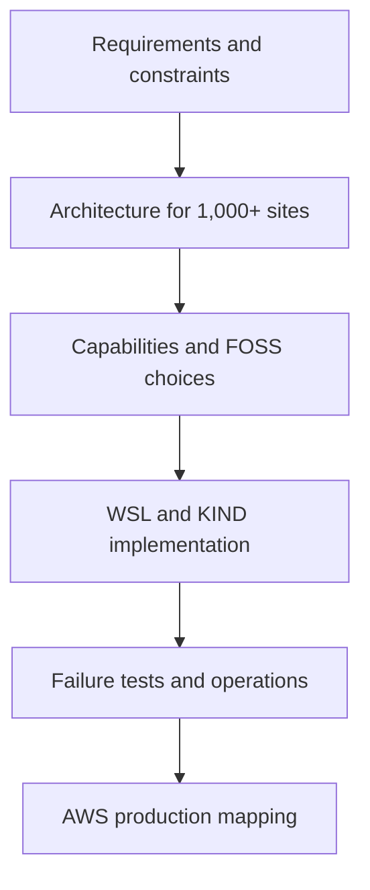

# Track-3 — Central Management Platform for 1,000+ EDGE Sites

**Status — 2026-09-27:** Current architecture-learning track concluded. Active implementation continues in [Track-4 — NEN Control, Factory and EC2 EDGE Lab](../track-4-nen-control-factory-ec2-lab/README.md). Open implementation questions remain unresolved. The Track-3A/3B descriptions below preserve the original roadmap; the immediate FOSS lab now proceeds as Track-4A, with EC2 EDGE work as Track-4B.

Track-3 designs and builds the central platform that enrolls, governs,
observes and operates a fleet of 1,000+ EDGE sites on customer premises.
Track-2 remains responsible for the EDGE-side trust, connectivity and lifecycle
journey; Track-3 focuses on the central services that the fleet depends on.

## Document roles

| Document | Purpose |
| --- | --- |
| [README.md](README.md) | Consolidated architecture, requirements, decisions and navigation. |
| [track-3-central-edge-platform-live.md](track-3-central-edge-platform-live.md) | Chronological transcript-like learning record. **Append only; never rewrite, reorder or restructure historical entries.** |
| [sub-topics/](sub-topics/) | Focused notes derived from the Track-3 learning journey. |
| [open-topic.md](open-topic.md) | Parked questions, evidence needed and revisit checkpoints. |

Current focused notes:

- [Factory provisioning: cold hardware to customer power-on](sub-topics/01-factory-provisioning.md)

## Track structure

### Track-3A — FOSS reference implementation

Track-3A is the first implementation. It runs locally on Ubuntu WSL with KIND
as the hands-on Kubernetes environment and uses open-source components where
they are justified by explicit requirements.

The production-grade architecture and theory are **not simplified for KIND**.
Availability, trust boundaries, failure domains, scaling, recovery, security,
upgrade safety and Day-2 operations must still be designed for a fleet of
1,000+ EDGE sites. KIND is only the inexpensive implementation environment in
which those responsibilities and interactions are learned and tested.

### Track-3B — AWS production implementation

Track-3B comes after the FOSS reference implementation. It maps the proven
requirements and architecture to Amazon EKS and appropriate AWS managed
services. Managed services are selected deliberately from operational,
security, availability, scaling and cost requirements rather than used as a
substitute for understanding the underlying platform responsibilities.

## Architecture-first scope

Track-3 begins with requirements, constraints, trust boundaries, data flows,
failure modes, recovery objectives and scale assumptions. It does not begin by
installing a tool list.

Candidate FOSS components discussed for Track-3A include:

| Capability | Candidate components |
| --- | --- |
| Kubernetes lab environment | KIND / Kubernetes |
| Networking and traffic visibility | Cilium, Hubble and Gateway API |
| Desired-state delivery | Argo CD |
| Fleet inventory and durable platform data | PostgreSQL |
| Secrets and private PKI | OpenBao, chosen over current HashiCorp Vault for a strict FOSS path |
| Metrics, dashboards, logs, traces and telemetry | Prometheus, Grafana OSS, Loki, OpenTelemetry and Tempo |
| Artifact and image registry | Harbor |
| Vulnerability and supply-chain controls | Trivy, Syft and Cosign |
| Policy enforcement | Kyverno |
| Load and scale validation | k6 OSS |

This is a candidate capability map, not an instruction to install every
component at once. Each component is introduced only after the requirement it
serves, its trust and data boundaries, its failure behavior, its operational
cost and its acceptance evidence are understood.

## Initial learning sequence

## Documentation rule

The live file preserves the chronological learning and decision record. Append
new dated checkpoints for corrections or changed understanding; never clean up
historical entries in place. Stable conclusions can be refined in this README
and expanded into focused documents under `sub-topics/`.

## Factory use-case navigation

Every factory-to-first-boot transition has a focused Markdown file in the [complete sub-topic index](sub-topics/README.md). All 18 original sub-topics now contain architecture conclusions; implementation and acceptance evidence remain pending. The overview includes the consolidated block diagram and corrected factory sequence.

## 2026-09-27 checkpoint

- [Factory conclusion and diagrams](sub-topics/01-factory-provisioning.md): shared preparation, vendor intake, repeated per-EDGE work, tests and shipping.
- [Trust and certificate ownership](sub-topics/17-nen-trust-and-certificate-issuance.md).
- [Factory to branch activation](sub-topics/18-nen-factory-to-branch-activation.md).
- [UKI, Secure Boot and PCR](sub-topics/19-uki-secure-boot-and-pcr.md).
- [PKI evidence and planned VirtualBox lab](sub-topics/20-pki-and-virtualbox-lab-checkpoint.md).
- [Data-center services and endpoint map](sub-topics/21-data-center-services-and-endpoints.md).

Factory architecture learning is concluded. TPM enrollment, bootstrap integration, firmware recovery and acceptance tests remain [open](open-topic.md). The root-certificate inspection is recorded; issuing-CA signing and Secure Boot VM tests are not completed. Continue next with central-service requirements and the first FOSS end-to-end lab. Branch operations and upgrade learning remain recorded as Steps 8–27 in the live document.
