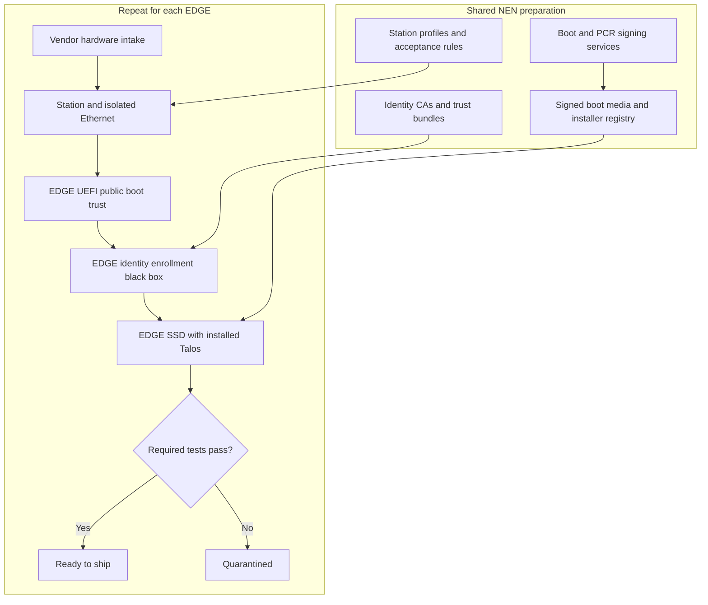
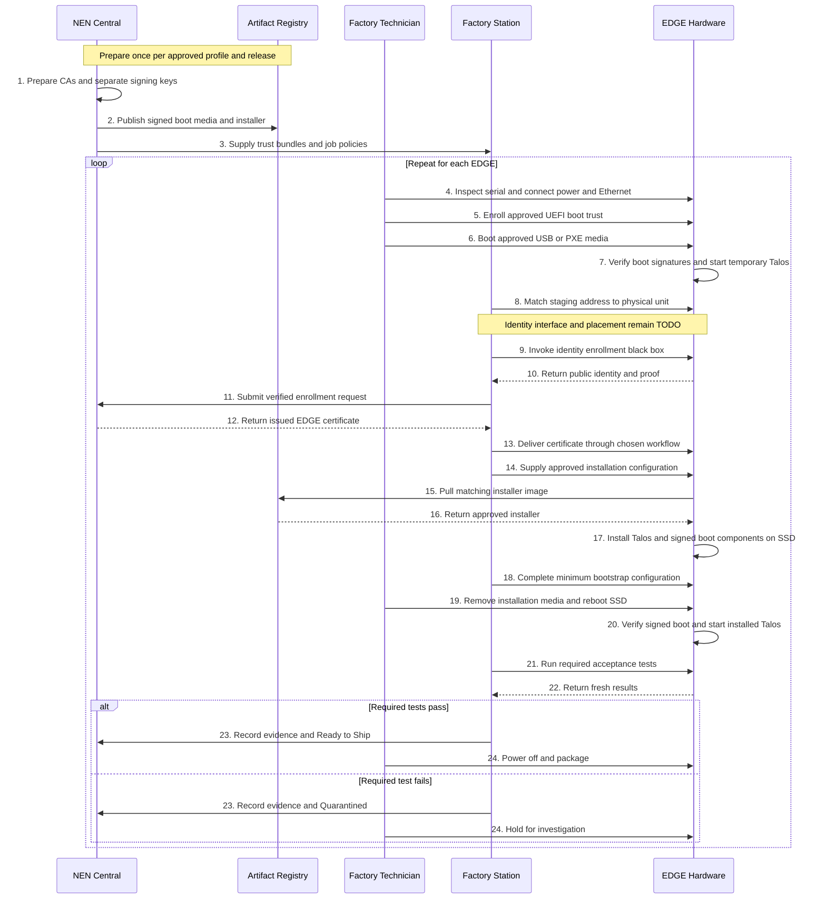

# Factory Provisioning — Consolidated Conclusion

**Status:** Architecture discussion concluded on 2026-09-27. Implementation and hardware validation remain open. This is a target workflow, not an executable runbook.

## 1. Shared preparation before hardware arrives

| Prepared centrally | Purpose and custody |
| --- | --- |
| Offline Root CA and online issuing CAs | Issue identity certificates; private CA keys stay with protected NEN signers |
| Boot signing key and public UEFI enrollment material | Sign approved bootloader and UKI; private key stays centrally protected |
| Separate PCR policy signing key | Support the selected TPM disk-unlock policy |
| Approved kernel, initramfs and boot arguments | Inputs assembled into the UKI by the image build workflow; not separately installed by factory operators |
| Signed bootloader and UKI | Executable boot components checked along the Secure Boot chain |
| USB ISO or PXE assets | Start the approved temporary installation environment |
| Matching installer container image | Install Talos and boot components onto the EDGE SSD |
| Registry, staging DHCP, station profiles and inventory | Distribute artifacts and coordinate repeatable per-device jobs |

No EDGE is required to create shared CA/signing keys or build boot artifacts. Artifacts are reused for an approved hardware profile and release; each EDGE identity is unique. Freeze an approved version and digest, rather than installing an unqualified moving “latest” release. Talos v1.14.1 is the learning reference recorded in this conversation.

## 2. Vendor delivery and connection

The vendor supplies the approved CPU, RAM, SSD, NICs, UEFI firmware, TPM and serial information. Cold hardware means not enrolled in NEN; it does not guarantee an empty SSD, missing OEM keys or a known firmware configuration.

The technician checks the manifest and hardware, records custody, scans the serial and connects power plus wired Ethernet to an isolated staging network. USB or PXE supplies the approved boot environment. DHCP provides an address; it does not establish identity. Factory Wi-Fi discovery and automatic station discovery are not assumed.

## 3. Factory modifications and tests

| Component | Factory action | Acceptance evidence |
| --- | --- | --- |
| UEFI | Enroll authorized public boot trust and configure boot policy | Expected trust/state and successful signed SSD boot; negative tests under an approved plan |
| TPM identity | Invoke the parked enrollment black box | Verified public identity, binding/proof and registered EDGE-ID |
| SSD | Install approved Talos, signed boot components and minimum bootstrap configuration | Correct disk, approved release, persistent startup and health |
| Device credential | Deliver the NEN-issued certificate for the EDGE-held key | Certificate/key match and authenticated connection through the chosen integration |
| Disk encryption | Configure selected policy where required | Unlock/recovery behavior tested; no claim of completion yet |
| Inventory | Record hardware, public identity, versions, job and evidence | Auditable pass or quarantine decision |

The station supplies a job: hardware profile, disk selection, artifact digest, configuration and acceptance rules. EDGE firmware/software performs local changes. Central signing private keys are never copied to EDGEs or stations.

## Factory Components

## Factory Provisioning Sequence

Identity enrollment is a logical black box. Its actual environment and position relative to Talos installation depend on OT-01; the diagram does not assert that temporary Talos exposes the needed TPM APIs. Certificate storage, use and survival across installation must be designed before executing this sequence.

## 4. Shipment and customer handoff

The SSD remains inside the shipped EDGE and contains installed Talos and approved signed boot components. Remove USB installation media and avoid re-entering installation PXE on normal boot. Factory completion is ReadyToShip, not branch Active.

At the branch, usable power and networking allow SSD boot. A proposed NEN bootstrap component connects outbound through NAT, verifies NEN, presents the EDGE credential and fresh private-key proof, and obtains only its authorized site configuration. This component is not an established stock Talos feature.

## 5. Closure boundary

All factory-to-first-boot sub-topics now have architecture conclusions, responsibilities, evidence and failure behavior. No unperformed TPM, Secure Boot, encryption or VirtualBox test is marked passed. See the [sub-topic index](README.md) and [open questions](../open-topic.md).

Sources previously reviewed: [Talos Secure Boot](https://docs.siderolabs.com/talos/v1.14/platform-specific-installations/bare-metal-platforms/secureboot), [Image Factory](https://docs.siderolabs.com/talos/v1.14/learn-more/image-factory), [disk encryption](https://docs.siderolabs.com/talos/v1.14/configure-your-talos-cluster/storage-and-disk-management/disk-encryption).
