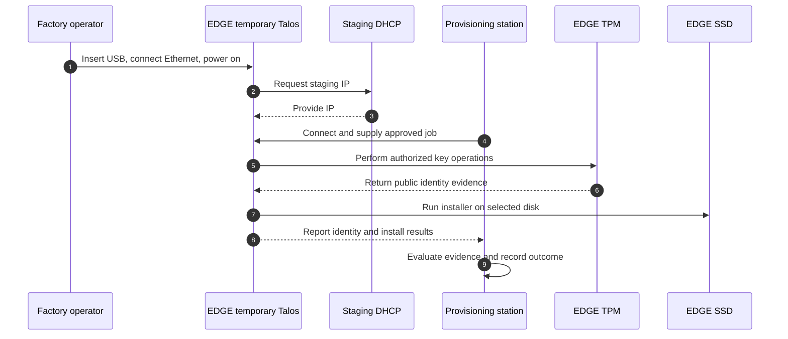
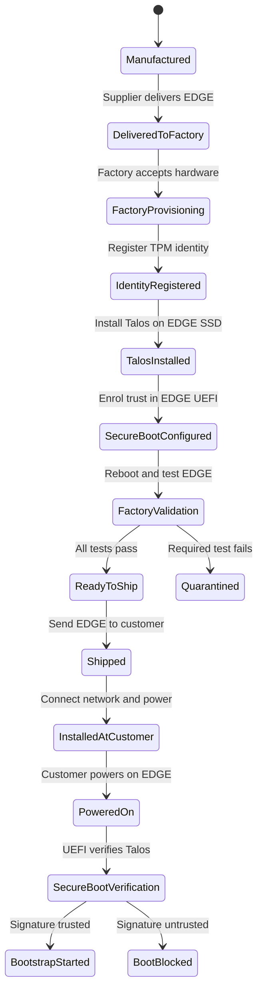
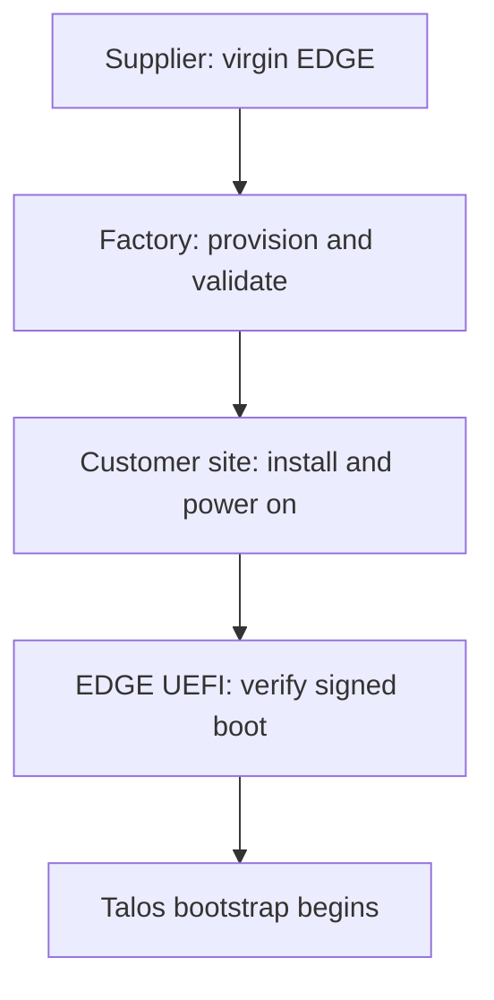

# Factory Provisioning — Cold Hardware to Customer Power-On

## Purpose

Factory provisioning converts virgin hardware from a supplier into a known,
trusted and tested EDGE that is safe to ship. It does not make the device an
active production EDGE; customer-site enrollment happens after power-on.

This document is the end-to-end overview. Each meaningful arrow in the
lifecycle diagram becomes its own focused sub-topic after that transition is
studied. This keeps identity, installation, Secure Boot, validation, shipping
and customer-site boot responsibilities understandable without losing the
complete journey.

## Locations and responsibilities

| Location | Responsibility |
| --- | --- |
| Supplier site | Manufacture and deliver cold hardware with serial number and TPM |
| Factory staging facility | Inspect, provision and validate the EDGE |
| Inside the EDGE | TPM protects keys, UEFI holds boot trust, and SSD holds installed Talos |
| Central platform | Publish signed artifacts and store fleet public information |
| Customer site | Connect the provisioned EDGE to network and power |

The factory may operate multiple identically configured provisioning servers
in parallel. A provisioning server orchestrates the work, but configuration
changes occur on components inside the EDGE.

## Interaction model

**Factory EDGE Interactions**

This shows the EDGE-side execution boundary. UEFI trust enrollment and post-install reboot are separate state transitions; see [06](06-talos-installed-to-secure-boot-configured.md) and [07](07-secure-boot-configured-to-factory-validation.md).

## Lifecycle model

**Factory to Customer States**

## What resides on the EDGE

| EDGE component | Factory activity |
| --- | --- |
| TPM | Read EK public identity; generate non-exportable AK and operational keys |
| UEFI | Enrol the public trust used to verify signed boot software |
| SSD | Install approved Talos and the selected minimum bootstrap information |

Private keys remain protected by the TPM. The central fleet inventory stores
only the required public identities, assignments, versions, evidence and
lifecycle state.

## Factory outcome

Passing factory validation produces `READY_TO_SHIP`. A required test failure
produces `QUARANTINED` and the EDGE must not be shipped.

## Open implementation detail

The exact storage and delivery mechanism for minimum bootstrap information is
not decided yet. First establish the artifact flow among the Talos ISO,
installer, installed Talos and UKI. Only then select how bootstrap information
is safely delivered and retained.
