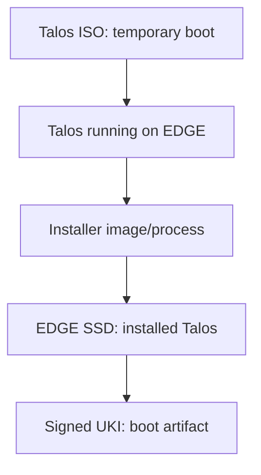

# Identity Registered → Talos Installed

**Status:** Physical artifact relationship established; Talos v1.14.1 reference; implementation and artifact selection pending.

## Use case

The factory station selects the approved Talos build for this EDGE hardware profile. The EDGE boots temporary installation media, obtains its machine configuration and installer image according to the chosen Talos workflow, and installs Talos onto its SSD. The station orchestrates, but the installer executes on the EDGE and writes its disk.

The ISO is removable installation media. The installer image is the source used for disk installation. Installed Talos persists on the SSD; a signed UKI, when using the Talos Secure Boot installation path, is a boot artifact of that installation, not a second OS. After installation and reboot, boot comes from SSD. Confirm the selected Talos release, image customization, signing path and UEFI support before specifying exact partitions or commands.

| Check | Location |
| --- | --- |
| Verify approved artifact provenance and profile | Factory station before delivery; EDGE-side validation as designed |
| Run installer and write selected disk | EDGE temporary Talos environment and EDGE SSD |
| Record install result/version/disk identity | EDGE reports; station/inventory record |

**Exit evidence:** correct SSD selected, installation completes, expected Talos version and boot artifact recorded. An installer result alone does not prove Secure Boot. For our chosen Secure Boot path, UEFI trust is prepared before booting installation media; enforcement is verified again after SSD reboot. Disk selection and failed-install recovery need an explicit test before automation.

## Open questions

Artifact source and signature/checksum policy; extension compatibility; configuration delivery and secret handling; exact Talos Secure Boot artifacts; safe retry after partial disk writes.

## NEN artifact clarification

OS means the operating system. ISO/PXE boots temporary Talos; it pulls the installer container image specified by machine configuration, not another ISO. Proposed NEN repositories provide approved boot assets and installers. See [trust preparation](17-nen-trust-and-certificate-issuance.md) and [two-phase activation](18-nen-factory-to-branch-activation.md).

## Architecture closure — 2026-09-27

This sub-topic's responsibility boundary is concluded for the current learning pass. The [consolidated factory workflow](01-factory-provisioning.md) supplies the corrected shared-preparation/per-EDGE sequence. UEFI trust precedes the Secure Boot installation environment; SSD reboot verifies enforcement again. Implementation questions remain in [open-topic.md](../open-topic.md), and no unperformed test is marked successful.
