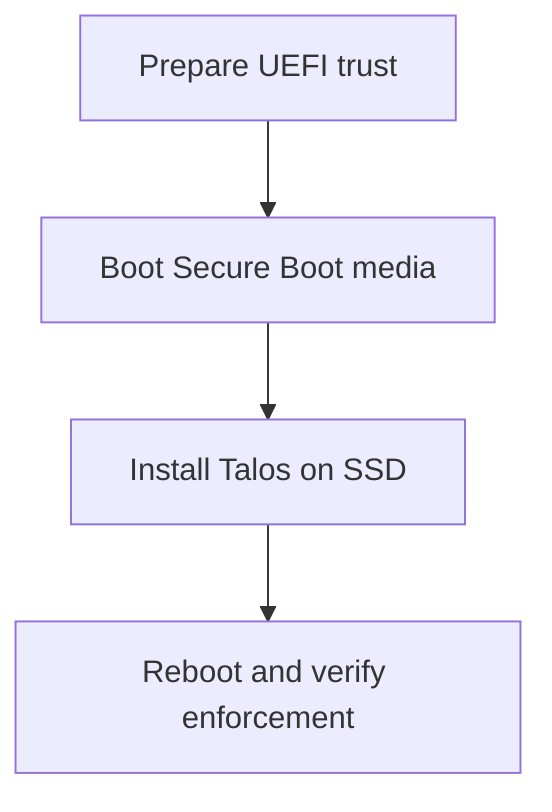

# Secure Boot Trust Preparation and Verification

**Status:** Fundamentals and responsibility boundary established; key enrollment method pending.

## Use case

The authorized factory workflow establishes which signed boot code the EDGE firmware will accept. UEFI is motherboard firmware; Secure Boot is its signature-check policy for boot software. The signed Talos UKI resides on the installed system's EFI boot path. The station coordinates trust enrollment, while the EDGE UEFI stores and applies the trust databases.

| UEFI item | Basic role |
| --- | --- |
| PK | Platform ownership authority |
| KEK | Authorizes updates to signature databases |
| db | Allowed signing certificates/hashes |
| dbx | Revoked signing certificates/hashes |

The private signing keys stay in protected signing infrastructure. Public certificates or allowed hashes reach UEFI through an explicitly authorized enrollment procedure. TPM measurements and attestation are separate evidence about boot state; Secure Boot verifies signatures and blocks untrusted boot code.

**Exit evidence:** actual UEFI Secure Boot enabled state, expected trust databases and signed UKI compatibility recorded. A later reboot must demonstrate enforcement. Incorrect trust enrollment can make the machine unbootable, so document recovery and key rotation before running a fleet-wide procedure.

## To study next

Talos-specific enrollment workflow and key hierarchy, OEM versus custom keys, dbx and revocation, signed update path, rollback and physical recovery.

## Ordering correction — 2026-09-27

The filename preserves existing links; its former transition label is superseded. For the Talos 1.14 Secure Boot path, enroll trust before running the Secure Boot installation environment. Install using a matching Secure Boot installer, then verify again after booting SSD. UEFI checks signed bootloader/UKI components, not a signature over the complete ISO.

**Secure Boot Installation Order**

See [NEN signing ownership](17-nen-trust-and-certificate-issuance.md). Source: [Talos 1.14 Secure Boot](https://docs.siderolabs.com/talos/v1.14/platform-specific-installations/bare-metal-platforms/secureboot).

## Architecture closure — 2026-09-27

This sub-topic's responsibility boundary is concluded for the current learning pass. The [consolidated factory workflow](01-factory-provisioning.md) supplies the corrected shared-preparation/per-EDGE sequence. UEFI trust precedes the Secure Boot installation environment; SSD reboot verifies enforcement again. Implementation questions remain in [open-topic.md](../open-topic.md), and no unperformed test is marked successful.
