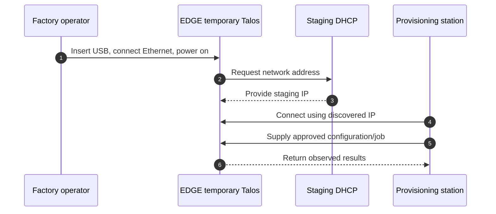

# Factory Provisioning Station — Per-EDGE Run

**Status:** Reference workflow and assumptions established; implementation design pending.

## Use case

A factory operator attaches an accepted virgin EDGE to a station. The station loads an approved job for its hardware profile, directs operations on the EDGE, gathers evidence, and records a pass/fail decision. Multiple similarly configured stations may process different devices concurrently. A lab can perform these steps manually with USB media; a production line can automate scanning, network boot/media selection, installation and tests with operator intervention on exceptions.

**Step 2 — Temporary boot and staging connection**

Talos booted without machine configuration enters maintenance mode. The initial design uses wired Ethernet and DHCP; Talos does not automatically discover a factory Wi-Fi or its provisioning station. How the station reliably finds and authorizes the right EDGE is still to be designed (for example a scanned port/serial mapping plus observed address).

## What the station knows

- Authorized job, scanned serial, expected hardware profile and EDGE-ID from inventory.
- Approved OEM EK trust roots, firmware and TPM policy, Talos artifact identifiers, signed artifact verification metadata, and a narrowly scoped credential for inventory/enrollment APIs.
- Target disk selection rules, test definitions, current signing public trust, station identity and audit context.

It does **not** hold TPM private keys or central image-signing/CA private keys. Decide separately whether any short-lived enrollment secret is required, how it is issued and destroyed, and how a compromised station is revoked.

## How it operates

| Step | Initiator | Where the work happens |
| --- | --- | --- |
| Scan and match hardware | Operator/station | Station checks records; EDGE exposes hardware facts |
| Create identity keys (parked) | Station requests | EDGE-side TPM environment and API not yet selected |
| Install Talos | Station supplies approved job/artifacts | EDGE temporary Talos environment runs installer on EDGE SSD |
| Set boot trust before booting installation media | Authorized station workflow | EDGE UEFI changes its own Secure Boot state/databases |
| Reboot and validate | Station triggers and evaluates | EDGE UEFI, TPM, Talos and hardware perform the checks |
| Record outcome | Station/validation service | Central inventory stores evidence and state |

The station cannot infer successful Secure Boot or Talos health just from its own configuration. It needs fresh evidence from the physical unit and should attribute every result to a specific EDGE-ID, job, artifact version and station.

## Assumptions and open decisions

- The factory has controlled physical access and an isolated staging network; station identity and software are themselves managed and audited.
- Artifacts are prepared and signed by a central pipeline before the station fetches them.
- Provisioning concurrency, network outages, duplicate inventory claims and partial installs need idempotent job handling and quarantine rules.
- Exact automation machinery (USB, PXE/network boot, fixture or conveyor), Talos commands, UEFI enrollment procedure, evidence policy and security of the initial EDGE-side environment remain to be selected and tested.

**TODO:<Question>** On Talos v1.14.1, can an unconfigured EDGE in maintenance mode expose its TPM EK public key and manufacturer certificate, create or use an AK, and provide a verifiable EK–AK binding through documented Talos API/`talosctl` operations? If not, what controlled factory boot environment or OEM identity handoff performs these operations before Talos installation? Verify with official documentation/source and a physical TPM PoC before selecting the workflow.

Follow the state-specific files [03](03-delivered-to-factory-provisioning.md), [04](04-factory-provisioning-to-identity-registered.md), [05](05-identity-registered-to-talos-installed.md), [06](06-talos-installed-to-secure-boot-configured.md) and [07](07-secure-boot-configured-to-factory-validation.md) for the transitions.

## Architecture closure — 2026-09-27

This sub-topic's responsibility boundary is concluded for the current learning pass. The [consolidated factory workflow](01-factory-provisioning.md) supplies the corrected shared-preparation/per-EDGE sequence. UEFI trust precedes the Secure Boot installation environment; SSD reboot verifies enforcement again. Implementation questions remain in [open-topic.md](../open-topic.md), and no unperformed test is marked successful.
