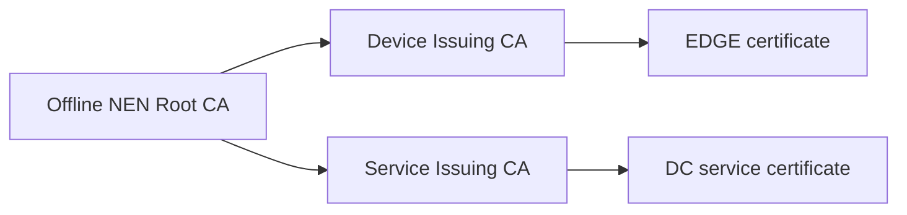

# NEN Trust and Certificate Issuance

**Status:** Proposed architecture; certificate issuance explained. TPM implementation remains [OT-01](../open-topic.md).

## NEN scope

Naren Edge Networks operates thousands of geographically distributed branch offices. Each Site-ID has one or more unique EDGE-IDs. Each EDGE has its own operational key and certificate.

## Who creates and keeps each key?

| Key | Creator and private-key custodian | Purpose |
| --- | --- | --- |
| NEN Root CA | NEN security administrators; protected offline root environment | Sign issuing CA certificates |
| Device Issuing CA | NEN PKI service; protected online DC signer | Issue individual EDGE certificates |
| Service Issuing CA | NEN PKI service; protected online DC signer | Issue management/enrollment service certificates |
| EDGE operational key | EDGE; TPM generation assumed through the black box | Prove device identity |
| Boot-signing key | NEN central signing service | Sign bootloader and UKI |
| PCR policy signing key | NEN central signing service | Sign TPM disk-unlock policies |

A sub-CA is an intermediate CA whose certificate is signed by its parent. The EDGE sends its public key and issuance request/evidence; the issuing CA signs a certificate binding that key to an approved EDGE identity. The EDGE private key stays protected locally. Inventory stores public identity, certificate and audit information.

**NEN Certificate Hierarchy**



## Concrete issuance use case

EDGE-001 creates its key pair, requests a certificate and supplies required identity evidence. NEN verifies the request and issues a certificate containing the EDGE identity, its public key, validity and issuer signature. Later the EDGE presents it and proves possession of its private key. Copying a certificate alone does not provide that proof.

Boot-signing trust is separate: Talos supports self-signed custom boot certificates enrolled in UEFI, or Sidero Labs-signed images. Our proposed NEN path keeps boot-signing private keys centrally and distributes signed artifacts plus public enrollment material to stations. Talos API and Kubernetes CAs remain separate cluster trust systems; do not assume they are replaced by the device CA.

Illustrative preparation commands, not executed:

```bash
talosctl gen secureboot uki --common-name "NEN Boot Signing"
talosctl gen secureboot database
talosctl gen secureboot pcr
```

The first command produces uki-signing-key.pem and public certificates in PEM/DER. The second produces PK.auth, KEK.auth and db.auth enrollment material. The third creates a separate PCR policy signing key. Image generation/signing follows separately. These preparations precede provisioning the first EDGE; station setup can happen in parallel.

**TODO:<Question>** Define CA lifetime, rotation, revocation, issuance authorization and regional availability before implementation. One sub-CA per branch is not required by default.

References: [Talos Secure Boot](https://docs.siderolabs.com/talos/v1.14/platform-specific-installations/bare-metal-platforms/secureboot), [certificate chains](https://docs.openssl.org/3.5/man7/ossl-guide-tls-introduction/).

## Architecture closure — 2026-09-27

This sub-topic's responsibility boundary is concluded for the current learning pass. The [consolidated factory workflow](01-factory-provisioning.md) supplies the corrected shared-preparation/per-EDGE sequence. UEFI trust precedes the Secure Boot installation environment; SSD reboot verifies enforcement again. Implementation questions remain in [open-topic.md](../open-topic.md), and no unperformed test is marked successful.
