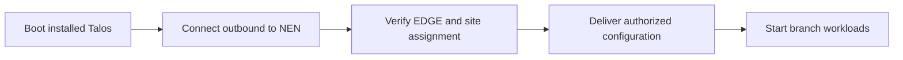

# NEN Factory to Branch Activation

**Status:** Two-phase architecture agreed for learning; enrollment software and configuration handoff remain unimplemented.

## Phase 1 — Factory

Prepare NEN public boot trust in EDGE UEFI, boot approved Secure Boot media and install approved Talos on SSD. Establish individual EDGE identity using the parked TPM black box; obtain a NEN-issued operational certificate and record public identity centrally. Supply minimum NEN enrollment address, service CA trust and initial networking configuration. Reboot, validate and approve shipment. The exact ordering of TPM enrollment relative to Talos depends on resolving [OT-01](../open-topic.md).

The station orchestrates; EDGE firmware/software executes local changes. Central CA and boot-signing private keys remain in protected signing systems. Each EDGE's operational private key remains protected on that EDGE.

## Phase 2 — Branch

Power and usable networking let installed Talos boot. The proposed EDGE bootstrap component initiates an outbound connection through NAT to NEN, authenticates and obtains authorized site-specific configuration and secrets.

**Branch Activation**

This is NEN's target workflow, not a built-in stock Talos enrollment feature. NEN must implement/integrate the bootstrap component and secure configuration delivery. Initial network reachability and trusted NEN service identity must work before site-specific secrets arrive.

**TODO:<Question>** Define how an EDGE is assigned to a Site-ID, which bootstrap component runs before branch configuration, how it uses the operational credential, and which settings require restart/reinstallation. Do not assume any machine configuration can be changed live.

One site may contain one or multiple EDGEs. Identity verification alone does not authorize every EDGE for every site: central assignment and lifecycle policy must also approve it.

## Architecture closure — 2026-09-27

This sub-topic's responsibility boundary is concluded for the current learning pass. The [consolidated factory workflow](01-factory-provisioning.md) supplies the corrected shared-preparation/per-EDGE sequence. UEFI trust precedes the Secure Boot installation environment; SSD reboot verifies enforcement again. Implementation questions remain in [open-topic.md](../open-topic.md), and no unperformed test is marked successful.
