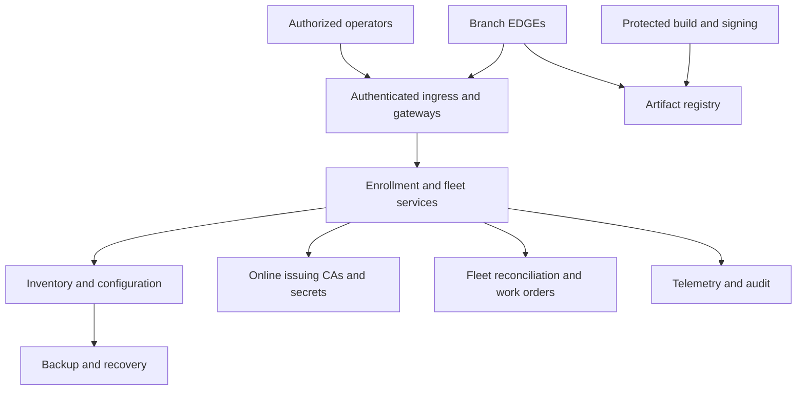

# NEN Data Center Services

**Status:** Logical capability design; endpoint names are examples, not deployed services.

| Capability | Example endpoint or access | Responsibility |
| --- | --- | --- |
| Enrollment | enroll.nen.example:443 | Verify enrollment evidence and authorize registration |
| Fleet API | fleet.nen.example:443 | Device desired state, reported state and work orders |
| Management connectivity | connect.nen.example; protocol and port TBD | Accept EDGE-initiated connectivity through NAT |
| Credential renewal | identity.nen.example:443 | Authorized certificate renewal and lifecycle |
| Artifact distribution | registry.nen.example:443 | Approved installers and workload images |
| Boot assets | boot.nen.example:443 | HTTPS boot-asset distribution; complete PXE infrastructure remains separate |
| Telemetry | telemetry.nen.example:443 | Authenticated metric/log/trace ingestion |
| Operator portal | portal.nen.example:443 | Role-controlled inventory and operations |

These names describe logical responsibilities; they need not be eight separate products. Internal dependencies include inventory storage, fleet controller, online issuing CAs, secrets, configuration repository, signing pipeline, audit, monitoring, backups and operator identity. Offline Root CA custody stays outside routine online service operation.

## Common preparation

1. Define DNS, ingress certificates, service/device trust and authorization boundaries.
2. Prepare hardware profiles, inventory schema, site assignment rules and lifecycle ownership.
3. Publish approved artifacts and versioned configuration; protect signing keys.
4. Define service availability, recovery objectives, backup restoration and audit retention.
5. Define enrollment/reconnect/upgrade concurrency and validate expected fleet load.
6. Select FOSS components by requirement and identify NEN-specific integration work.

## Central Components

The diagram shows logical dependencies, not a final network or trust-zone design. TLS termination, inter-service identity and access enforcement remain decisions.

**TODO:<Question>** Select service boundaries, FOSS implementations, availability topology and the first end-to-end KIND lab without reducing the 1,000+ site production requirements.
