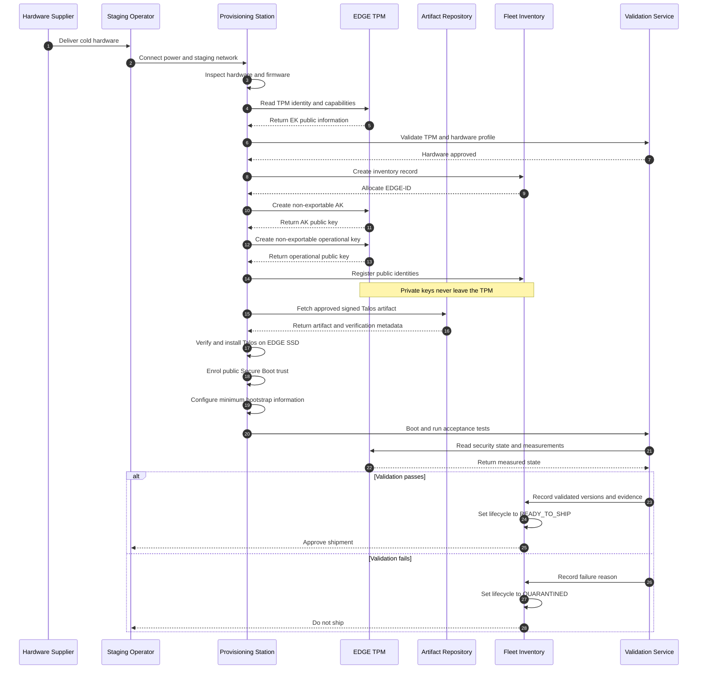
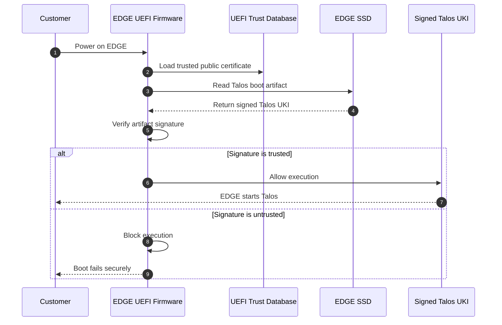
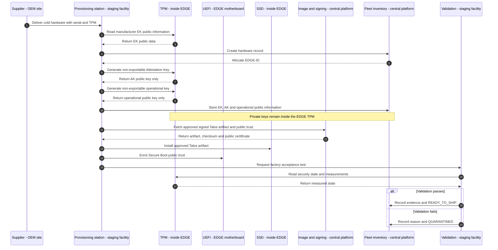
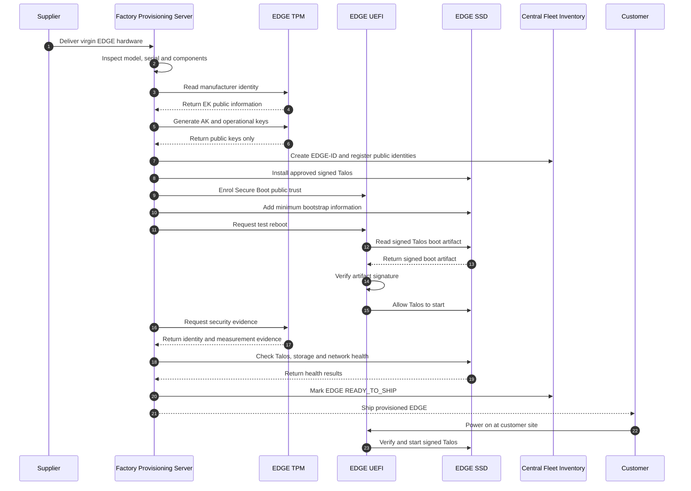
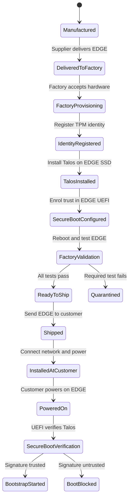

# Track-3 — Central Management Platform for 1,000+ EDGE Sites — Live Record

This file is the chronological, transcript-like record for Track-3.

**Append-only rule:** after creation, never rewrite, reorder, restructure or
clean up historical entries. Record corrections and changed understanding as
new dated checkpoints.

---

## 2026-09-26 — Track-3 creation and context switch

### Decision

Create a separate Track-3 for the central management platform that will
control and operate 1,000+ EDGE sites on customer premises.

Track-2 and Track-3 have different viewpoints:

- Track-2 asks how an EDGE is built, trusted, connected and managed securely.
- Track-3 asks how the central platform enrolls, governs, observes and operates
  the fleet at scale.

Track-2 is paused, not completed. Point 24, Container Strategy, remains
unfinished. Track-2 will resume after Track-3A so that the central platform
responsibilities are understood before the EDGE-side journey continues.

### Track split

```text
Track-3 — Central Management Platform for 1,000+ EDGE Sites

├── Track-3A — FOSS reference implementation
│   └── Local Ubuntu WSL + KIND
│
└── Track-3B — AWS production implementation
    └── Amazon EKS + appropriate AWS managed services
```

Track-3A is implemented locally, but the architecture and theory remain
production-grade for 1,000+ EDGE sites. KIND is only the hands-on environment;
it is not permission to simplify production requirements, failure modes,
security boundaries, availability, recovery or Day-2 operational reasoning.

### Initial component direction

The FOSS direction discussed includes KIND/Kubernetes, Cilium, Hubble, Gateway
API, Argo CD, PostgreSQL, OpenBao, Prometheus, Grafana OSS, Loki,
OpenTelemetry, Tempo, Harbor, Trivy, Syft, Cosign, Kyverno and k6 OSS.

OpenBao is preferred over current HashiCorp Vault for the strict FOSS reference
path. This list is not an installation checklist. Requirements and architecture
come first; components are added incrementally only when their responsibilities
and trade-offs justify them.

### Safe start point

Begin Track-3A with requirements and architecture for the production-scale
central platform. Define capabilities, trust boundaries, data flows, failure
domains, recovery objectives, evidence and scale assumptions before installing
KIND or any platform component.


---

## 2026-09-26 — Learning checkpoint: Cold hardware to ready to ship

### Learning objective and pace

The immediate objective is to understand and absorb the architecture before
implementing it. New and advanced topics must be introduced steadily, one
mental model at a time. Do not install a large platform stack or move to the
next concept until the current boundary is clear.

### Initial central-platform responsibilities

The first responsibilities identified for the central platform were:

- verify that an EDGE is legitimate;
- maintain fleet inventory, including EDGE-ID, account, customer and site;
- provide approved signed Talos artifacts;
- maintain desired and observed information such as Talos version, Kubernetes
  version, WireGuard overlay address and configuration version.

These responsibilities should remain separate capabilities rather than become
one all-powerful service:

```text
Enrollment and verification
        ↓
Fleet inventory
        ↓
Image and signing pipeline
        ↓
Configuration and lifecycle management
```

The signed image is normally shared by an approved hardware/software profile.
Per-device identity and configuration remain separate:

```text
Shared signed Talos image
        +
Unique TPM-backed identity
        +
Per-device configuration
        =
Individually managed EDGE
```

### What an EDGE physically is

An EDGE is a role, not a specific product. In this architecture it is a
physical computer installed at a customer site and managed by the central
platform. Depending on the workload, it could be a compact x86 computer, a
rugged fanless industrial computer or a server-class system.

Before purchasing at fleet scale, define and qualify an approved hardware
profile. A representative profile might include x86_64 CPU, suitable RAM and
SSD capacity, UEFI Secure Boot, TPM 2.0, multiple network interfaces, the
required power/cooling/mounting design and an appropriate vendor warranty.
Exact sizing depends on the customer workload.

The safe commercial sequence is to buy evaluation units first and verify
Talos compatibility, NICs, storage, UEFI, Secure Boot, TPM behavior, power-loss
recovery, thermals and workload capacity before freezing an approved model.

### Cold hardware and factory provisioning

Cold hardware has not yet become a trusted member of the fleet. Factory or
staging provisioning binds the physical unit to a fleet identity and prepares
it for shipment.

The initial inventory record separates the business identity from manufacturer
attributes:

```text
EDGE-001
├── Manufacturer serial
├── Hardware profile
├── TPM identity
├── Lifecycle state
├── Customer/account assignment
└── Site assignment
```

The main factory activities are:

1. Inspect and validate the hardware.
2. Allocate an EDGE-ID and create the inventory record.
3. Read and validate TPM manufacturer/public identity information.
4. Create separate TPM-protected attestation and operational keys.
5. Register only public information centrally; private keys stay protected by
   the TPM.
6. Fetch and install the approved signed Talos artifact for the hardware
   profile.
7. Enrol the corresponding public Secure Boot trust in UEFI.
8. Configure only minimum bootstrap information.
9. Run factory acceptance tests.
10. Mark the unit `READY_TO_SHIP` or `QUARANTINED`.

### TPM mental model

A TPM is the EDGE's local hardware root of trust and protected cryptographic
engine. It may be a discrete security chip, an integrated implementation or a
firmware-backed protected environment; the production hardware profile must
state and validate the required assurance level.

The key roles are:

```text
EK  = Which TPM is this?
AK  = Which TPM signed this attestation evidence?
PCR = What platform/boot state was measured?
Operational key = Which EDGE is authenticating now?
```

**PCR means Platform Configuration Register**, not Platform Container
Register. PCRs live in the TPM and hold hash values extended from boot
measurements. The current values are not permanent device identity.

The central platform can retain the EK public identity or fingerprint, EK
certificate validation result, AK public key, operational public key or
certificate, and approved measurement policy. It must never copy the EK, AK or
operational private keys from the EDGE.

The TPM produces cryptographic evidence; the central platform makes the trust
decision. For local disk protection, the operating system encryption layer
encrypts the SSD data while the TPM protects or releases the disk key under an
approved policy.

### Factory provisioning sequence

**Cold Hardware Provisioning**



### Provisioning station and artifact destination

The provisioning station is another trusted machine in the staging facility,
not a component shipped with the EDGE. For the initial design it can be a
secured Linux workstation. At larger scale it can become an automated network
or manufacturing-line provisioning service.

The precise artifact path is:

```text
Image build pipeline
        ↓
Protected signing service
        ↓
Artifact repository
        ↓
Provisioning station
        ↓
EDGE internal SSD
```

The provisioning station fetches an already approved and signed artifact,
verifies it, and installs it. It does not receive the private image-signing
key. The signed Talos artifact goes onto the SSD; the corresponding public
Secure Boot trust is enrolled into UEFI.

### ISO, installed Talos and remote provisioning

The Talos ISO is installation media. The chosen initial architecture does not
leave the ISO on the EDGE SSD:

```text
Talos ISO or installer
        ↓
Install Talos
        ↓
EDGE SSD contains installed Talos
        ↓
Remove installation media
```

Factory provisioning and remote provisioning solve different problems:

```text
Factory provisioning
= install trusted Talos and establish hardware identity

Remote provisioning after customer power-on
= verify the EDGE and deliver customer/site-specific configuration
```

Remote provisioning in the initial design does not reinstall the operating
system. It supplies the unique network, WireGuard, Talos machine, Kubernetes
role and application assignments after enrollment succeeds. Fully remote OS
installation is another possible design, but it adds recovery-image and
network-boot complexity and is not selected for the first architecture.

### Secure Boot preview

UEFI is firmware on the EDGE motherboard. Secure Boot is configured before
shipment and enforced on every boot, including the first customer-site boot.
Its narrow question is:

> Is this signed boot software trusted and therefore allowed to execute?

**Secure Boot Decision**



This was only a preview. The terms image, ISO, installed Talos, UKI and Secure
Boot began to overlap and the mental model stopped being clear. The learning
session was deliberately paused instead of adding more detail.

### Current understanding

The stable checkpoint is:

```text
Cold hardware
        ↓
Factory validates hardware and TPM
        ↓
Public identities registered centrally
        ↓
Approved Talos is installed on the SSD
        ↓
Public Secure Boot trust is enrolled in UEFI
        ↓
Acceptance tests pass
        ↓
READY_TO_SHIP
```

The unit is prepared but not yet an active production EDGE. Customer-site
enrollment, verification and unique configuration happen after power-on and
will be covered only after the boot-artifact model is clear.

### Exact restart point

Resume slowly from this unresolved question:

> What exactly are the Talos image, ISO, installer and UKI; which one is used
> temporarily, which one remains on the SSD, and which one UEFI verifies?

Do not proceed to detailed customer-site enrollment or remote provisioning
until this artifact flow is understood in a simple physical sequence.


---

## 2026-09-27 — Clarification: Provisioning sources and locations

The diagram added in commit `54dfb90` showed the sequence but did not clearly
identify where each system lives or where each identity/artifact originates.
The historical diagram remains unchanged under the append-only rule. This
checkpoint adds the clarified version.

### Source and location map

| Item | Source | Location after creation |
| --- | --- | --- |
| Hardware serial and TPM/EK | Hardware/TPM manufacturer | EDGE hardware; public details copied to fleet inventory |
| EDGE-ID | Fleet inventory | Central management platform |
| Attestation Key | Generated inside the EDGE TPM | Private key remains in TPM; public key copied to fleet inventory |
| Operational key | Generated inside the EDGE TPM | Private key remains in TPM; public key copied to fleet inventory |
| Signed Talos artifact | Central image and signing pipeline | Artifact repository, then installed on the EDGE SSD |
| Secure Boot public trust | Central signing system | Enrolled into the EDGE UEFI trust database |
| Validation result | Staging validation service | Fleet inventory |

### Provisioning sequence with locations

**Provisioning Sources and Locations**



The four physical boundaries are now explicit:

```text
Supplier site
    -> supplies cold hardware and manufacturer identity

Staging facility
    -> provisions and validates the EDGE

Inside the EDGE
    -> TPM protects private keys, UEFI holds boot trust, SSD holds Talos

Central platform
    -> signs/publishes artifacts and stores fleet public information
```


---

## 2026-09-27 — Correction: Provisioning interactions and EDGE state

### Diagram correction

The earlier factory sequence used self-directed provisioning-station arrows
for installing Talos, enrolling Secure Boot trust and adding bootstrap
information. Those arrows were misleading because the provisioning server
orchestrates the actions, but the changes occur on components inside the EDGE.

For production scale, the factory can operate a pool of similarly configured
provisioning servers. Each server provisions one or more virgin EDGEs through
the controlled staging network.

The provisioning server does not perform all tests on itself. It instructs the
EDGE, causes the EDGE to boot, and evaluates evidence returned by the EDGE:

- Talos is installed on the EDGE SSD.
- Secure Boot public trust is enrolled in the EDGE UEFI.
- Private keys are generated and used inside the EDGE TPM.
- UEFI performs boot-signature verification on the EDGE.
- Talos, storage and network health are observed from the EDGE.
- The provisioning and validation systems record the final decision.

### Factory interaction diagram

**Factory EDGE Interactions**



The diagram uses TPM, UEFI and SSD as separate EDGE participants so that every
factory action shows its real target. The provisioning server is the
orchestrator; it is not the destination of EDGE configuration changes.

### EDGE lifecycle state diagram

**Factory to Customer States**



### Physical journey

```text
Supplier
    ↓ virgin hardware
Factory provisioning environment
    ↓ provisioned and tested hardware
Customer site
    ↓ customer powers on
EDGE UEFI verifies Talos
    ↓
Bootstrap begins
```

The exact storage and delivery mechanism for minimum bootstrap information is
still an open implementation detail. It must be resolved only after the ISO,
installer, installed Talos and UKI artifact flow is understood.

### Sub-topic organization decision

The factory-to-customer diagram is the lifecycle overview. Each meaningful
state transition will receive a separate focused sub-topic after it is studied,
including the failure branches to `Quarantined` and `BootBlocked`. Detailed
pages will not be generated speculatively; they will capture the architecture,
trust, evidence, failure behavior and recovery path established during the
learning discussion.

The corresponding Markdown files `02` through `15` were created under
`sub-topics/`. Each file defines the transition and current learning scope;
details remain explicitly marked as planned until that state change is studied.
