# Track-3 — Central Management Platform for 1,000+ EDGE Sites — Live Record

This file is the chronological, transcript-like record for Track-3.

**Append-only rule:** after creation, never rewrite, reorder, restructure or
clean up historical entries. Record corrections and changed understanding as
new dated checkpoints.

---

## 2026-09-26 — Track-3 creation and context switch

### Decision

Create a separate Track-3 for the central management platform that will
control and operate 1,000+ EDGE sites on customer premises.

Track-2 and Track-3 have different viewpoints:

- Track-2 asks how an EDGE is built, trusted, connected and managed securely.
- Track-3 asks how the central platform enrolls, governs, observes and operates
  the fleet at scale.

Track-2 is paused, not completed. Point 24, Container Strategy, remains
unfinished. Track-2 will resume after Track-3A so that the central platform
responsibilities are understood before the EDGE-side journey continues.

### Track split

```text
Track-3 — Central Management Platform for 1,000+ EDGE Sites

├── Track-3A — FOSS reference implementation
│   └── Local Ubuntu WSL + KIND
│
└── Track-3B — AWS production implementation
    └── Amazon EKS + appropriate AWS managed services
```

Track-3A is implemented locally, but the architecture and theory remain
production-grade for 1,000+ EDGE sites. KIND is only the hands-on environment;
it is not permission to simplify production requirements, failure modes,
security boundaries, availability, recovery or Day-2 operational reasoning.

### Initial component direction

The FOSS direction discussed includes KIND/Kubernetes, Cilium, Hubble, Gateway
API, Argo CD, PostgreSQL, OpenBao, Prometheus, Grafana OSS, Loki,
OpenTelemetry, Tempo, Harbor, Trivy, Syft, Cosign, Kyverno and k6 OSS.

OpenBao is preferred over current HashiCorp Vault for the strict FOSS reference
path. This list is not an installation checklist. Requirements and architecture
come first; components are added incrementally only when their responsibilities
and trade-offs justify them.

### Safe start point

Begin Track-3A with requirements and architecture for the production-scale
central platform. Define capabilities, trust boundaries, data flows, failure
domains, recovery objectives, evidence and scale assumptions before installing
KIND or any platform component.


---

## 2026-09-26 — Learning checkpoint: Cold hardware to ready to ship

### Learning objective and pace

The immediate objective is to understand and absorb the architecture before
implementing it. New and advanced topics must be introduced steadily, one
mental model at a time. Do not install a large platform stack or move to the
next concept until the current boundary is clear.

### Initial central-platform responsibilities

The first responsibilities identified for the central platform were:

- verify that an EDGE is legitimate;
- maintain fleet inventory, including EDGE-ID, account, customer and site;
- provide approved signed Talos artifacts;
- maintain desired and observed information such as Talos version, Kubernetes
  version, WireGuard overlay address and configuration version.

These responsibilities should remain separate capabilities rather than become
one all-powerful service:

```text
Enrollment and verification
        ↓
Fleet inventory
        ↓
Image and signing pipeline
        ↓
Configuration and lifecycle management
```

The signed image is normally shared by an approved hardware/software profile.
Per-device identity and configuration remain separate:

```text
Shared signed Talos image
        +
Unique TPM-backed identity
        +
Per-device configuration
        =
Individually managed EDGE
```

### What an EDGE physically is

An EDGE is a role, not a specific product. In this architecture it is a
physical computer installed at a customer site and managed by the central
platform. Depending on the workload, it could be a compact x86 computer, a
rugged fanless industrial computer or a server-class system.

Before purchasing at fleet scale, define and qualify an approved hardware
profile. A representative profile might include x86_64 CPU, suitable RAM and
SSD capacity, UEFI Secure Boot, TPM 2.0, multiple network interfaces, the
required power/cooling/mounting design and an appropriate vendor warranty.
Exact sizing depends on the customer workload.

The safe commercial sequence is to buy evaluation units first and verify
Talos compatibility, NICs, storage, UEFI, Secure Boot, TPM behavior, power-loss
recovery, thermals and workload capacity before freezing an approved model.

### Cold hardware and factory provisioning

Cold hardware has not yet become a trusted member of the fleet. Factory or
staging provisioning binds the physical unit to a fleet identity and prepares
it for shipment.

The initial inventory record separates the business identity from manufacturer
attributes:

```text
EDGE-001
├── Manufacturer serial
├── Hardware profile
├── TPM identity
├── Lifecycle state
├── Customer/account assignment
└── Site assignment
```

The main factory activities are:

1. Inspect and validate the hardware.
2. Allocate an EDGE-ID and create the inventory record.
3. Read and validate TPM manufacturer/public identity information.
4. Create separate TPM-protected attestation and operational keys.
5. Register only public information centrally; private keys stay protected by
   the TPM.
6. Fetch and install the approved signed Talos artifact for the hardware
   profile.
7. Enrol the corresponding public Secure Boot trust in UEFI.
8. Configure only minimum bootstrap information.
9. Run factory acceptance tests.
10. Mark the unit `READY_TO_SHIP` or `QUARANTINED`.

### TPM mental model

A TPM is the EDGE's local hardware root of trust and protected cryptographic
engine. It may be a discrete security chip, an integrated implementation or a
firmware-backed protected environment; the production hardware profile must
state and validate the required assurance level.

The key roles are:

```text
EK  = Which TPM is this?
AK  = Which TPM signed this attestation evidence?
PCR = What platform/boot state was measured?
Operational key = Which EDGE is authenticating now?
```

**PCR means Platform Configuration Register**, not Platform Container
Register. PCRs live in the TPM and hold hash values extended from boot
measurements. The current values are not permanent device identity.

The central platform can retain the EK public identity or fingerprint, EK
certificate validation result, AK public key, operational public key or
certificate, and approved measurement policy. It must never copy the EK, AK or
operational private keys from the EDGE.

The TPM produces cryptographic evidence; the central platform makes the trust
decision. For local disk protection, the operating system encryption layer
encrypts the SSD data while the TPM protects or releases the disk key under an
approved policy.

### Factory provisioning sequence

**Cold Hardware Provisioning**

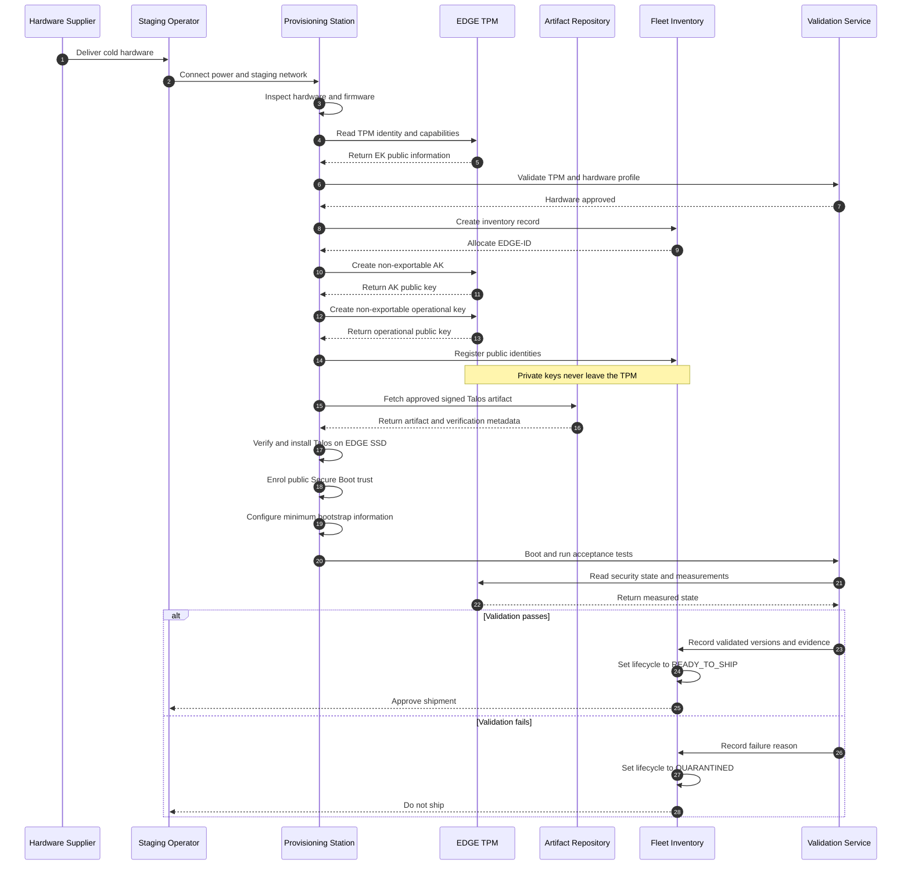

### Provisioning station and artifact destination

The provisioning station is another trusted machine in the staging facility,
not a component shipped with the EDGE. For the initial design it can be a
secured Linux workstation. At larger scale it can become an automated network
or manufacturing-line provisioning service.

The precise artifact path is:

```text
Image build pipeline
        ↓
Protected signing service
        ↓
Artifact repository
        ↓
Provisioning station
        ↓
EDGE internal SSD
```

The provisioning station fetches an already approved and signed artifact,
verifies it, and installs it. It does not receive the private image-signing
key. The signed Talos artifact goes onto the SSD; the corresponding public
Secure Boot trust is enrolled into UEFI.

### ISO, installed Talos and remote provisioning

The Talos ISO is installation media. The chosen initial architecture does not
leave the ISO on the EDGE SSD:

```text
Talos ISO or installer
        ↓
Install Talos
        ↓
EDGE SSD contains installed Talos
        ↓
Remove installation media
```

Factory provisioning and remote provisioning solve different problems:

```text
Factory provisioning
= install trusted Talos and establish hardware identity

Remote provisioning after customer power-on
= verify the EDGE and deliver customer/site-specific configuration
```

Remote provisioning in the initial design does not reinstall the operating
system. It supplies the unique network, WireGuard, Talos machine, Kubernetes
role and application assignments after enrollment succeeds. Fully remote OS
installation is another possible design, but it adds recovery-image and
network-boot complexity and is not selected for the first architecture.

### Secure Boot preview

UEFI is firmware on the EDGE motherboard. Secure Boot is configured before
shipment and enforced on every boot, including the first customer-site boot.
Its narrow question is:

> Is this signed boot software trusted and therefore allowed to execute?

**Secure Boot Decision**

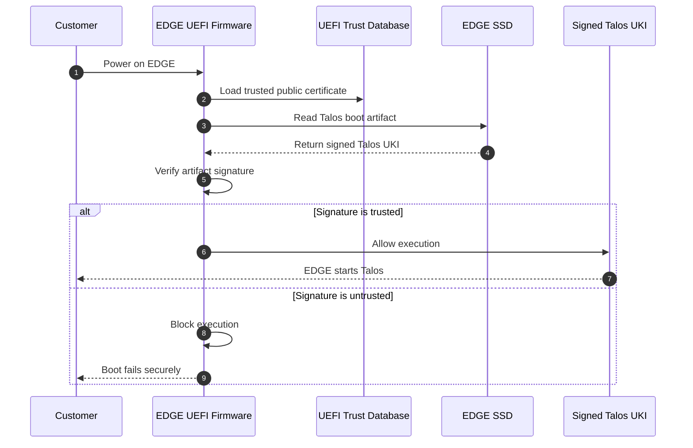

This was only a preview. The terms image, ISO, installed Talos, UKI and Secure
Boot began to overlap and the mental model stopped being clear. The learning
session was deliberately paused instead of adding more detail.

### Current understanding

The stable checkpoint is:

```text
Cold hardware
        ↓
Factory validates hardware and TPM
        ↓
Public identities registered centrally
        ↓
Approved Talos is installed on the SSD
        ↓
Public Secure Boot trust is enrolled in UEFI
        ↓
Acceptance tests pass
        ↓
READY_TO_SHIP
```

The unit is prepared but not yet an active production EDGE. Customer-site
enrollment, verification and unique configuration happen after power-on and
will be covered only after the boot-artifact model is clear.

### Exact restart point

Resume slowly from this unresolved question:

> What exactly are the Talos image, ISO, installer and UKI; which one is used
> temporarily, which one remains on the SSD, and which one UEFI verifies?

Do not proceed to detailed customer-site enrollment or remote provisioning
until this artifact flow is understood in a simple physical sequence.


---

## 2026-09-27 — Clarification: Provisioning sources and locations

The diagram added in commit `54dfb90` showed the sequence but did not clearly
identify where each system lives or where each identity/artifact originates.
The historical diagram remains unchanged under the append-only rule. This
checkpoint adds the clarified version.

### Source and location map

| Item | Source | Location after creation |
| --- | --- | --- |
| Hardware serial and TPM/EK | Hardware/TPM manufacturer | EDGE hardware; public details copied to fleet inventory |
| EDGE-ID | Fleet inventory | Central management platform |
| Attestation Key | Generated inside the EDGE TPM | Private key remains in TPM; public key copied to fleet inventory |
| Operational key | Generated inside the EDGE TPM | Private key remains in TPM; public key copied to fleet inventory |
| Signed Talos artifact | Central image and signing pipeline | Artifact repository, then installed on the EDGE SSD |
| Secure Boot public trust | Central signing system | Enrolled into the EDGE UEFI trust database |
| Validation result | Staging validation service | Fleet inventory |

### Provisioning sequence with locations

**Provisioning Sources and Locations**

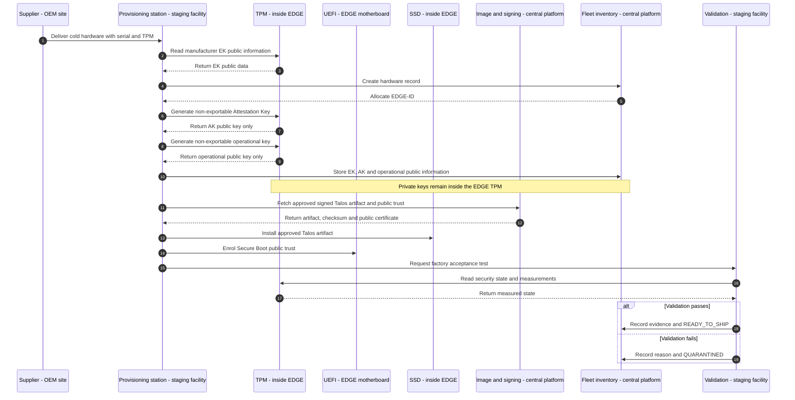

The four physical boundaries are now explicit:

```text
Supplier site
    -> supplies cold hardware and manufacturer identity

Staging facility
    -> provisions and validates the EDGE

Inside the EDGE
    -> TPM protects private keys, UEFI holds boot trust, SSD holds Talos

Central platform
    -> signs/publishes artifacts and stores fleet public information
```


---

## 2026-09-27 — Correction: Provisioning interactions and EDGE state

### Diagram correction

The earlier factory sequence used self-directed provisioning-station arrows
for installing Talos, enrolling Secure Boot trust and adding bootstrap
information. Those arrows were misleading because the provisioning server
orchestrates the actions, but the changes occur on components inside the EDGE.

For production scale, the factory can operate a pool of similarly configured
provisioning servers. Each server provisions one or more virgin EDGEs through
the controlled staging network.

The provisioning server does not perform all tests on itself. It instructs the
EDGE, causes the EDGE to boot, and evaluates evidence returned by the EDGE:

- Talos is installed on the EDGE SSD.
- Secure Boot public trust is enrolled in the EDGE UEFI.
- Private keys are generated and used inside the EDGE TPM.
- UEFI performs boot-signature verification on the EDGE.
- Talos, storage and network health are observed from the EDGE.
- The provisioning and validation systems record the final decision.

### Factory interaction diagram

**Factory EDGE Interactions**

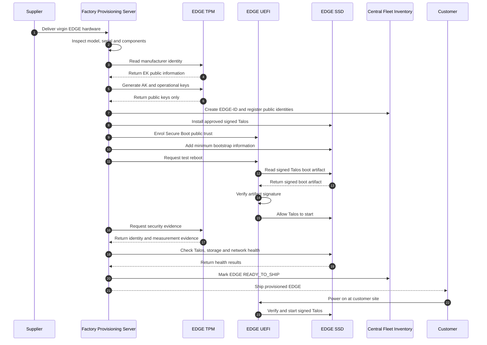

The diagram uses TPM, UEFI and SSD as separate EDGE participants so that every
factory action shows its real target. The provisioning server is the
orchestrator; it is not the destination of EDGE configuration changes.

### EDGE lifecycle state diagram

**Factory to Customer States**

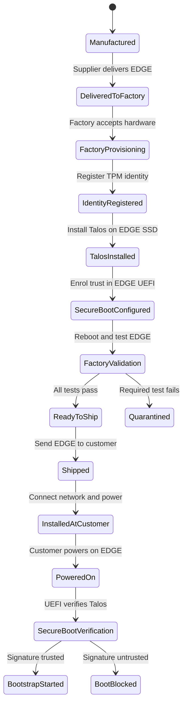

### Physical journey

```text
Supplier
    ↓ virgin hardware
Factory provisioning environment
    ↓ provisioned and tested hardware
Customer site
    ↓ customer powers on
EDGE UEFI verifies Talos
    ↓
Bootstrap begins
```

The exact storage and delivery mechanism for minimum bootstrap information is
still an open implementation detail. It must be resolved only after the ISO,
installer, installed Talos and UKI artifact flow is understood.

### Sub-topic organization decision

The factory-to-customer diagram is the lifecycle overview. Each meaningful
state transition will receive a separate focused sub-topic after it is studied,
including the failure branches to `Quarantined` and `BootBlocked`. Detailed
pages will not be generated speculatively; they will capture the architecture,
trust, evidence, failure behavior and recovery path established during the
learning discussion.

The corresponding Markdown files `02` through `15` were created under
`sub-topics/`. Each file defines the transition and current learning scope;
details remain explicitly marked as planned until that state change is studied.


---

## 2026-09-27 — Factory station and state-change use cases

### User direction

Each state change is a separate sub-topic Markdown use case. Update the live record now. Keep unstudied transitions as explicit outlines rather than presenting invented implementation as settled design.

### Coverage check

Sub-topics 02–15 already map one-to-one to the state transitions shown in the lifecycle diagram, including the quarantine and boot-blocked branches. The factory provisioning overview (01) provides the end-to-end map. Added a separate station run use case (16) for the cross-cutting question of how a factory station is configured and operates. Expanded 03–07 with intake, TPM identity, Talos installation, UEFI Secure Boot and factory validation boundaries. Files 02 and 08–15 remain scoped outlines.

### Station model and test ownership

A lab engineer can use USB media and explicit commands. A production facility can run multiple managed stations in parallel with scans, automated jobs and pass/fail gates. In either case the station coordinates work on the EDGE: temporary EDGE-side software invokes the TPM and installer; UEFI stores boot trust and enforces Secure Boot; Talos and hardware provide health observations. The station verifies artifacts and evaluates returned evidence. It cannot prove EDGE health or trusted boot solely by testing itself.

The station needs approved hardware profiles, OEM public trust roots, approved Talos artifact references and verification metadata, public boot trust, inventory enrollment endpoints, scoped station credentials and test policy. TPM private keys and central signing/CA private keys stay outside the station. A scanned serial or EK public key alone is insufficient proof of TPM possession; a challenge and binding protocol must be designed.

### Physical boot relationship and open decisions

The ISO is temporary boot media; the installer runs in the EDGE environment and writes installed Talos to its SSD. On the chosen Secure Boot path a signed UKI is a boot artifact on the installed system. EDGE UEFI verifies allowed boot code against its configured trust databases; the TPM records measurements that can later support attestation. Exact Talos release/artifacts, UEFI key-enrollment process, bootstrap configuration delivery, negative test, evidence policy and station automation remain to be worked through step by step.

Next learning checkpoint: factory provisioning station assumptions and the EDGE-side execution boundary, then the UEFI/Secure Boot fundamentals. Do not infer the exact Talos procedure from this architecture-level outline.


---

## 2026-09-27 — Step 2 diagram correction and Mermaid convention

The simplified station arrow omitted the actual boot and network boundary. In the chosen lab/factory learning model, an operator inserts Talos USB media, connects wired Ethernet, and powers on the EDGE. Temporary Talos requests a staging IP via DHCP and enters maintenance mode without machine configuration. The station connects to the observed EDGE address and supplies the approved configuration or job. No automatic factory Wi-Fi or automatic provisioning-server discovery is assumed. The way the station associates the observed IP with the scanned physical unit and authorizes first contact remains an open design decision.

**Step 2: Boot and Connect**

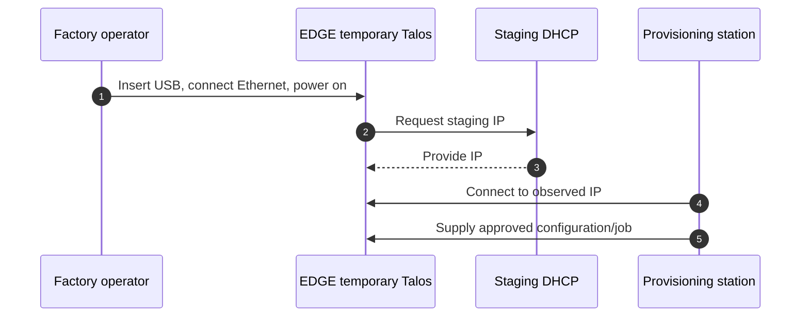

For future entries, express process, architecture, state and interaction diagrams as Mermaid. Historical text diagrams remain as originally recorded under this file's append-only rule; this dated correction supersedes the earlier simplified Step 2 picture. The stable overview and station sub-topic diagrams have been corrected.


---

## 2026-09-27 — Step 5 parked: TPM identity access

**TODO:<Question>** On Talos v1.14.1, can an unconfigured EDGE in maintenance mode expose its TPM EK public key and manufacturer certificate, create or use an AK, and provide a verifiable EK–AK binding through documented Talos API/`talosctl` operations? If not, what controlled factory boot environment or OEM identity handoff performs these operations before Talos installation? Verify with official documentation/source and a physical TPM PoC before selecting the workflow.

The OneUptime TPM article discusses detecting a TPM and TPM-backed disk encryption. The official Talos 1.14 disk-encryption guide documents LUKS2 keys sealed to TPM PCR policy (default PCR 7), using `VolumeConfig`. Neither source establishes an EK certificate read, AK creation or EK–AK proof through the unconfigured Talos maintenance API. Do not treat the earlier Step 5 sequence diagram as an implemented interface. Resume this question after checking Talos v1.14.1 APIs/source and a physical TPM PoC. Continue later learning with this dependency explicit.

References: https://oneuptime.com/blog/post/2026-03-03-use-trusted-platform-module-tpm-with-talos-linux/view ; https://docs.siderolabs.com/talos/v1.14/configure-your-talos-cluster/storage-and-disk-management/disk-encryption


---

## 2026-09-27 — NEN vision, trust ownership and two-phase provisioning

### Company and fleet model

The reference company is **Naren Edge Networks (NEN)**. NEN operates a central data center and thousands of geographically distributed branch/franchise offices. A site has one or more EDGEs depending on office size. Each site has a Site-ID; each EDGE has its own EDGE-ID and device credentials.

The factory prepares and validates hardware. The data center remains the long-term fleet controller. At the branch, the EDGE initiates connectivity outward through customer NAT; management uses that established connectivity. The protocol, enrollment agent and site-configuration mechanism remain design work.

**NEN Fleet Lifecycle**

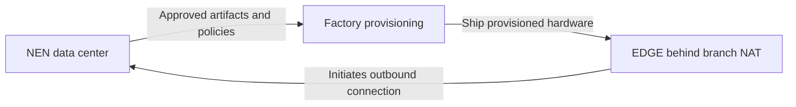

### Learning continuity and unresolved implementation

Step 5, factory TPM EK/AK access and proof, remains unresolved. Treat it as a black box for subsequent architecture learning: its assumed output is “EDGE identity verified and registered.” This is not a claim of a working Talos maintenance API implementation.

The question is tracked as OT-01 in [open-topic.md](open-topic.md). Do not silently close it or infer arbitrary TPM access from maintenance mode.

Use numbered learning steps. All new diagrams must be Mermaid: top-down on mobile/small screens, left-to-right on laptops when it fits, and the best-fitting orientation in Markdown files.

### OS, ISO, installer and UKI

“OS” means the Talos operating system; ISO is one distribution/boot format.

| Artifact | Role |
| --- | --- |
| ISO on USB or virtual media | Boots temporary Talos |
| PXE assets | Boot temporary Talos over the network |
| Installer container image | Supplies installer and installation payload |
| Installed Talos on SSD | Persistent system used after installation |
| UKI | Bootable bundle containing kernel, initramfs and boot arguments |

Temporary Talos retrieves the installer image named in its machine configuration. It does not download another ISO to install. The proposed NEN design publishes approved boot assets and installer images in NEN-controlled repositories; direct EDGE internet downloads from Sidero Labs are not a requirement.

**NEN Artifact Delivery**

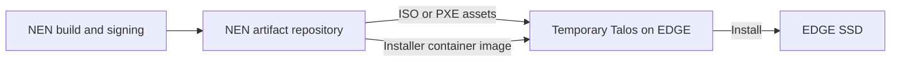

### Secure Boot clarification and ordering correction

Secure Boot is a verification feature of EDGE UEFI firmware. UEFI does not verify the entire ISO as one signed object. The Talos Secure Boot path uses signed EFI boot components: systemd-boot and the Talos UKI. The bootloader loads the UKI through the UEFI verification chain. Direct UKI boot is also possible.

The earlier learning sequence “install Talos, then prepare Secure Boot” was too simple. For the official Talos 1.14 Secure Boot installation path, prepare/enroll UEFI trust before running temporary Talos in Secure Boot mode, install using a matching Secure Boot installer, then verify Secure Boot again after rebooting from SSD. The linked sub-topic filenames represent earlier conceptual states and are not yet a corrected executable runbook.

**Secure Boot Installation Order**

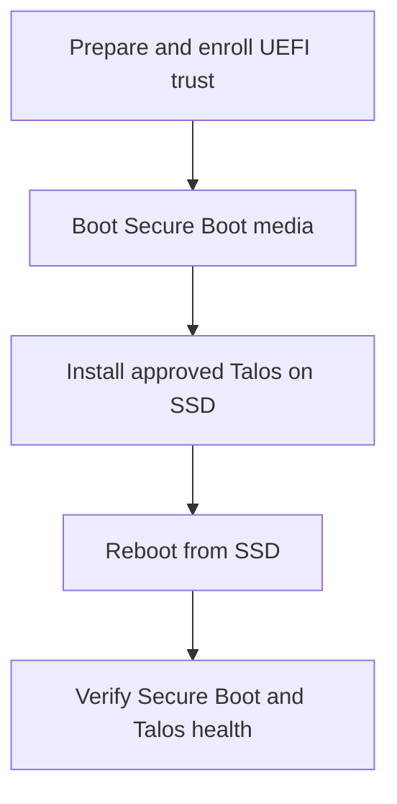

The official guide distinguishes firmware setup mode and VM versus bare-metal enrollment behavior. The actual NEN hardware enrollment procedure remains an implementation decision.

### Which signing identity does NEN use?

Talos supports Sidero Labs-signed boot assets and custom keys. For the NEN reference architecture, the proposed choice is NEN-controlled boot signing in protected signing infrastructure. This is separate from NEN device certificates, TPM EK/AK and Talos/Kubernetes API certificates.

Keys and signed artifacts must be ready before provisioning the first EDGE. Setting up the provisioning servers can happen in parallel.

Illustrative commands on a secured signing machine, not commands executed in this discussion:

```bash
talosctl gen secureboot uki --common-name "NEN Boot Signing"
talosctl gen secureboot database
```

| Generated artifact | Purpose |
| --- | --- |
| uki-signing-key.pem | Private key for signing boot software |
| uki-signing-cert.pem / .der | Public signing certificate |
| PK.auth, KEK.auth, db.auth | UEFI trust-enrollment material |

These commands generate key and enrollment material; building and signing the images follows separately. The convenience generator creates a self-signed signing certificate; a Root CA/sub-CA hierarchy is not required for this boot-signing pattern. PCR policy signing uses a separate key, for which Talos provides `talosctl gen secureboot pcr`.

### NEN CA and key ownership

A certificate binds an identity/purpose to a public key. A CA signs certificates with its private key. A sub-CA, also called an intermediate CA, receives a CA certificate signed by its parent.

The following is a proposed NEN identity-PKI design, not a deployed configuration:

| Key | Creator / private-key custodian | What it signs or proves |
| --- | --- | --- |
| NEN Root CA | NEN security administrators; protected offline root environment | Issuing/sub-CA certificates |
| NEN Device Issuing CA | NEN PKI service; protected online DC signing service | Individual EDGE identity certificates |
| NEN Service Issuing CA | NEN PKI service; protected online DC signing service | DC enrollment and management service certificates |
| EDGE operational key | Generated on each EDGE, TPM path assumed through the parked black box; private key protected there | EDGE authentication proofs |
| NEN boot-signing key | Protected central build/signing system | Approved bootloader and UKI |
| NEN PCR policy signing key | Protected central build/signing system | TPM disk-unlock policies |

**NEN Identity Certificate Hierarchy**

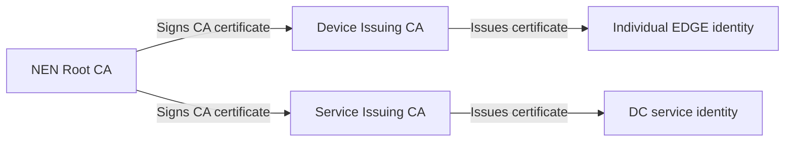

One sub-CA per branch is not required by default; regional issuing CAs can be considered when availability or isolation requirements justify them. Multiple EDGEs in the same branch still have individual credentials.

The provisioning station receives approved signed artifacts and public trust material. It does not hold NEN central CA/boot-signing private keys. EDGE UEFI receives boot trust; the software establishing connections receives the service CA trust it needs. These are different trust stores.

Talos API and Kubernetes CA arrangements remain separate cluster-management concerns. Do not assume the NEN Device Issuing CA automatically replaces those CAs.

### What “NEN signs the EDGE certificate” means

1. EDGE-001 generates its own key pair; the private key remains protected on the EDGE.
2. Its public key and certificate request, with required identity evidence, reach NEN enrollment/issuance services.
3. After policy checks, the Device Issuing CA issues a certificate binding EDGE-001 to that public key.
4. The EDGE receives that public certificate; central inventory records its public identity/certificate and provisioning evidence.
5. On a later connection, the EDGE presents the certificate and proves possession of the corresponding private key. The DC verifies the certificate chain and authentication proof.

Illustrative certificate fields:

| Field | Example meaning |
| --- | --- |
| Identity | EDGE-001 |
| Public key | EDGE-001 operational public key |
| Issuer | NEN Device Issuing CA |
| Validity | Certificate start and expiry times |
| CA signature | Issuer's cryptographic approval of the certificate |

The certificate may be shared. Copying it alone does not supply the private key needed to authenticate.

### Phase 1 — Factory: prepare and validate

Prepare UEFI boot trust and approved Talos installation using the corrected sequence above. Provide NEN service trust and the bootstrap enrollment address. Through the assumed identity black box, establish the EDGE key and identity proof, obtain its NEN-issued certificate, and record the EDGE-ID and public evidence centrally. Reboot, validate and approve shipment.

Factory issuance of the operational certificate is the current teaching assumption. Credential lifetime, renewal and activation authorization still need detailed policy.

### Phase 2 — Branch: connect and activate

The operator supplies power and usable networking. The EDGE boots installed Talos, initiates an outbound connection to NEN, authenticates, and receives authorized site-specific configuration and secrets before running branch workloads.

**Branch Activation**

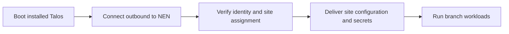

“Just power on” assumes usable initial networking and an authorized mapping from EDGE-ID to Site-ID, either prepared before shipment or completed during activation. Stock Talos does not inherently implement the proposed NEN enrollment workflow. Initial machine configuration, outbound connectivity and the software delivering site configuration must be designed and tested. Until then this is the target architecture, not proof of zero-touch operation.

### References and next checkpoint

- [Talos 1.14 Secure Boot](https://docs.siderolabs.com/talos/v1.14/platform-specific-installations/bare-metal-platforms/secureboot)
- [Talos 1.14 Image Factory](https://docs.siderolabs.com/talos/v1.14/learn-more/image-factory)
- [Talos 1.14 disk encryption](https://docs.siderolabs.com/talos/v1.14/configure-your-talos-cluster/storage-and-disk-management/disk-encryption)
- [OpenSSL TLS and certificate introduction](https://docs.openssl.org/3.5/man7/ossl-guide-tls-introduction/)

Current understanding: the user has confirmed the explanation of NEN issuing an EDGE certificate. Continue slowly from this checkpoint, preserving the two-phase NEN vision and the parked TPM implementation question.
